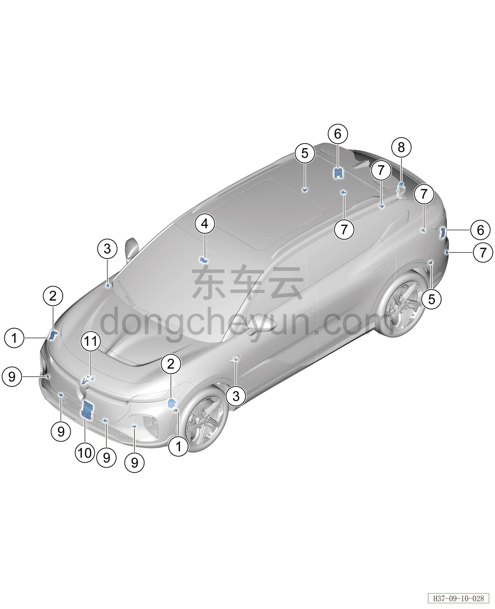

# Расположение компонентов

> Электрическая и электронная система › Система интеллектуального вождения  
> Оригинал: `零部件位置图` · [dongcheyun 56746](https://dongcheyun.com/p/56746), страница `ef12c4d98e9c4c5aa1055ed4f87ebc2b` · [оглавление](../README.md)

| № | Наименование детали | Кол-во на автомобиль | Примечание |
|---|---|---|---|
| 1 | Передний датчик парковочного радара (дальнего действия) | 2 | Расположен с внутренней стороны переднего бампера |
| 2 | Передний угловой радар | 2 | Расположен с внутренней стороны переднего бампера |
| 3 | Боковая камера обзора | 2 | Расположена с внутренней стороны крыла |
| 4 | Передняя бинокулярная (стереоскопическая) камера в сборе | 1 | Расположена с внутренней стороны декоративного кожуха внутреннего зеркала заднего вида |
| 5 | Задний датчик парковочного радара (дальнего действия) | 2 | Расположен с внутренней стороны заднего бампера |
| 6 | Задний угловой радар | 2 | Расположен с внутренней стороны заднего бампера |
| 7 | Задний датчик парковочного радара | 4 | Расположен с внутренней стороны заднего бампера |
| 8 | Камера заднего вида | 1 | Расположена внутри заднего комбинированного фонаря, со стороны открывающейся части |
| 9 | Передний датчик парковочного радара | 4 | Расположен с внутренней стороны переднего бампера |
| 10 | Передний радар миллиметрового диапазона | 1 | Расположен с внутренней стороны переднего бампера |
| 11 | Передняя камера | 1 | Расположен с внутренней стороны переднего бампера |
