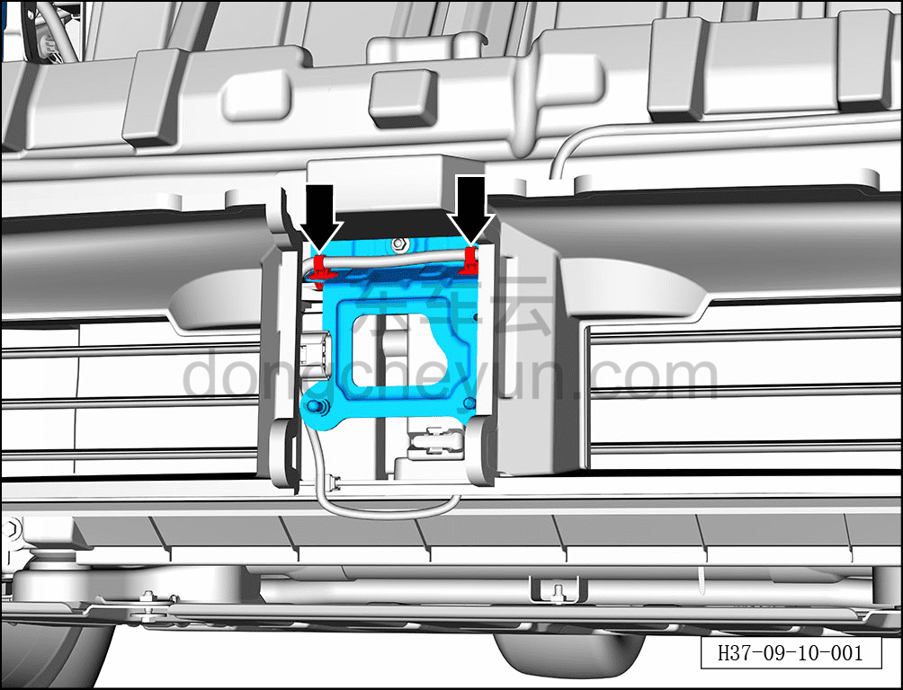
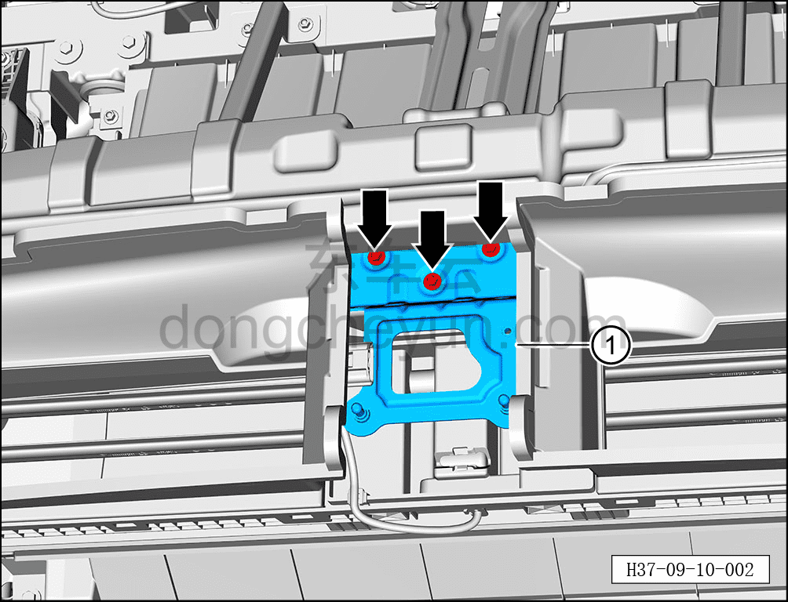

# Снятие и установка кронштейна переднего радара миллиметрового диапазона

> Электрическая и электронная система › Система интеллектуального вождения › Расширенная помощь при вождении и парковке  
> Оригинал: `拆卸与安装前向毫米波雷达支架` · [dongcheyun 56746](https://dongcheyun.com/p/56746), страница `b823c4f3b95b4873991a13f28bc5a0d0` · [оглавление](../README.md)

**Порядок снятия**

1. Выключите все электроприборы, отключите питание.

2. Выполните обесточивание автомобиля для ремонта. См. [3.1.4.1 Обесточивание автомобиля](../03-техническое-обслуживание/005-обесточивание-автомобиля.md)

3. Снимите передний бампер в сборе. См. [8.6.3.3 Снятие и установка переднего бампера в сборе](../08-внутренняя-и-внешняя-отделка/163-снятие-и-установка-переднего-бампера-в-сборе.md)

4. Снятие переднего радара миллиметрового диапазона. См. [9.10.3.2 Снятие и установка переднего радара миллиметрового диапазона](096-снятие-и-установка-переднего-радара-миллиметрового.md)

5. Снятие монтажного кронштейна переднего радара миллиметрового диапазона.

a. С помощью съёмника обивки отсоедините 2 фиксирующие защёлки жгута проводов.

b. Торцевой головкой 10 мм выверните 3 крепёжных болта монтажного кронштейна переднего радара миллиметрового диапазона.

Момент затяжки болта: 4±0,5 Н·м

c. Извлеките монтажный кронштейн переднего радара миллиметрового диапазона ①.

**Порядок установки**

Установка выполняется в обратном порядке.

**Примечание:**

**-После завершения установки переднего радара миллиметрового диапазона необходимо выполнить калибровку. См. [9.10.3.7 Динамическая калибровка переднего радара миллиметрового диапазона](101-динамическая-калибровка-переднего-радара.md)**
