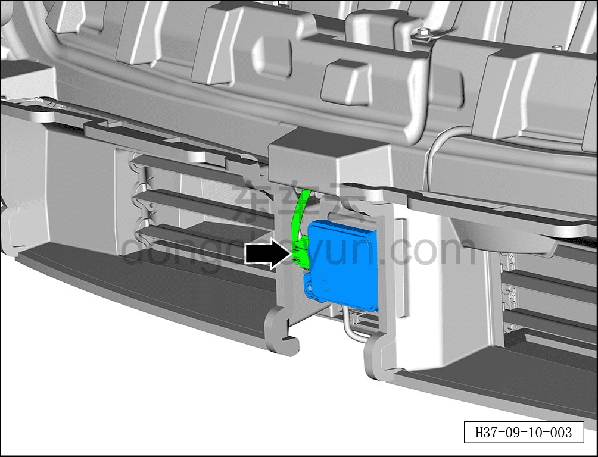
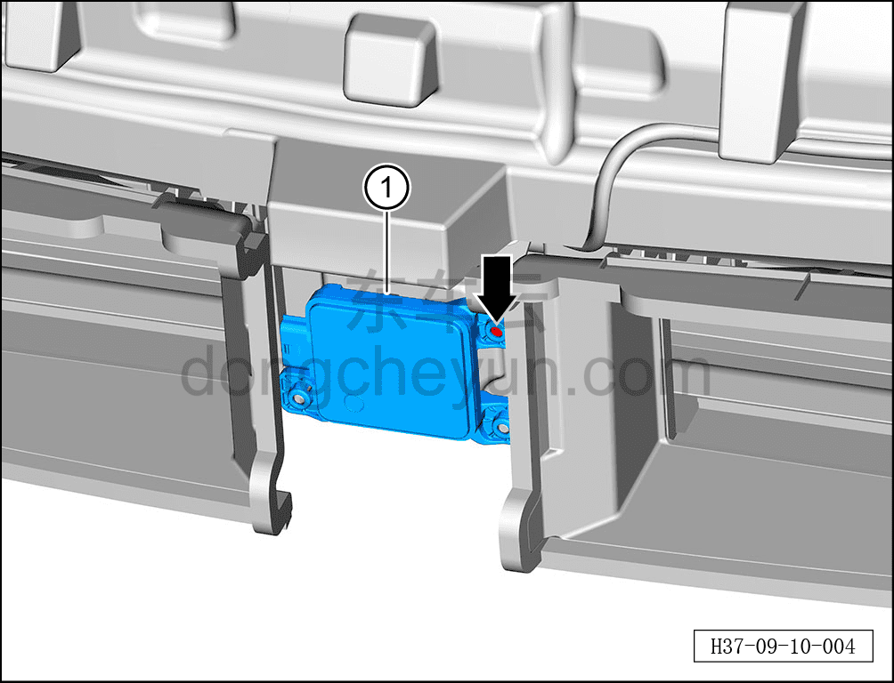

# Снятие и установка переднего радара миллиметрового диапазона

> Электрическая и электронная система › Система интеллектуального вождения › Расширенная помощь при вождении и парковке  
> Оригинал: `拆卸与安装前向毫米波雷达` · [dongcheyun 56746](https://dongcheyun.com/p/56746), страница `b89ed4f721244fd6b43327c744b0159b` · [оглавление](../README.md)

**Порядок снятия**

1. Выключите все электроприборы, отключите питание.

2. Выполните обесточивание автомобиля для ремонта. См. [3.1.4.1 Обесточивание автомобиля](../03-техническое-обслуживание/005-обесточивание-автомобиля.md)

3. Снимите передний бампер в сборе. См. [8.6.3.3 Снятие и установка переднего бампера в сборе](../08-внутренняя-и-внешняя-отделка/163-снятие-и-установка-переднего-бампера-в-сборе.md)

4. Снятие переднего радара миллиметрового диапазона.

a. Удерживая фиксатор разъёма, отсоедините разъём переднего радара миллиметрового диапазона.

b. Битой T15 выверните болт переднего радара миллиметрового диапазона.

c. Извлеките передний радар миллиметрового диапазона ①.

**Порядок установки**

Установка выполняется в обратном порядке.

**Примечание:**

**-После завершения установки переднего радара миллиметрового диапазона необходимо выполнить калибровку. См. [9.10.3.7 Динамическая калибровка переднего радара миллиметрового диапазона](101-динамическая-калибровка-переднего-радара.md)**
