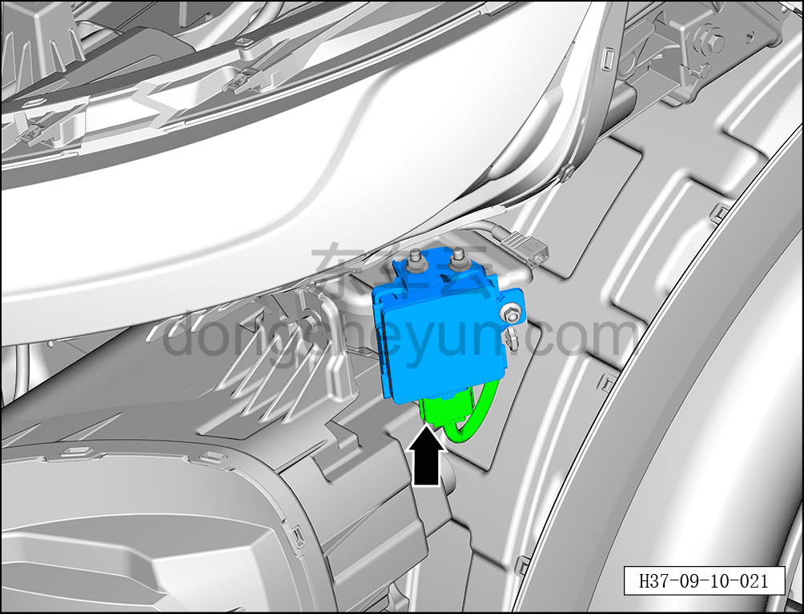
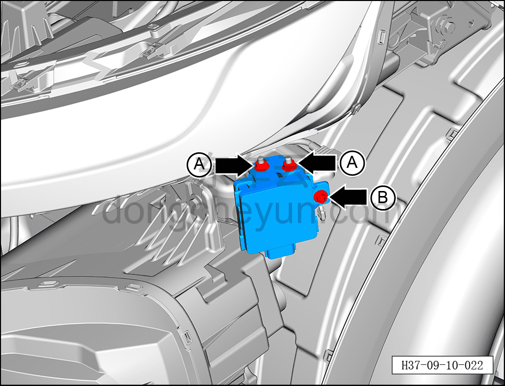
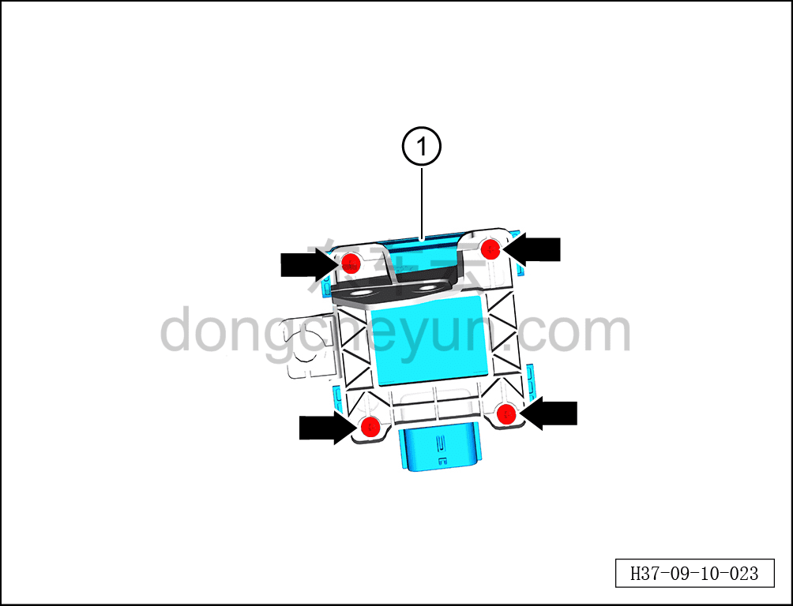

# Снятие и установка переднего левого углового радара

> Электрическая и электронная система › Система интеллектуального вождения › Расширенная помощь при вождении и парковке  
> Оригинал: `拆卸与安装前左角雷达` · [dongcheyun 56746](https://dongcheyun.com/p/56746), страница `3c44d74c0f23445d9f1965c662c54db1` · [оглавление](../README.md)

**Порядок снятия**

**Примечание:**

**-Далее описаны снятие и установка переднего левого углового радара, для переднего правого углового радара см. по аналогии с передним левым угловым радаром.**

1. Выключите все электроприборы, отключите питание.

2. Выполните обесточивание автомобиля для ремонта. См. [3.1.4.1 Обесточивание автомобиля](../03-техническое-обслуживание/005-обесточивание-автомобиля.md)

3. Снимите передний бампер в сборе. См. [8.6.3.3 Снятие и установка переднего бампера в сборе](../08-внутренняя-и-внешняя-отделка/163-снятие-и-установка-переднего-бампера-в-сборе.md)

4. Снятие переднего левого углового радара.

a. Удерживая фиксатор разъёма, отсоедините разъём переднего левого углового радара.

b. Гаечным ключом 10 мм отверните 2 крепёжные гайки A переднего левого углового радара.

Момент затяжки гайки: 4±0,5 Н·м

c. Торцевой головкой 10 мм выверните крепёжный болт B переднего левого углового радара.

Момент затяжки болта: 4±0,5 Н·м

d. Крестовой отвёрткой выверните 4 крепёжных винта переднего левого углового радара.

Момент затяжки винта: 0,7±0,1 Н·м

e. Извлеките передний левый угловой радар ①.

**Порядок установки**

Установка выполняется в обратном порядке.

**Примечание:**

**После завершения замены необходимо выполнить следующие операции с помощью диагностического сканера или удалённой диагностики:**

**- Сначала прошить программное обеспечение до последней версии;**

**- После успешного обновления программного обеспечения выполнить процедуру замены детали для контроллера.**

**-После завершения установки углового радара необходимо выполнить калибровку. См. [9.10.3.8 Калибровка углового радара RCR_L](102-калибровка-углового-радара-rcr-l.md)**
