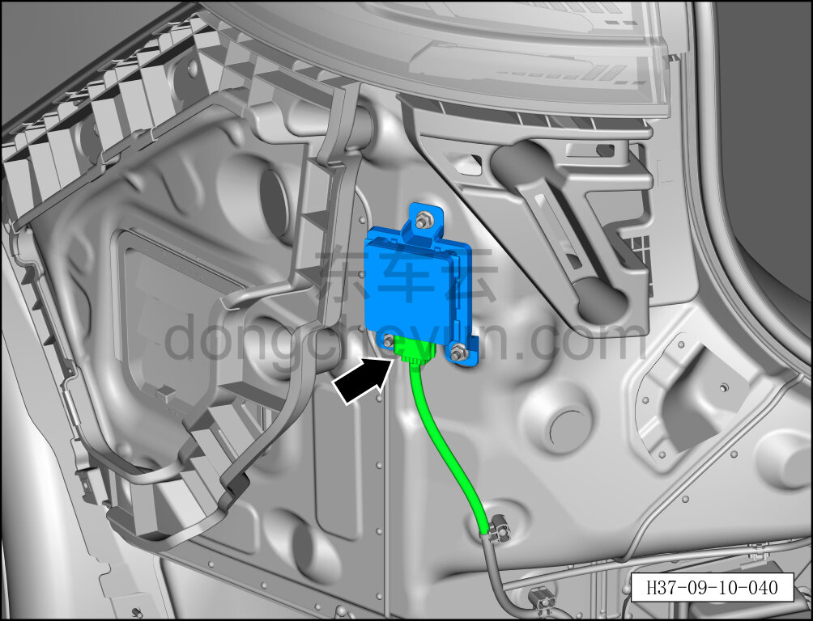
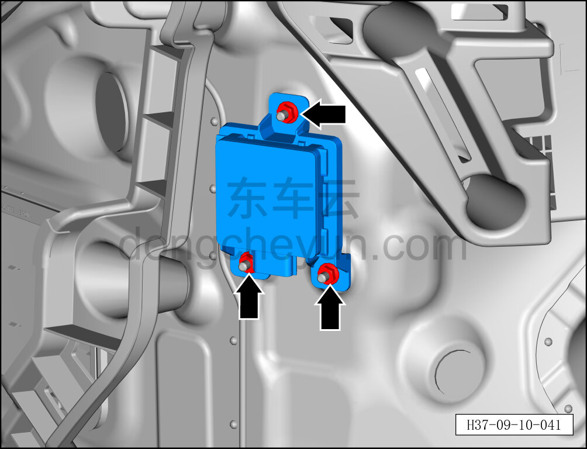
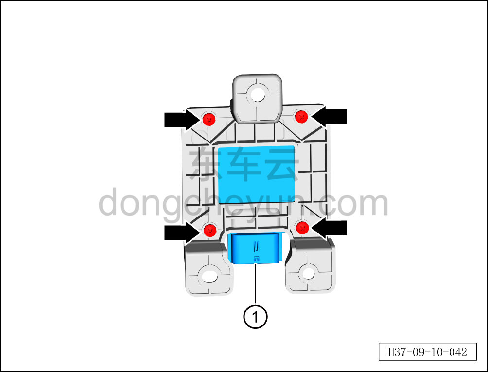

# Снятие и установка заднего левого углового радара

> Электрическая и электронная система › Система интеллектуального вождения › Расширенная помощь при вождении и парковке  
> Оригинал: `拆卸与安装后左角雷达` · [dongcheyun 56746](https://dongcheyun.com/p/56746), страница `75650a74ca50404db37e8e682d435a0e` · [оглавление](../README.md)

**Порядок снятия**

**Примечание:**

**-Далее описаны снятие и установка заднего левого углового радара, для заднего правого углового радара см. по аналогии с задним левым угловым радаром.**

1. Выключите все электроприборы, отключите питание.

2. Выполните обесточивание автомобиля для ремонта. См. [3.1.4.1 Обесточивание автомобиля](../03-техническое-обслуживание/005-обесточивание-автомобиля.md)

3. Снимите задний бампер в сборе. См. [8.6.3.26 Снятие и установка заднего бампера в сборе](../08-внутренняя-и-внешняя-отделка/186-снятие-и-установка-заднего-бампера-в-сборе.md)

4. Снятие заднего левого углового радара.

a. Отсоедините разъём заднего левого углового радара.

b. Гаечным ключом 10 мм отверните 3 крепёжные гайки заднего левого углового радара.

Момент затяжки гайки: 4±0,5 Н·м

c. Крестовой отвёрткой выверните 4 крепёжных винта заднего левого углового радара.

Момент затяжки винта: 0,7±0,1 Н·м

d. Извлеките задний левый угловой радар ①.

**Порядок установки**

Установка выполняется в обратном порядке.

**Примечание:**

**После завершения замены необходимо выполнить следующие операции с помощью диагностического сканера или удалённой диагностики:**

**- Сначала прошить программное обеспечение до последней версии;**

**- После успешного обновления программного обеспечения выполнить процедуру замены детали для контроллера.**

**-После завершения установки углового радара необходимо выполнить калибровку. См. [9.10.3.8 Калибровка углового радара RCR_L](102-калибровка-углового-радара-rcr-l.md)**
