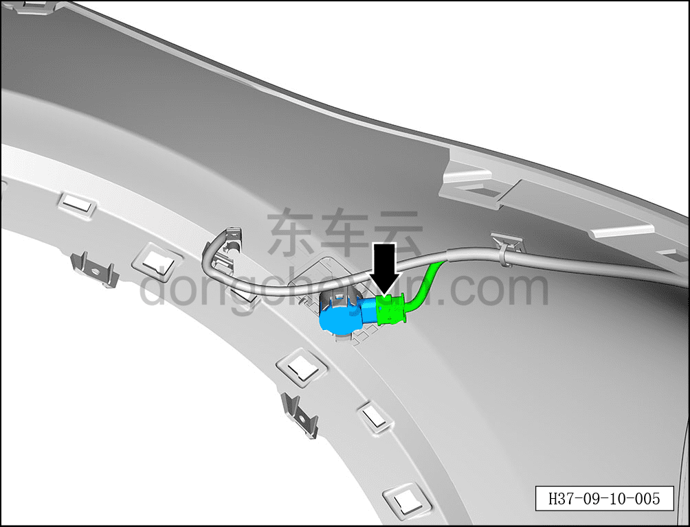
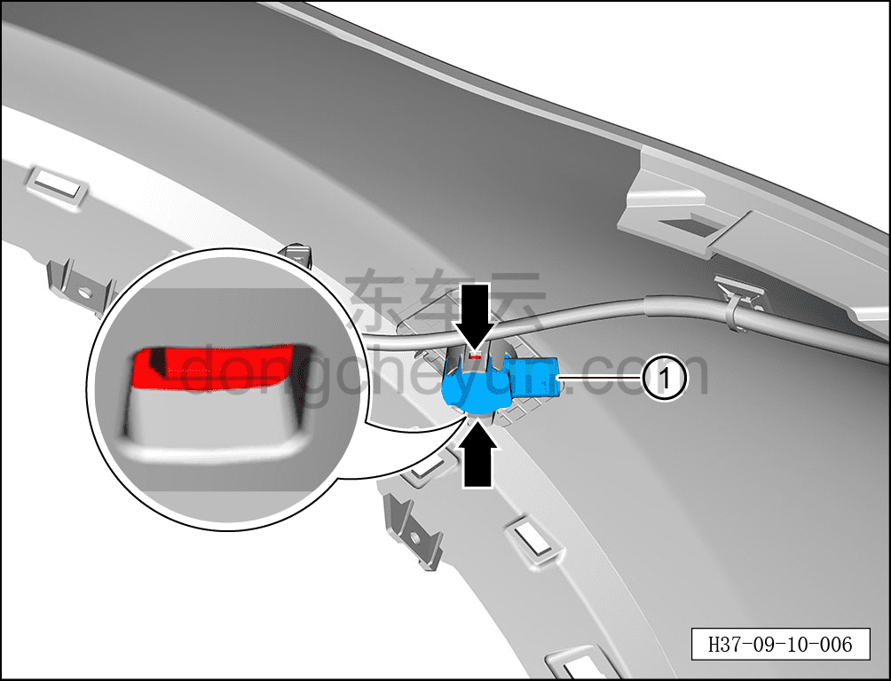
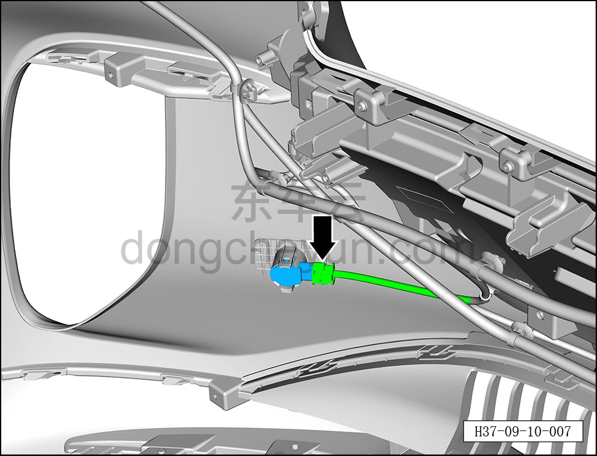
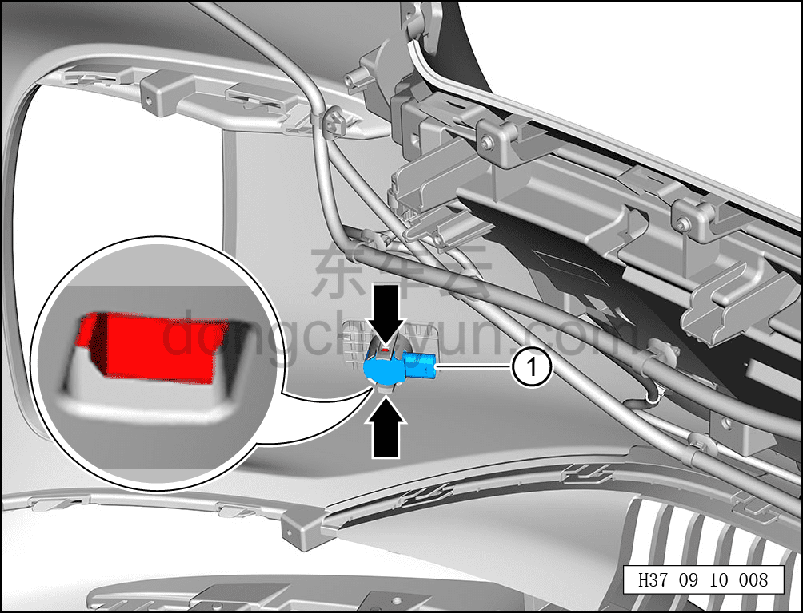

# Снятие и установка датчика парковочного радара (передний)

> Электрическая и электронная система › Система интеллектуального вождения › Расширенная помощь при вождении и парковке  
> Оригинал: `拆卸与安装泊车雷达传感器（前）` · [dongcheyun 56746](https://dongcheyun.com/p/56746), страница `e77f3cd0f703418a84a76c3cbdcffdc8` · [оглавление](../README.md)

**Порядок снятия**

1. Выключите все электроприборы, отключите питание.

2. Выполните обесточивание автомобиля для ремонта. См. [3.1.4.1 Обесточивание автомобиля](../03-техническое-обслуживание/005-обесточивание-автомобиля.md)

3. Снимите передний бампер в сборе. См. [8.6.3.3 Снятие и установка переднего бампера в сборе](../08-внутренняя-и-внешняя-отделка/163-снятие-и-установка-переднего-бампера-в-сборе.md)

4. Снятие переднего датчика парковочного радара.

a. Удерживая фиксатор разъёма, отсоедините разъём переднего датчика парковочного радара.

b. Отсоедините 2 фиксатора переднего датчика парковочного радара.

c. Извлеките передний датчик парковочного радара ①.

d. Удерживая фиксатор разъёма, отсоедините разъём переднего датчика парковочного радара.

e. Отсоедините 2 фиксатора переднего датчика парковочного радара.

f. Извлеките передний датчик парковочного радара ①.

**Порядок установки**

Установка выполняется в обратном порядке.

**Примечание:**

**-После завершения замены проверьте внешний вид датчика (равномерность прилегания резиновой втулки).**

**-После завершения замены проверьте нормальную работу функции помощи при парковке.**
