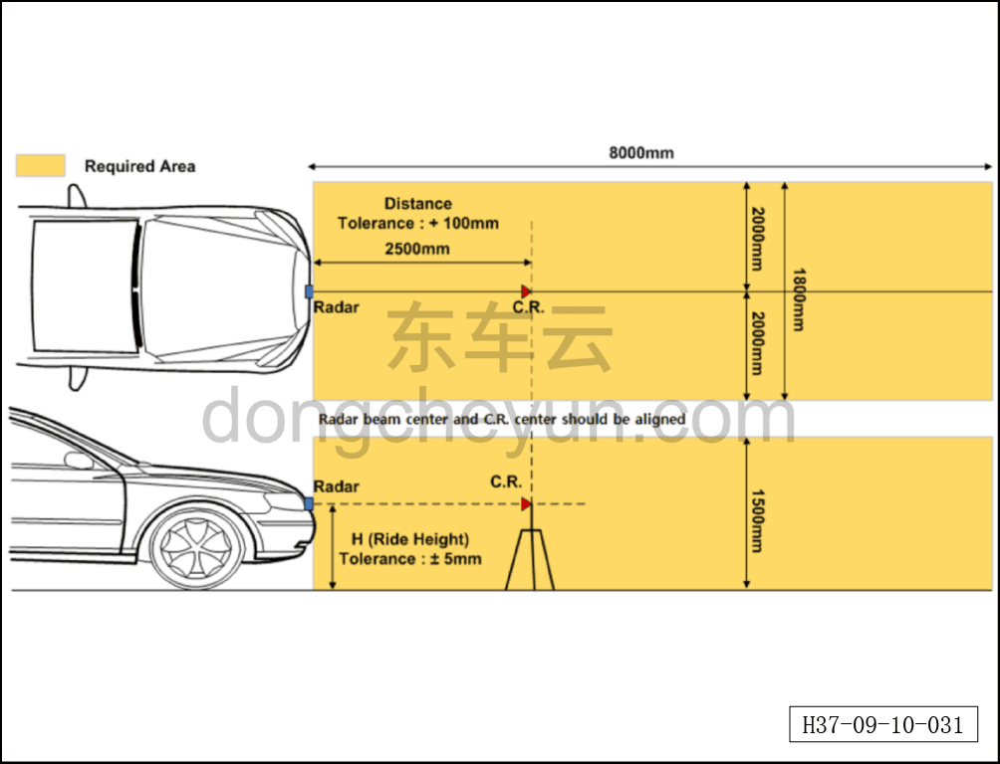
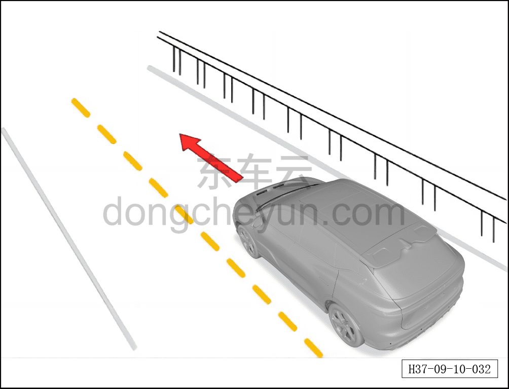

# Динамическая калибровка переднего радара миллиметрового диапазона

> Электрическая и электронная система › Система интеллектуального вождения › Расширенная помощь при вождении и парковке  
> Оригинал: `前向毫米波雷达动态标定` · [dongcheyun 56746](https://dongcheyun.com/p/56746), страница `dffb287cf749461ca62b2faf6d85a469` · [оглавление](../README.md)

Послепродажная калибровка переднего радара делится на калибровку вертикального угла, калибровку горизонтального угла и динамическую калибровку.

**Калибровка вертикального угла радара**

Если передний радар повреждён и требует замены, либо результат калибровки горизонтального угла показывает ошибку выхода вертикального угла за допустимый диапазон, необходимо выполнить калибровку вертикального угла переднего радара.

| Параметр | Порядок действий |
|---|---|
| Снятие/установка радара (при замене радара) | 1. Выключите зажигание и отсоедините минусовой провод аккумуляторной батареи.  2. Снимите передний бампер автомобиля.  3. Отсоедините передний разъём радара.  4. Ослабьте крепёжные болты и снимите передний радар.  5. Замените радар и установите его.  6. Затяните разъём переднего радара. |
| Калибровка вертикального угла | Отрегулируйте вертикальный угол установки переднего радара, обеспечив его в диапазоне -3~3°. |

**Калибровка горизонтального угла радара**

Требования к калибровке

Требования к состоянию автомобиля и типу статической цели:

- радар автомобиля установлен правильно, без люфта и явных отклонений;

- автомобиль стоит на горизонтальной поверхности дороги;

- автомобиль без нагрузки;

- передний бампер в зоне радара не загрязнён и ничем не закрыт;

- давление во всех шинах соответствует установленному значению;

- проверьте развал-схождение колёс;

- зажигание автомобиля (IGN) включено.

**Оборудование для калибровки**

Диагностический сканер, мишень (уголковый отражатель)

Требования к мишени: можно использовать простой уголковый отражатель на треноге либо стандартную калибровочную мишень.

1. Простой уголковый отражатель на треноге: особых требований к треноге нет. Преимущества: удобство перемещения и переноски. Недостатки: из-за помех от элементов треноги угол калибровки может отклоняться примерно на 0,2°. Рекомендуется использовать имеющиеся в продаже фотоштативы, которые легко заменить.

2. Стандартная мишень: вокруг уголкового отражателя устанавливаются дополнительные поглотители, что способствует созданию условий для точного наведения на цель. По сравнению с методом простой треноги поглощение более стабильно, поэтому при недостаточном опыте настройки калибровки или сомнениях в условиях отражения выгодно применять этот простой способ с целевой панелью.

**Условия калибровки**

Требования к площадке:

- калибровка радара должна выполняться на открытой площадке, как показано на рисунке выше: вперёд 8 м, влево/вправо 4 м, высота 1,5 м.

- остановите автомобиль на ровной площадке без уклона и перепада высот.

- между радаром и уголковым отражателем не должно быть препятствий. В требуемом пространстве не должно быть препятствий (металлические листы, смолы и др.).

Требования к расположению уголкового отражателя:

- продольное расстояние (направление T) от центра луча переднего радара до центра уголкового отражателя составляет 2500 мм, допуск: ±100 мм.

- горизонтальное положение (направление L) устанавливается согласно нормативу положения установки радара для данной модели, допуск: ±5 мм. При этом OL — центр автомобиля; если сидеть на месте водителя, влево — «минус», вправо — «плюс».

- вертикальное положение (направление H) — согласно нормативу положения установки радара для данной модели, допуск: ±5 мм.

**Порядок калибровки**

Процесс калибровки следующий:

1. Автомобиль должен находиться во включённом состоянии зажигания; с помощью диагностического сканера запустите калибровку.

2. После запуска калибровки радар переходит в режим калибровки.

3. Считайте результат калибровки радара, получите данные угла калибровки радара (калибровка успешна, если горизонтальный и вертикальный углы находятся в диапазоне -3~3°).

**Результат калибровки**

После завершения калибровки радара результат калибровки передаётся на диагностический сканер:

1. Если отображается «калибровка успешна», калибровка завершена.

2. Если отображается «калибровка не удалась», необходимо провести диагностику по полученному результату и проверить, не превышает ли угол установки радара допустимый диапазон отклонения.

**Динамическая калибровка**

Требования к калибровке

Требования к состоянию автомобиля и типу статической цели:

- необходимо убедиться в исправности вертикальной установки радара (вертикальный угол в диапазоне -3~3°).

- форма бампера автомобиля в норме и он установлен правильно;

- скорость автомобиля ≥50 км/ч и ≤60 км/ч;

- при движении вдоль ограждения автомобиль должен двигаться по прямой (обычно радиус поворота ≥1500 м);

- на стороне, подлежащей калибровке, должно быть ограждение или другой сильно отражающий объект;

- боковое расстояние от радара до ограждения ≤3 м; если требуется калибровка обеих сторон одновременно, ширина полосы движения ≤8 м;

- суммарное время движения автомобиля вдоль ограждения с одной стороны — более 15 с;

**Оборудование для калибровки**

Диагностический сканер, мишень

**Условия калибровки**

В процессе автоматической калибровки радар собирает информацию об ограждениях дороги и, статистически анализируя отклонение углов статических объектов по обеим сторонам дороги, оценивает отклонение угла установки и выполняет автоматическую калибровку. Условие запуска этой функции выполняется при скорости автомобиля 50 км/ч≤V≤60 км/ч и радиусе поворота ≥1500 м, после чего запускается автоматическая калибровка; обычно для завершения калибровки отклонения угла установки достаточно статистики по 30~100 объектам ограждения дороги.

Требуется движение автомобиля по прямому участку дороги со скоростью 50 км/ч≤V≤80 км/ч, длина ограждения на прямом участке MN>V*15 (м), расстояние от бортовой стороны кузова до ограждения 0,5 м≤L≤3 м. Общее время калибровки составляет около 4 мин. Если площадка для калибровки соответствует указанным требованиям, оба радара можно калибровать одновременно; если ширина всей полосы движения слишком велика и не позволяет выполнить указанные требования, можно сначала выполнить автоматическую калибровку для одной стороны, соответствующей требованиям, а затем — для другой стороны.

Типовые рекомендуемые значения: V=50 км/ч, L=1,5 м, MN>V*15=125 м (время калибровки — 4 мин, требуемую длину ограждения можно рассчитать по скорости автомобиля).

**Порядок калибровки**

Процесс калибровки следующий:

1. Автомобиль должен находиться во включённом состоянии зажигания; с помощью диагностического сканера запустите калибровку.

2. После запуска калибровки радар переходит в режим калибровки.

3. Когда скорость автомобиля ≥50 км/ч и ≤90 км/ч, автомобиль движется по прямой вдоль ограждения, расстояние от боковой стороны автомобиля до ограждения удерживается в пределах 0,5~3 м, время движения >4 мин — если в этот момент калибровка успешна, происходит выход из режима калибровки.

4. Если время движения >4 мин, а калибровка не завершена успешно, продолжайте движение до успешного завершения калибровки.

**Результат калибровки**

После завершения калибровки радара результат калибровки передаётся на диагностический сканер:

1. Если отображается «калибровка успешна», калибровка завершена.

2. Если отображается «калибровка не удалась», необходимо провести диагностику по полученному результату и проверить, не превышает ли угол установки радара допустимый диапазон отклонения.

**Причины неудачной калибровки**

Если возникают следующие ситуации, автоматическая калибровка угла может завершиться неудачно:

| № | Результат калибровки | Возможная причина | Принимаемые меры |
|---|---|---|---|
| 01 | Не калибровано | Команда калибровки не отправлена | Повторно отправить команду калибровки |
| 02 | Калибровка вне допуска | Накопленная погрешность установки превышает диапазон | Проверить погрешность установки |
| 03 | Ограждение не обнаружено | 1. Радар не подключён к питанию должным образом, не работает;  2. Боковая сторона автомобиля слишком далеко от ограждения, ограждение не распознано;  3. На дороге калибровки присутствуют мешающие объекты. | 1. Проверьте подключение питания радара;  2. Проверьте процесс движения автомобиля; если боковая сторона автомобиля слишком далеко от ограждения, повторно выполните калибровку в соответствии с требованиями;  3. Проверьте наличие мешающих объектов на дороге и устраните их. |
| 04 | Недостаточное число калибровок | 1. Недостаточная эффективная длина обнаруженного ограждения;  2. Скорость автомобиля слишком высокая или слишком низкая, не накоплено достаточное число эффективных калибровок;  3. Автомобиль совершает значительные повороты | 1. Продолжить движение для выполнения калибровки;  2. Отрегулировать скорость автомобиля до установленного уровня;  3. Скорректировать режим вождения |
