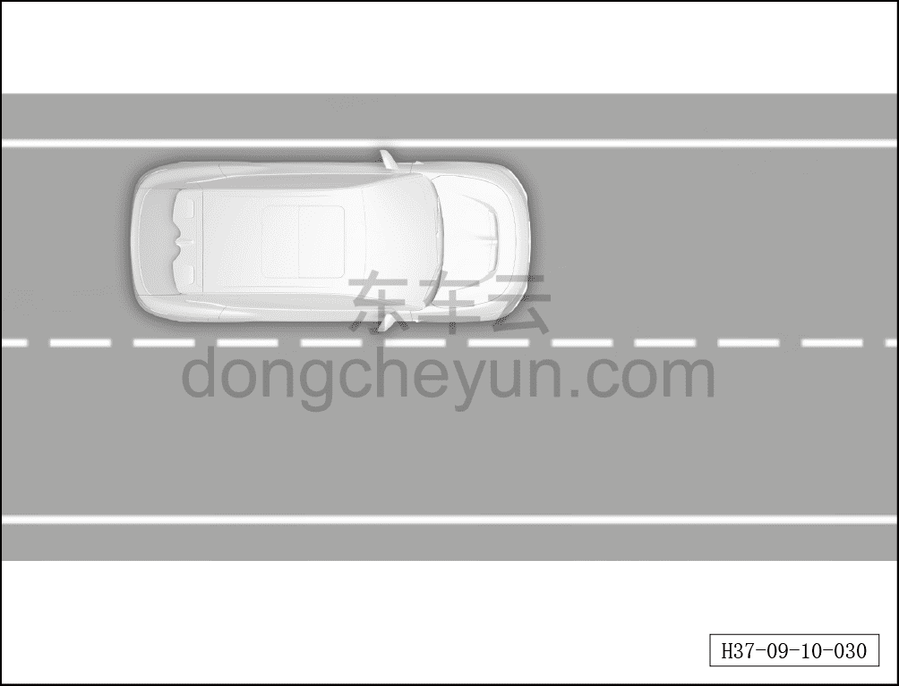
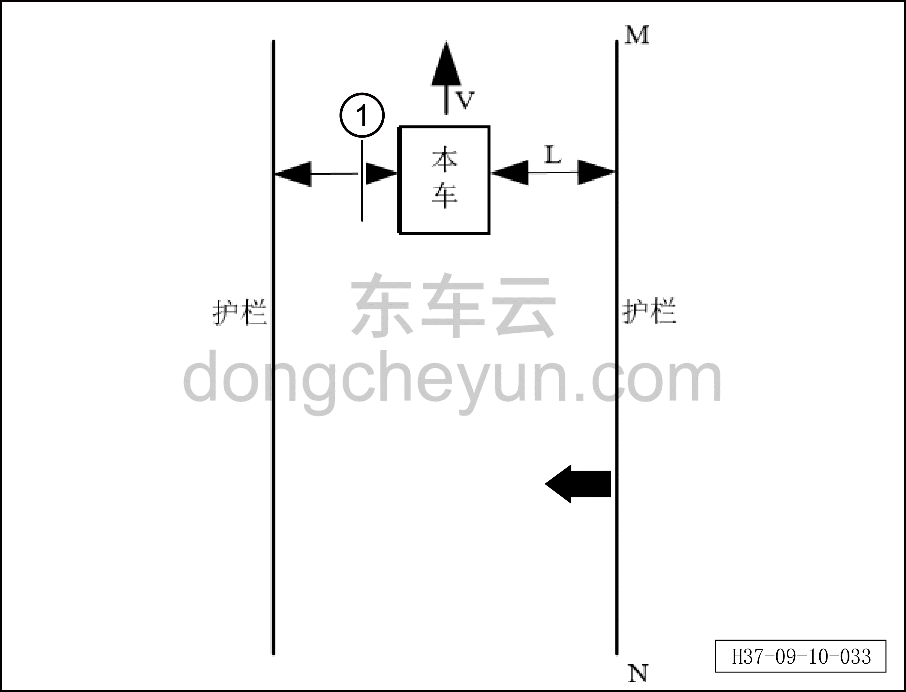

# Калибровка углового радара RCR_L

> Электрическая и электронная система › Система интеллектуального вождения › Расширенная помощь при вождении и парковке  
> Оригинал: `RCR_L角雷达标定` · [dongcheyun 56746](https://dongcheyun.com/p/56746), страница `556d417703784f9bab7144180b9fd356` · [оглавление](../README.md)

- Калибровка требуется в следующих случаях: 1. При замене неисправного датчика RCR_L; 2. При повреждении и замене кронштейна RCR_L.

**Требования к калибровке:**

- форма бампера автомобиля в норме и он установлен правильно;

- при взаимодействии автомобиля с радаром состояние сигнальных ламп на приборной панели, центральной консоли и зеркале заднего вида нормальное;

- при движении вдоль ограждения автомобиль должен двигаться по прямой (обычно радиус поворота ≥1500 м);

- на стороне, подлежащей калибровке, должно быть ограждение или другой сильно отражающий объект;

- боковое расстояние от радара до ограждения ≤3 м; если требуется калибровка обеих сторон одновременно, ширина полосы движения ≤8 м;

- суммарное время движения вдоль ограждения с одной стороны более 15 секунд (в зависимости от дороги и условий вождения);

- движение со скоростью ≥30 км/ч и ≤90 км/ч с постоянной скоростью по прямой дороге без значительных поворотов или уклонов;

- движение по ровному асфальтовому покрытию с малой кривизной;

- движение по дороге с повторяющимися неподвижными объектами (уличные фонари, ограждения и др.);

- движение в условиях отсутствия дождя и снега, по сухой дороге в хорошем состоянии.

**Оборудование для калибровки:**

Диагностический сканер

**Условия калибровки**

В процессе автоматической калибровки радар собирает информацию об ограждениях дороги и, статистически анализируя отклонение углов статических объектов по обеим сторонам дороги, оценивает отклонение угла установки и выполняет автоматическую калибровку. Условие запуска этой функции выполняется при скорости автомобиля 40 км/ч≤V≤55 км/ч при постоянной скорости и радиусе поворота ≥1500 м, после чего запускается автоматическая калибровка; обычно для завершения калибровки отклонения угла установки достаточно статистики по 30~100 объектам ограждения дороги.

Требуется движение автомобиля по прямому участку дороги со скоростью 40 км/ч≤V≤55 км/ч, длина ограждения на прямом участке MN>V*15 (м), расстояние от бортовой стороны кузова до ограждения 0,5 м≤L≤3 м. Общее время калибровки составляет около 15 с. Если площадка для калибровки соответствует указанным требованиям, оба радара можно калибровать одновременно; если ширина всей полосы движения слишком велика и не позволяет выполнить указанные требования, можно сначала выполнить автоматическую калибровку для одной стороны, соответствующей требованиям, а затем — для другой стороны.

Типовые рекомендуемые значения: V=40 км/ч, L=1,5 м, MN>V*15=166 м (время калибровки — 15 с, требуемую длину ограждения можно рассчитать по скорости автомобиля).

**Порядок калибровки**

С помощью диагностического сканера отдельно отправляются команды запуска послепродажной калибровки левого и правого радаров; ремонтник ведёт автомобиль, выполняя послепродажную калибровку при соблюдении вышеуказанных требований к калибровке, оборудованию и условиям.

Процесс калибровки следующий:

1. Автомобиль должен находиться во включённом состоянии зажигания; с помощью диагностического сканера запустите калибровку.

2. После запуска калибровки радар переходит в режим калибровки, индикатор наружного зеркала заднего вида начинает мигать с определённой частотой.

3. Ремонтник отсоединяет диагностический сканер, радар продолжает оставаться в режиме калибровки и выполняет калибровку, индикатор наружного зеркала заднего вида продолжает мигать с определённой частотой.

4. Когда скорость автомобиля ≥30 км/ч и ≤90 км/ч при постоянной скорости, автомобиль движется по прямой вдоль ограждения, расстояние от боковой стороны автомобиля до ограждения удерживается в пределах 0,5~3 м, время движения >15 с — если в этот момент калибровка успешна, происходит выход из режима калибровки, и индикатор зеркала заднего вида перестаёт мигать и гаснет.

5. Если время движения >15 секунд, а калибровка не завершена успешно, продолжайте движение до успешного завершения калибровки, после чего индикатор зеркала заднего вида перестаёт мигать и гаснет.

**Внимание:**

a. При скорости автомобиля <30 км/ч калибровка автоматически приостанавливается, но предыдущие данные калибровки сохраняются; после выполнения условий калибровки происходит автоматическая запись новых данных и продолжение калибровки.

b. Если в режиме калибровки калибровка не завершена, а автомобиль обесточен и выключен, радар записывает текущее состояние; при следующем запуске автомобиля он автоматически переходит в режим калибровки и продолжает калибровку с учётом предыдущего состояния.

c. Если происходит выключение и обесточивание, радар ведёт учёт числа случаев (отсчёт начинается с момента отправки Routine диагностическим сканером); если число случаев превышает 10, радар автоматически выходит из режима калибровки, и для повторного входа в режим калибровки требуется снова запустить калибровку с диагностического сканера.

d. Калибровка левого и правого радаров не влияет друг на друга, их можно калибровать как по отдельности, так и одновременно.

e. Если ширина между ограждениями по обеим сторонам полосы движения менее 8 м, автомобиль может двигаться ближе к середине дороги, и после движения в течение >15 секунд калибровка обеих сторон будет завершена.

f. Если ширина между ограждениями по обеим сторонам полосы движения более 8 м, то сначала автомобиль движется по прямой с расстоянием от левой стороны до левого ограждения 0,5~3 м; после движения в течение >15 секунд индикатор левого зеркала заднего вида перестаёт мигать и гаснет — калибровка левой стороны завершена. Затем автомобиль переезжает на правую сторону дороги и движется по прямой с расстоянием от правой стороны до правого ограждения 0,5~3 м; после движения в течение >15 с индикатор правого зеркала заднего вида перестаёт мигать и гаснет — калибровка правой стороны завершена.

**Результат калибровки**

После завершения калибровки радара результат калибровки передаётся на диагностический сканер:

1. Если отображается «калибровка успешна», калибровка завершена.

2. Если отображается «калибровка не удалась», необходимо провести диагностику по полученному результату и проверить, не превышает ли угол установки радара допустимый диапазон отклонения.

**Причины неудачной калибровки**

Если возникают следующие ситуации, автоматическая калибровка угла может завершиться неудачно:

| № | Результат калибровки | Возможная причина | Принимаемые меры |
|---|---|---|---|
| 01 | Не калибровано | Команда калибровки не отправлена | Повторно отправить команду калибровки |
| 02 | Калибровка вне допуска | Накопленная погрешность установки превышает диапазон | Проверить погрешность установки |
| 03 | Ограждение не обнаружено | 1. Радар не подключён к питанию должным образом, не работает;  2. Боковая сторона автомобиля слишком далеко от ограждения, ограждение не распознано;  3. На дороге калибровки присутствуют мешающие объекты. | 1. Проверьте подключение питания радара;  2. Проверьте процесс движения автомобиля; если боковая сторона автомобиля слишком далеко от ограждения, повторно выполните калибровку в соответствии с требованиями;  3. Проверьте наличие мешающих объектов на дороге и устраните их. |
| 04 | Недостаточное число калибровок | 1. Недостаточная эффективная длина обнаруженного ограждения;  2. Скорость автомобиля слишком высокая или слишком низкая, не накоплено достаточное число эффективных калибровок;  3. Автомобиль совершает значительные повороты | 1. Продолжить движение для выполнения калибровки;  2. Отрегулировать скорость автомобиля до установленного уровня;  3. Скорректировать режим вождения |
