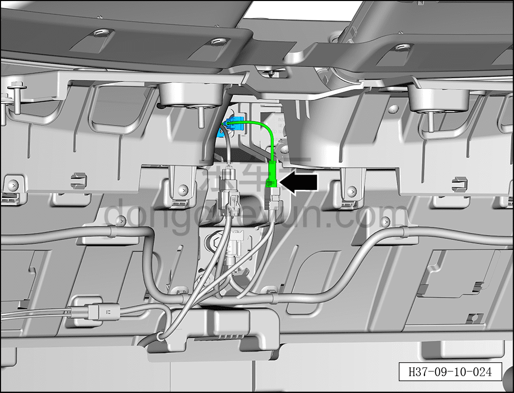
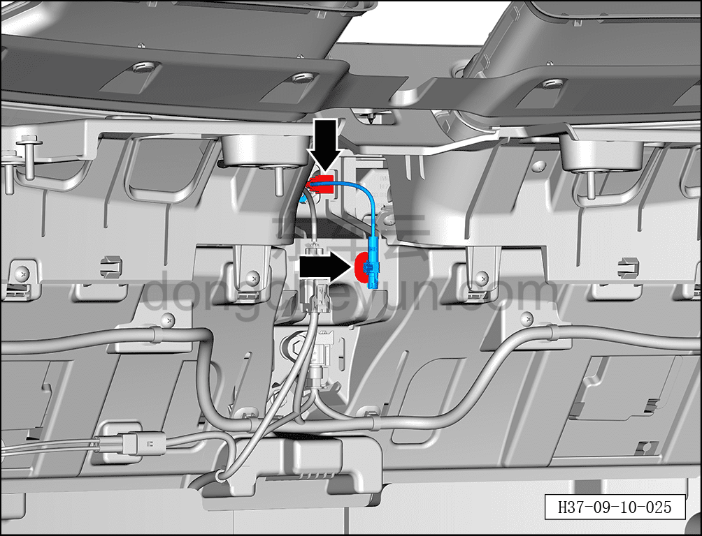
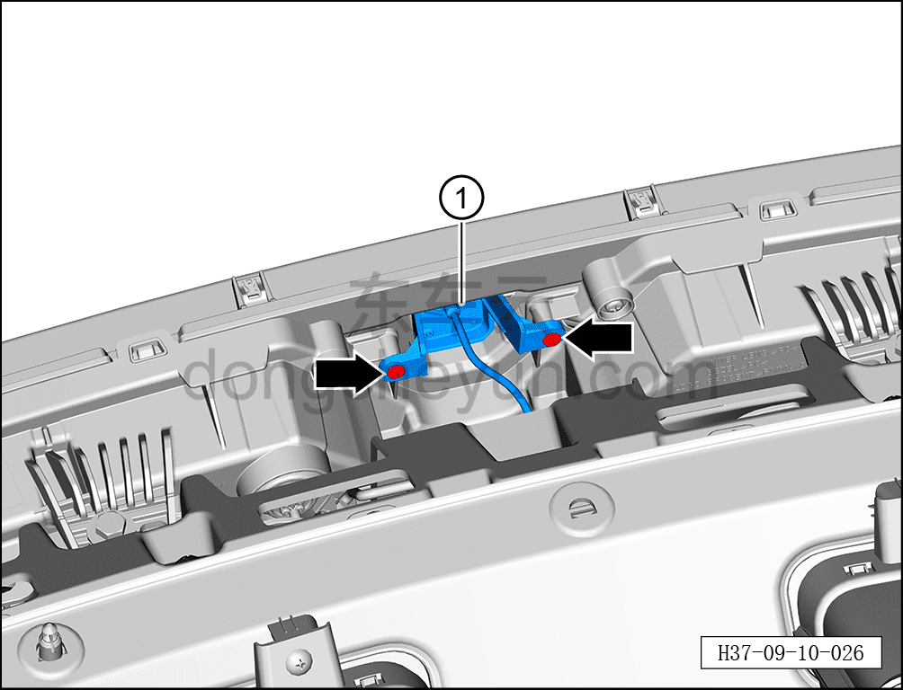

# Снятие и установка передней камеры кругового обзора

> Электрическая и электронная система › Система интеллектуального вождения › Помощь на основе видеонаблюдения  
> Оригинал: `拆卸与安装前环视摄像头` · [dongcheyun 56746](https://dongcheyun.com/p/56746), страница `07339ab40c19400a837130b545b74868` · [оглавление](../README.md)

**Порядок снятия**

1. Выключите все электроприборы, отключите питание.

2. Выполните обесточивание автомобиля для ремонта. См. [3.1.4.1 Обесточивание автомобиля](../03-техническое-обслуживание/005-обесточивание-автомобиля.md)

3. Снимите передний бампер в сборе. См. [8.6.3.3 Снятие и установка переднего бампера в сборе](../08-внутренняя-и-внешняя-отделка/163-снятие-и-установка-переднего-бампера-в-сборе.md)

4. Снятие передней камеры кругового обзора.

a. Отсоедините разъём передней камеры кругового обзора.

b. С помощью съёмника обивки отсоедините 2 фиксатора жгута проводов.

c. Крестовой отвёрткой выверните 2 крепёжных винта передней камеры кругового обзора.

Момент затяжки винта: 0,65±0,05 Н·м

d. Извлеките переднюю камеру кругового обзора ①.

**Порядок установки**

Установка выполняется в обратном порядке.

**Примечание:**

**-После завершения замены передней камеры кругового обзора необходимо выполнить калибровку. См. [9.10.4.5 Статическая калибровка камеры кругового обзора](107-статическая-калибровка-камеры-кругового-обзора.md)**
