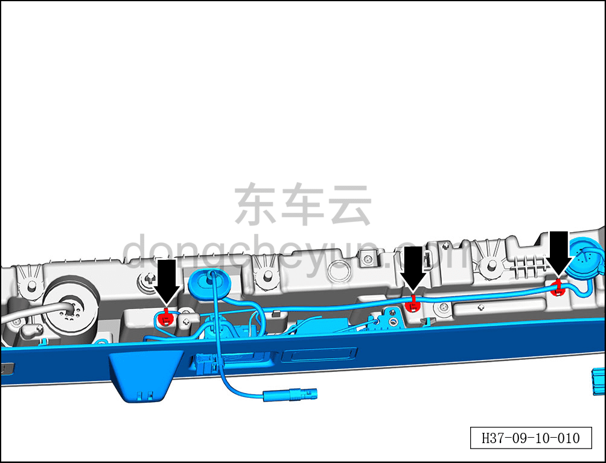
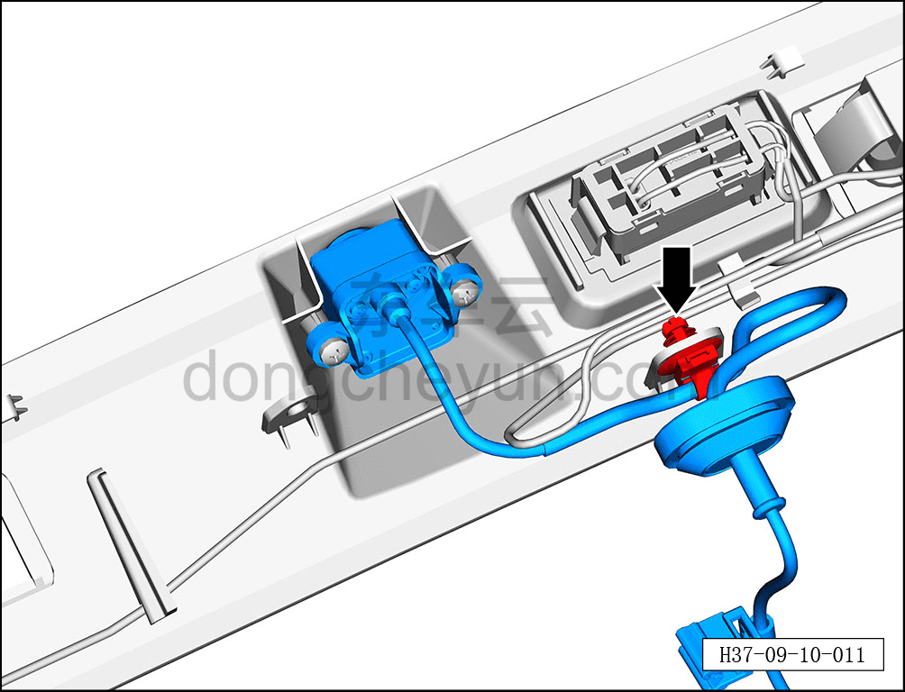
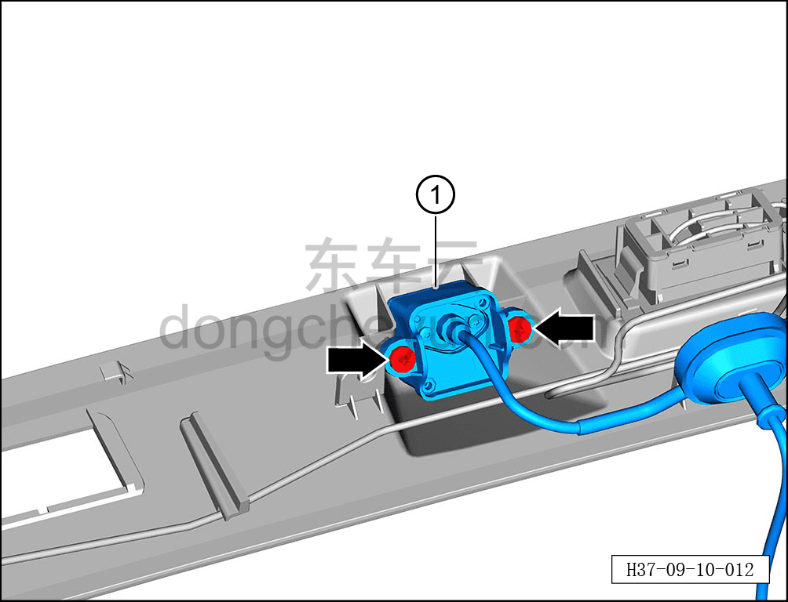

# Снятие и установка задней камеры кругового обзора

> Электрическая и электронная система › Система интеллектуального вождения › Помощь на основе видеонаблюдения  
> Оригинал: `拆卸与安装后环视摄像头` · [dongcheyun 56746](https://dongcheyun.com/p/56746), страница `3c17130554e840339678f8a31988ed87` · [оглавление](../README.md)

**Порядок снятия**

1. Выключите все электроприборы, отключите питание.

2. Выполните обесточивание автомобиля для ремонта. См. [3.1.4.1 Обесточивание автомобиля](../03-техническое-обслуживание/005-обесточивание-автомобиля.md)

3. Снимите подвижную сторону заднего комбинированного фонаря. См. [9.9.4.4 Снятие и установка подвижной стороны заднего комбинированного фонаря](081-снятие-и-установка-подвижной-стороны-заднего.md)

4. Снятие задней камеры кругового обзора.

a. С помощью биты T15 выверните 7 крепёжных винтов декоративной накладки подвижной стороны заднего комбинированного фонаря.

Момент затяжки винта: 3,5±0,5 Н·м

b. С помощью съёмника обивки отсоедините 3 фиксатора жгута проводов со стороны открывающейся части заднего комбинированного фонаря.

c. Извлеките декоративную накладку заднего комбинированного фонаря со стороны открывающейся части.

d. Отсоедините фиксатор жгута проводов задней камеры кругового обзора.

e. Крестовой отвёрткой выверните 2 крепёжных винта задней камеры кругового обзора.

Момент затяжки винта: 1,5±0,1 Н·м

f. Извлеките заднюю камеру кругового обзора ①.

**Порядок установки**

Установка выполняется в обратном порядке.

**Примечание:**

**-После завершения замены задней камеры кругового обзора необходимо выполнить калибровку. См. [9.10.4.5 Статическая калибровка камеры кругового обзора](107-статическая-калибровка-камеры-кругового-обзора.md)**
