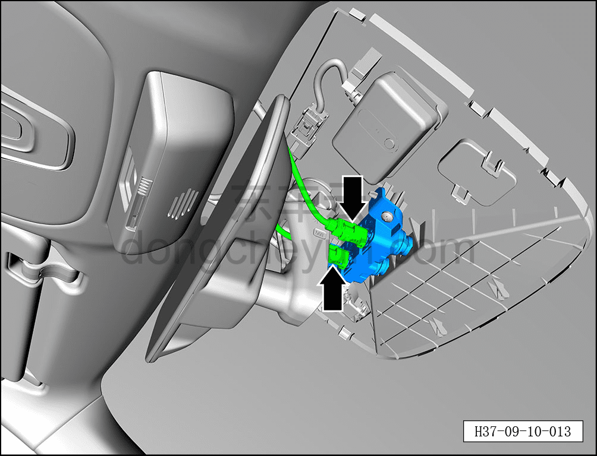
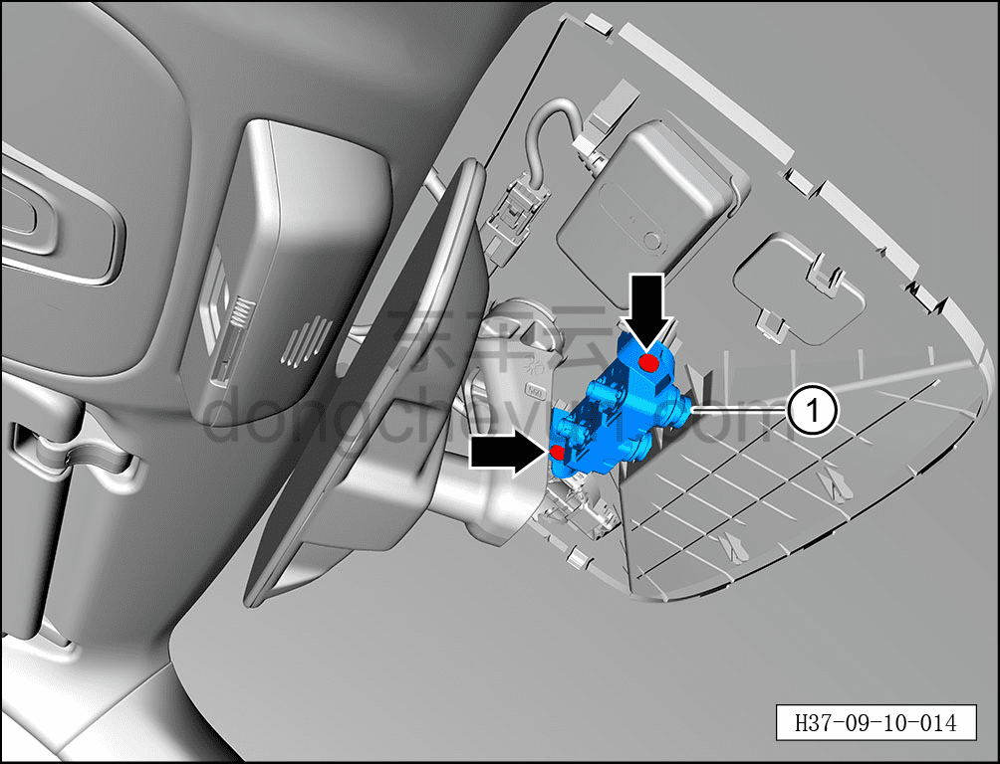

# Снятие и установка передней бинокулярной (стереоскопической) камеры

> Электрическая и электронная система › Система интеллектуального вождения › Помощь на основе видеонаблюдения  
> Оригинал: `拆卸与安装前视双目摄像头` · [dongcheyun 56746](https://dongcheyun.com/p/56746), страница `d85ed202f52a4d72b5bd56a153dbc11e` · [оглавление](../README.md)

**Порядок снятия**

1. Выключите все электроприборы, отключите питание.

2. Выполните обесточивание автомобиля для ремонта. См. [3.1.4.1 Обесточивание автомобиля](../03-техническое-обслуживание/005-обесточивание-автомобиля.md)

3. Снимите передний декоративный кожух внутреннего зеркала заднего вида. См. [8.6.8.7 Снятие и установка переднего декоративного кожуха внутреннего зеркала заднего вида](../08-внутренняя-и-внешняя-отделка/260-снятие-и-установка-переднего-декоративного-кожуха.md)

4. Снимите задний декоративный кожух внутреннего зеркала заднего вида. См. [8.6.8.8 Снятие и установка заднего декоративного кожуха внутреннего зеркала заднего вида](../08-внутренняя-и-внешняя-отделка/261-снятие-и-установка-заднего-декоративного-кожуха.md)

5. Снятие передней бинокулярной камеры в сборе.

a. Удерживая фиксатор разъёма, отсоедините 2 разъёма передней бинокулярной камеры в сборе.

b. Крестовой отвёрткой выверните 2 крепёжных винта передней бинокулярной камеры в сборе.

Момент затяжки винта: 1.5±0.5 Н·м

c. Извлеките переднюю бинокулярную камеру в сборе ①.

**Порядок установки**

Установка выполняется в обратном порядке.

**Примечание:**

**-После завершения замены передней бинокулярной камеры необходимо выполнить калибровку. См. [9.10.4.6 Динамическая калибровка передней бинокулярной камеры](108-динамическая-калибровка-передней-бинокулярной-камеры.md)**
