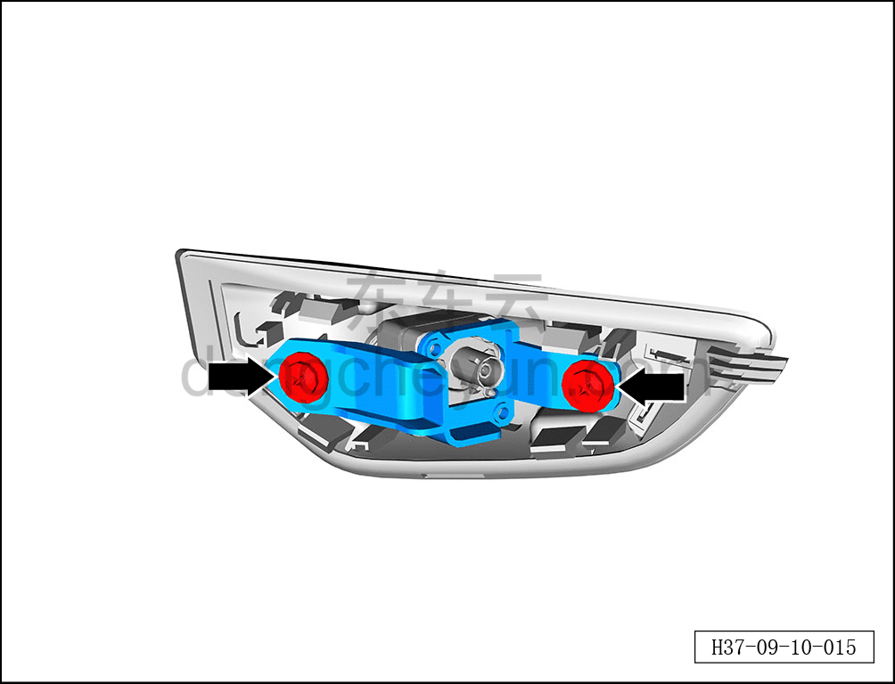
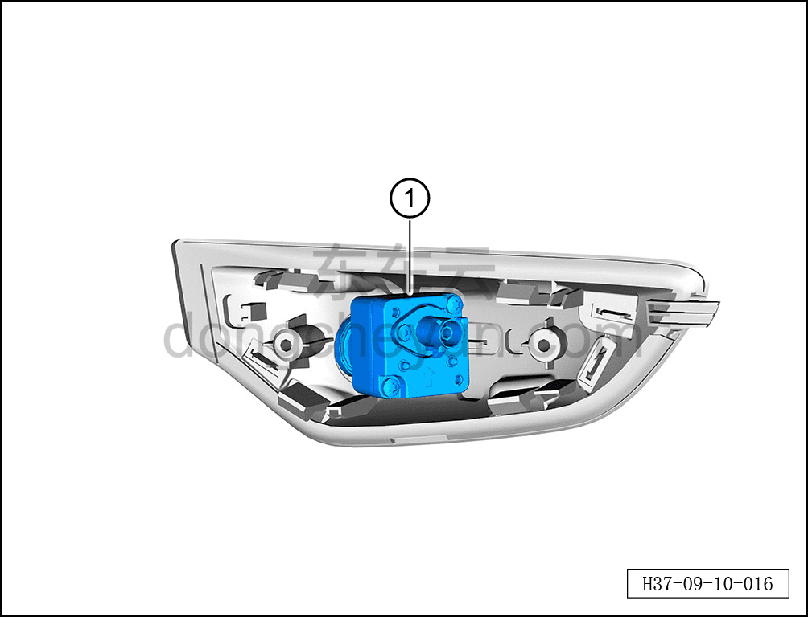

# Снятие и установка боковой камеры обзора

> Электрическая и электронная система › Система интеллектуального вождения › Помощь на основе видеонаблюдения  
> Оригинал: `拆卸与安装侧视摄像头` · [dongcheyun 56746](https://dongcheyun.com/p/56746), страница `b9625f1aea8d4a04928cc79c93dd152a` · [оглавление](../README.md)

**Порядок снятия**

**Примечание:**

**-Далее описаны снятие и установка левой задней боковой камеры обзора, для правой задней см. по аналогии с левой задней.**

1. Выключите все электроприборы, отключите питание.

2. Выполните обесточивание автомобиля для ремонта. См. [3.1.4.1 Обесточивание автомобиля](../03-техническое-обслуживание/005-обесточивание-автомобиля.md)

3. Снятие защитной панели камеры левого крыла в сборе. См. [8.6.6.16 Снятие и установка защитной панели камеры левого крыла](../08-внутренняя-и-внешняя-отделка/229-снятие-и-установка-защитной-накладки-камеры-левого.md)

4. Снятие левой задней боковой камеры обзора.

a. Крестовой отвёрткой выверните 2 крепёжных винта кронштейна левой задней боковой камеры обзора.

Момент затяжки винта: 0,8±0,1 Н·м

b. Извлеките левую заднюю боковую камеру обзора ①.

**Порядок установки**

Установка выполняется в обратном порядке.

**Примечание:**

**-После завершения замены левой задней боковой камеры обзора необходимо выполнить калибровку. См. [9.10.4.7 Статическая калибровка боковой камеры обзора](109-статическая-калибровка-боковой-камеры-обзора.md)**
