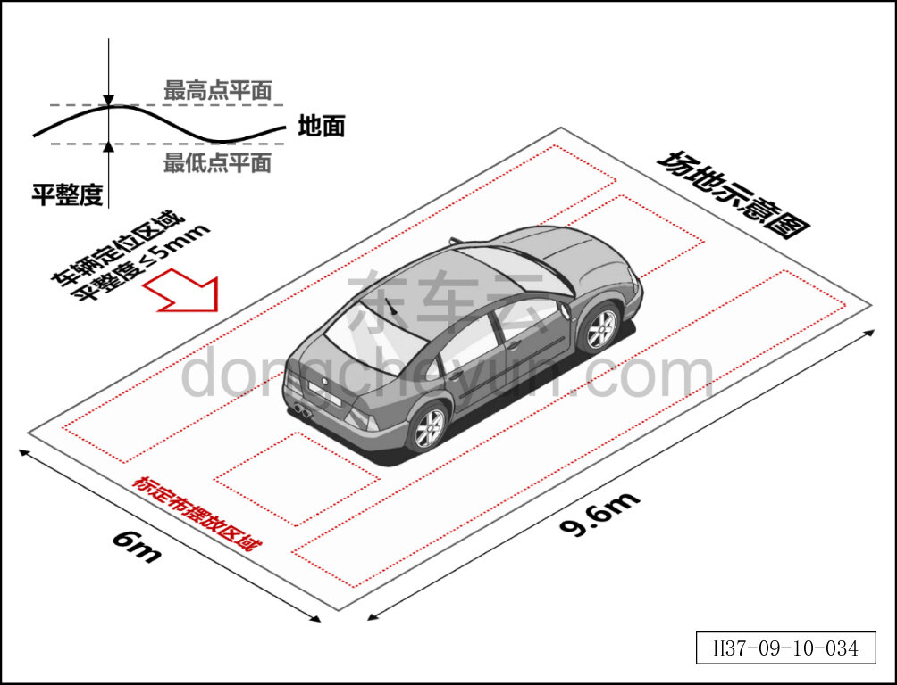
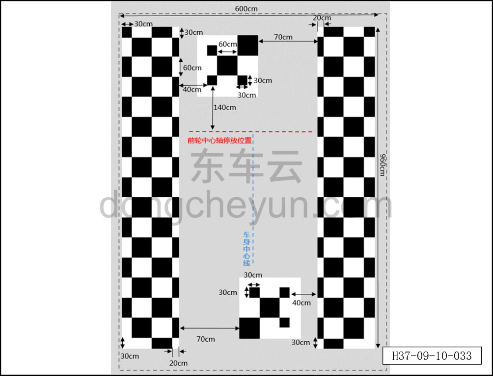

# Статическая калибровка камеры кругового обзора

> Электрическая и электронная система › Система интеллектуального вождения › Помощь на основе видеонаблюдения  
> Оригинал: `环视摄像头静态标定` · [dongcheyun 56746](https://dongcheyun.com/p/56746), страница `686a6f0fe02847febce427d64e78c572` · [оглавление](../README.md)

**Статическая калибровка камеры кругового обзора**

**1. Статическая послепродажная калибровка камеры требуется в следующих случаях**

a. При замене или повторной установке камеры и контроллера по любой причине, включая, но не ограничиваясь:

- замена после повреждения камеры или контроллера;

- замена после повреждения кузова в месте установки, повторная установка камеры или контроллера.

b. При изменении места установки или угла камеры по любой причине, включая, но не ограничиваясь:

- после сильного столкновения автомобиля;

- естественная деформация кронштейна камеры при многолетней эксплуатации.

**2. Для выполнения послепродажной калибровки необходимо подготовить следующие инструменты**

- диагностический сканер.

- калибровочное полотно.

- рулетка.

**3. Выбор места проведения послепродажной калибровки**

Как показано на рисунке, послепродажная калибровка должна проводиться на широкой ровной площадке, калибровочное полотно не размещается вокруг автомобиля; конкретные требования к месту следующие:

a. Для места калибровки рекомендуется помещение, без других препятствий на площадке;

b. Требования к размерам пространства: длина ≥9,6 м; ширина ≥6 м;

c. Отклонение от плоскости участка пола, на котором размещается калибровочный рисунок, ≤5 мм (абсолютная погрешность);

d. На площадке не должно быть других рисунков, похожих на калибровочный; e. При калибровке в помещении освещённость должна составлять 300~3000 лк, без встречного света; f. При калибровке на открытом воздухе не проводите послепродажную калибровку ночью или в плохую погоду; рекомендуется проводить её днём, в безветренную погоду, в облачную или ясную погоду, в направлении без встречного света.

**4. Требования к калибровочному рисунку**

Требования к изготовлению калибровочного рисунка следующие:

a. Размеры калибровочного рисунка показаны на рисунке выше, он состоит из чёрно-белых клеток;

b. Цвет калибровочного рисунка: белый номер N9.5, чёрный номер N1.5;

c. Поверхность калибровочного рисунка должна быть из матового материала с низкой отражающей способностью;

d. Материал калибровочного рисунка должен обладать определённой прочностью и упругостью, не должен легко повреждаться и деформироваться;

Требования к размещению калибровочного рисунка следующие:

a. Калибровочный рисунок должен быть точно расположен в соответствии с рисунком выше;

b. После размещения калибровочного рисунка убедитесь, что:

- полный рисунок калибровочного рисунка (чёрно-белые клетки) не закрыт.

- калибровочный рисунок расстелен по полу без перекручивания и складок.

- высота калибровочного рисунка совпадает с уровнем пола, на котором стоит автомобиль, не размещайте его на другой плоскости.

- калибровочный рисунок не подвержен воздействию ветра, которое могло бы сместить его или вызвать колебания.

**5. Порядок послепродажной калибровки**

Для выполнения послепродажной калибровки необходимо выполнить следующие действия: a. Установите подлежащий калибровке автомобиль на соответствующем участке; относительное положение калибровочного полотна и автомобиля должно соответствовать требованиям, точность по направлению X — +30 мм, по направлению Y — +10 мм;

b. Визуально проверьте состояние автомобиля по следующим требованиям: - давление в шинах в норме; - автомобиль без нагрузки; - состояние питания IGN ON, питание от батареи, автомобиль неподвижен, передача P; - капот, стеклоочистители, крышка багажника, двери и другие детали, которые могут повлиять на камеру, находятся в закрытом состоянии;

- фары, указатели поворота и другие элементы, влияющие на освещённость, выключены; - перед калибровкой необходимо завершить настройку всех параметров, соответствующих модели автомобиля.

c. Правильно разместите калибровочный рисунок вокруг автомобиля; d. Проверьте и убедитесь, что программное обеспечение диагностического сканера обновлено до последней версии;

e. Подключите диагностический сканер; f. Вручную нажмите кнопку запуска программы калибровки для перехода в режим автоматической калибровки; конкретные действия определяются интерфейсом диагностического сканера; g. От момента нажатия кнопки калибровки до отображения на верхнем компьютере сообщения об успешной калибровке калибровка камеры кругового обзора должна быть завершена в течение 60 с.
