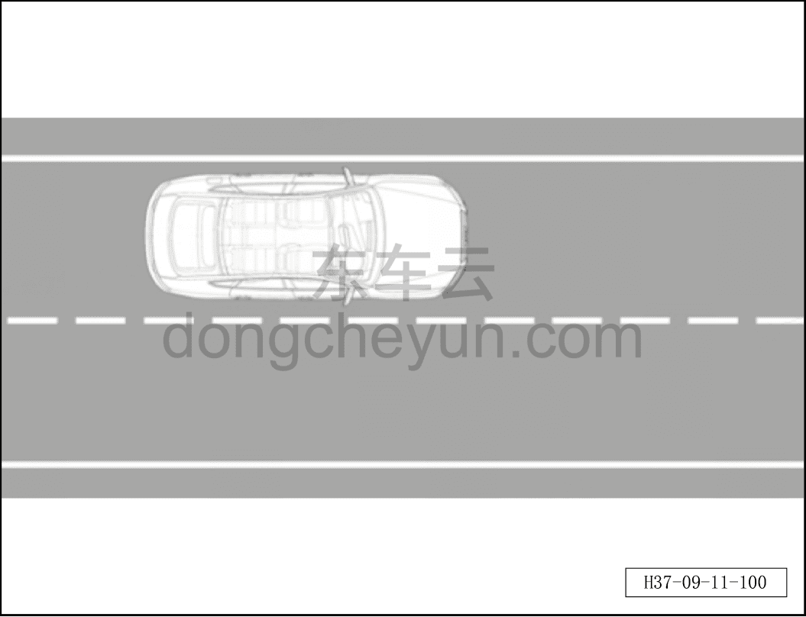

# Динамическая калибровка передней бинокулярной камеры

> Электрическая и электронная система › Система интеллектуального вождения › Помощь на основе видеонаблюдения  
> Оригинал: `前视双目摄像头动态标定` · [dongcheyun 56746](https://dongcheyun.com/p/56746), страница `a3dfd52cf12d49f9bdf793bb51a47ebf` · [оглавление](../README.md)

**Динамическая калибровка передней бинокулярной камеры**

**Внимание: широкоугольная и узкоугольная камеры передней бинокулярной камеры должны проходить послепродажную калибровку одновременно.**

**1. Динамическая послепродажная калибровка камеры требуется в следующих случаях:**

a. При замене или повторной установке камеры и контроллера по любой причине, включая, но не ограничиваясь:

- замена после повреждения камеры или контроллера;

- замена после повреждения кузова в месте установки, повторная установка камеры или контроллера.

b. При изменении места установки или угла камеры по любой причине, включая, но не ограничиваясь:

- после сильного столкновения автомобиля;

- естественная деформация кронштейна камеры при многолетней эксплуатации.

**2. Для выполнения послепродажной калибровки необходимо подготовить следующие инструменты:**

- диагностический сканер.

**3. Требования к калибровке**

3.1 Требования к полосе движения при динамической калибровке

a. Ширина полосы движения: стандартная ширина полосы согласно государственному стандарту, рекомендуется 3,5~3,8 м.

b. Длина полосы движения: доля прямого участка не менее 90%, общая длина не менее 800 м.

c. Регулярность полосы: дорога прямая и ровная, без заметных ухабов, наклонов и других проблем.

d. Чистота полосы: на дороге нет проблем со скольжением, скоплением воды, отражением света, затенением деревьями и др.

e. Количество полос: рекомендуется не менее трёх полос в одном направлении, автомобиль движется по средней полосе; на чистой прямой дороге для калибровки может подойти и одна полоса.

3.2 Требования к вождению при динамической калибровке

a. Скорость: рекомендуется скорость ≥30 км/ч; во время движения не выполняйте частые резкие ускорения или торможения; допускается кратковременная остановка автомобиля, при этом кузов должен быть по возможности параллелен линии полосы.

b. Прямолинейное движение: двигайтесь по прямой, обеспечивая параллельность кузова линии полосы; допускаются кратковременные остановки/повороты/развороты/проезд перекрёстков, допускается повторное движение по одной и той же дороге.

c. Движение по центру: обеспечьте движение по центру полосы, расстояние от кузова до левой и правой линий полосы должно быть по возможности равным.

d. Окружающие транспортные средства: в радиусе 20 м впереди и сзади по своей полосе не должно быть других участников движения — пешеходов, немоторизованных и моторизованных транспортных средств; доля пробега с сопровождающим транспортным средством от общего пробега калибровки должна быть по возможности не более 5%.

**4. Проверка автомобиля перед калибровкой**

a. Давление в шинах в норме, автомобиль остановлен у края дороги, передача P;

b. Состояние питания IGN ON, питание от батареи в норме;

c. Капот, стеклоочистители, крышка багажника, двери и другие детали находятся в закрытом состоянии;

d. Перед калибровкой необходимо завершить настройку всех параметров, соответствующих модели автомобиля.

**5. Выбор места проведения послепродажной калибровки:**

- динамическая калибровка должна проводиться в определённых условиях для повышения вероятности успешной калибровки и обеспечения точности её результата; условия проведения динамической калибровки должны соответствовать следующим требованиям:

① Дорожное покрытие

a. Дорожное покрытие в целом ровное, без заметных подъёмов и спусков;

b. По возможности избегайте маршрутов с поворотами (радиус поворота не менее 300 м).

② Линии полосы движения

a. На дороге должны быть две или более параллельных линий полосы движения;

b. Линии полосы чёткие и целые, без загрязнений, закрытий или истёртых краёв; могут быть белого или жёлтого цвета, сплошными или прерывистыми; не рекомендуется выбирать полосу с двойной жёлтой линией;

c. Ширина полосы 3~3,75 м, ширина линии полосы 10~15 см;

d. По возможности избегайте появления в поле обзора камеры непараллельных линий полосы.

③ Режим движения

a. Наилучший результат достигается при движении автомобиля параллельно линиям полосы по её центру;

b. Скорость ≥30 км/ч, по возможности равномерное прямолинейное движение;

c. По возможности двигайтесь прямо, избегая перестроений и движения по S-образной траектории.

④ Дорожная обстановка

a. Выбирайте время и участок дороги с меньшим количеством транспортных средств, пешеходов и других участников движения;

b. По возможности уменьшите количество транспортных средств, попадающих в кадр во время калибровки;

c. При запуске калибровки камеры (и при соблюдении условия по скорости) в пределах 50 м прямо перед автомобилем не должно быть других транспортных средств.

⑤ Условия окружающей среды

a. Рекомендуется проводить динамическую калибровку днём, в облачную, пасмурную или ясную погоду, без встречного света;

b. По возможности не выбирайте дорожную обстановку с большим количеством теней на покрытии в солнечную погоду;

c. Запрещается проводить динамическую калибровку ночью или в плохую погоду (дождь, снег, туман и др.).

**6. Порядок выполнения динамической калибровки:**

- для выполнения динамической калибровки необходимо выполнить следующие действия:

① Доставьте подлежащий калибровке автомобиль в начальную точку калибровочной дороги и подключите соответствующее оборудование (диагностический сканер);

② Включите диагностический сканер и запустите программу динамической калибровки;

③ Ведите автомобиль по возможности равномерно и прямо, скорость должна поддерживаться на уровне ≥30 км/ч; если скорость не соответствует требованию, программа калибровки автоматически приостанавливается, а при повторном достижении требуемой скорости продолжает работу, что может соответственно увеличить время калибровки; если линии полосы не соответствуют требованиям калибровки, калибровка завершается неудачно.

**Примечание:**

**Динамическая калибровка передней бинокулярной камеры обычно завершается примерно за 5 минут; при превышении времени будет выдан результат «калибровка не удалась»; при неудачной калибровке проверьте условия динамической калибровки и состояние автомобиля.**
