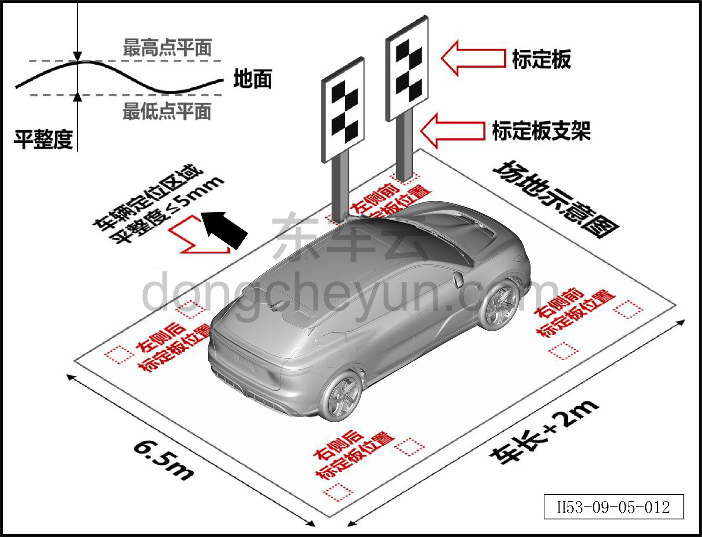
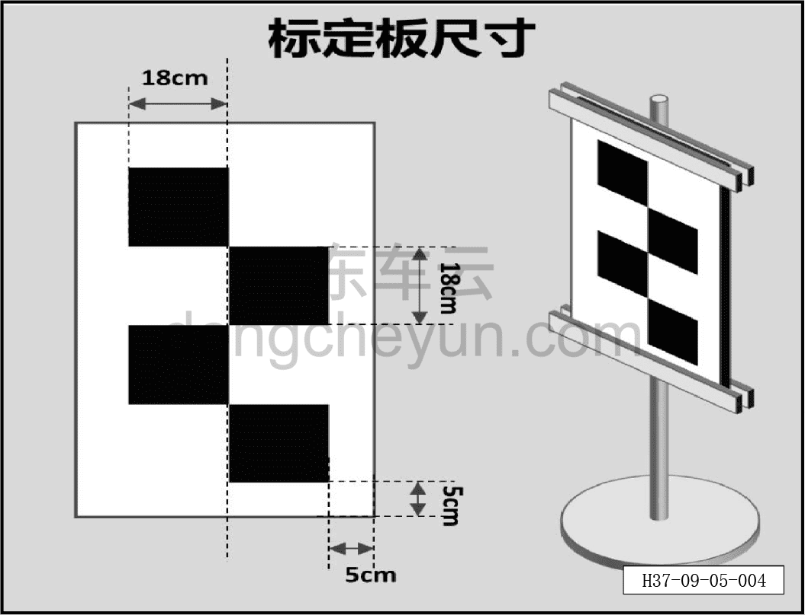
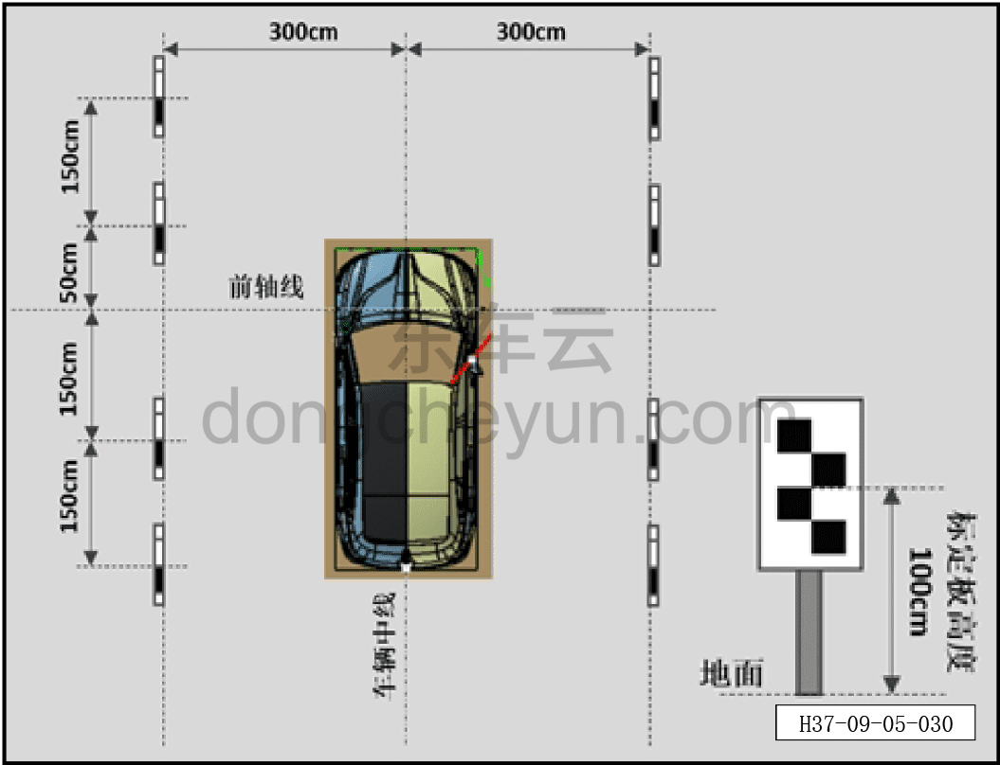
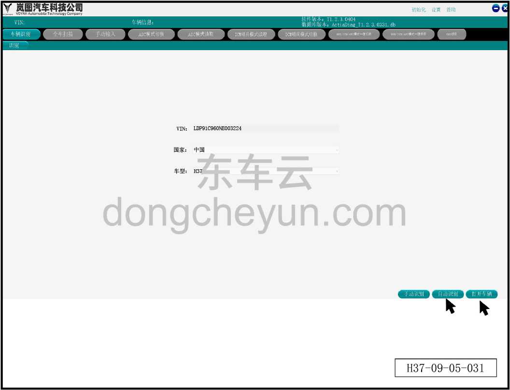
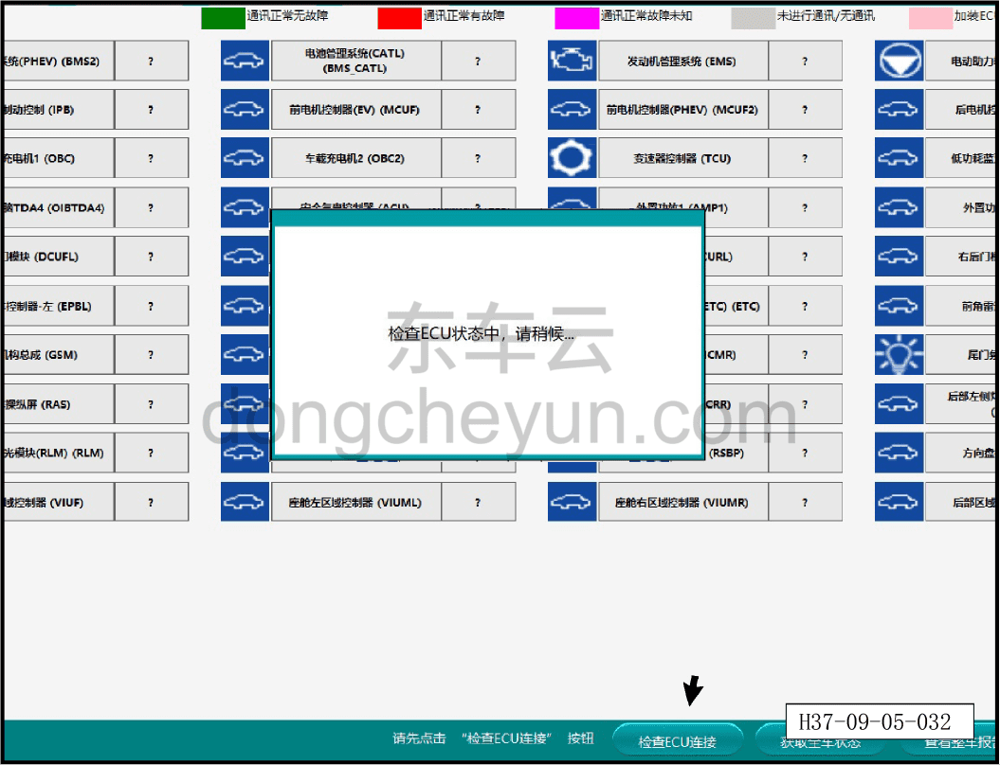
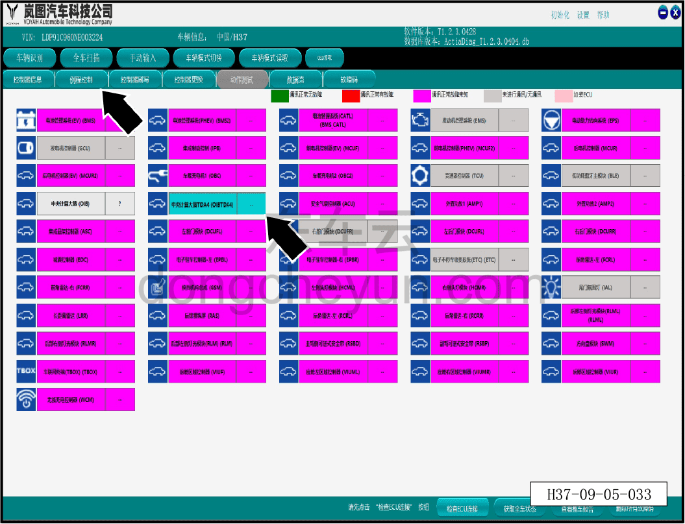
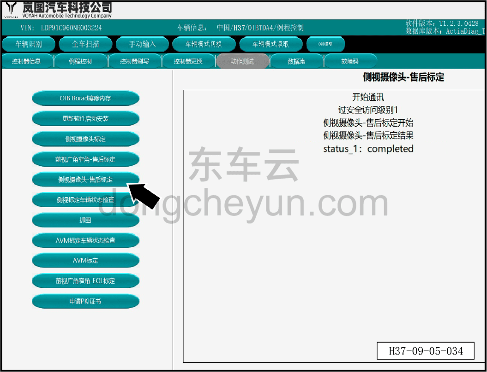

# Статическая калибровка боковой камеры обзора

> Электрическая и электронная система › Система интеллектуального вождения › Помощь на основе видеонаблюдения  
> Оригинал: `侧视摄像头静态标定` · [dongcheyun 56746](https://dongcheyun.com/p/56746), страница `6b1bba8feade4f698c4889bf98ba33a6` · [оглавление](../README.md)

**1. Статическая послепродажная калибровка камеры требуется в следующих случаях: **

a. При замене или повторной установке камеры или контроллера по любой причине, включая, но не ограничиваясь:

- замена после повреждения камеры или контроллера;

- замена после повреждения кузова в месте установки, повторная установка камеры или контроллера.

b. При изменении места установки или угла камеры по любой причине, включая, но не ограничиваясь:

- после сильного столкновения автомобиля;

- естественная деформация кронштейна камеры при многолетней эксплуатации.

**2. Для выполнения послепродажной калибровки необходимо подготовить следующие инструменты:**

- удалённый диагностический сканер (последняя версия ПО), калибровочная панель ×8, кронштейн ×8, рулетка ×5; послепродажная калибровка должна проводиться на широкой ровной площадке.

**3. Конкретные требования к месту следующие:**

- для места калибровки рекомендуется помещение, без других препятствий на площадке;

- требования к размерам пространства: длина ≥ длина автомобиля +2 м; ширина ≥6,5 м;

- отклонение от плоскости участка пола, на котором размещается калибровочный рисунок, ≤5 мм (абсолютная погрешность);

- на площадке не должно быть других рисунков, похожих на калибровочный;

- при калибровке в помещении освещённость должна составлять 300~3000 лк, без встречного света;

- при калибровке на открытом воздухе не проводите послепродажную калибровку ночью или в плохую погоду; рекомендуется проводить её днём, в безветренную погоду, в облачную или ясную погоду, в направлении без встречного света.

**4. При послепродажной калибровке автомобиль должен соответствовать следующим условиям:**

- на водительском сиденье находится водитель или эквивалентный груз;

- состояние питания IGN ON, питание от батареи, автомобиль неподвижен, передача P;

- давление в шинах в норме;

- капот, стеклоочистители и другие детали, которые могут закрыть камеру, находятся в закрытом состоянии;

- фары, указатели поворота и другие элементы, влияющие на освещённость, выключены.

**5. Требования к калибровочной панели:**

a. Требования к изготовлению калибровочной панели следующие:

- размеры калибровочной панели показаны на рисунке, она состоит из чёрно-белых клеток 2×4 с белой рамкой по краям;

- цвет калибровочной панели: белый номер N9.5, чёрный номер N1.5;

- требование к плоскостности калибровочной панели: отклонение от плоскости ≤3 мм;

- поверхность калибровочной панели должна быть из матового материала с низкой отражающей способностью;

- материал калибровочной панели должен обладать определённой прочностью и упругостью, не должен легко деформироваться и ломаться.

b. Требования к размещению калибровочной панели следующие:

- калибровочная панель должна быть закреплена на удобном для перемещения кронштейне;

- кронштейн должен быть рассчитан на длительное использование, устойчив к деформации и коррозии.

- кронштейн, фиксирующий калибровочную панель, должен обеспечивать:

- полный рисунок калибровочной панели (чёрно-белые клетки) не закрыт;

- плоскость калибровочной панели перпендикулярна поверхности пола;

- положение калибровочной панели относительно кронштейна не меняется;

- калибровочная панель не раскачивается.

**6. Порядок действий:**

a. Установите подлежащий калибровке автомобиль на соответствующем участке;

b. Как показано на рисунке, найдите центральную линию передней оси и, используя рулетку (при наличии условий можно использовать лазерный уровень в качестве вспомогательного средства) как измерительный инструмент, разместите все калибровочные панели в указанных местах;

c. С помощью диагностического сканера запустите программу послепродажной калибровки;

d. Нажмите «Калибровка боковой камеры обзора» и дождитесь результата калибровки «успешно»;

e. Обесточьте автомобиль (перезапустите контроллер для обновления данных), отсоедините соответствующее оборудование;

f. Калибровка завершена.

**Внимание:**

**- При калибровке необходимо обеспечить:**

**a. Высота центра всех калибровочных панелей от поверхности пола одинакова, погрешность ≤±5 мм;**

**b. Калибровочная панель обращена к боковой стороне автомобиля и параллельна направлению его движения;**

**c. Погрешность размещения калибровочной панели по направлениям вперёд-назад и влево-вправо при каждой установке ≤±20 мм;**

**d. В процессе калибровки камера (автомобиль) и калибровочная панель остаются неподвижными. **

**7. Порядок действий: **

① Нажмите кнопку «Автоматическое распознавание», чтобы получить информацию о VIN/стране/модели и т. д., затем нажмите кнопку «Открыть автомобиль» для перехода на главный экран диагностики.

② Нажмите кнопку «Проверить ЭБУ», чтобы убедиться в подключении каждого блока управления ЭБУ.

③ Нажмите кнопку «Центральный вычислительный блок TDA4 (OIBTDA4)», затем нажмите кнопку «Управление процедурами».

④ Нажмите кнопку «Калибровка боковой камеры обзора» — появится изображение, показывающее завершение проверки.
