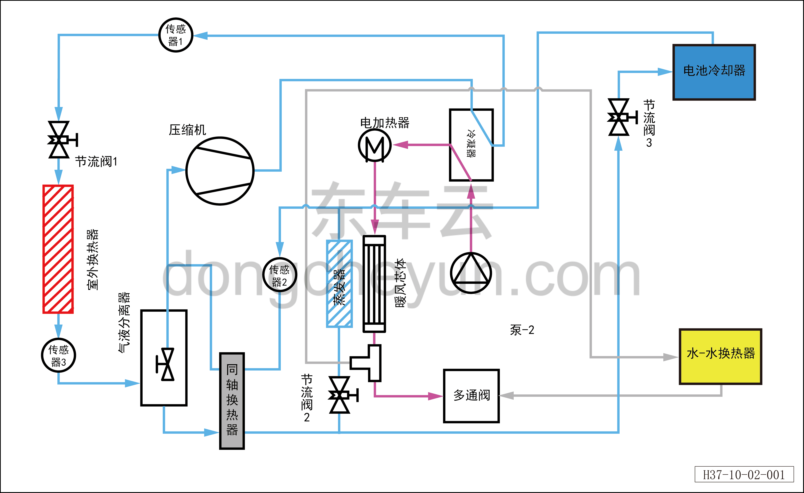

# Принцип работы системы

> Кондиционер › Система охлаждения (кондиционирования)  
> Оригинал: `系统工作原理` · [dongcheyun 56746](https://dongcheyun.com/p/56746), страница `5786f278104b4d77ab7f3fa1a6d5ff6c` · [оглавление](../README.md)

**Принцип охлаждения кондиционера** – Хладагент в газообразном состоянии с низкой температурой и низким давлением сжимается компрессором и превращается в газ с высокой температурой и высоким давлением, затем охлаждается наружным теплообменником (конденсатором) до жидкого состояния со средней температурой и высоким давлением; в этом процессе дроссельный клапан 1 не выполняет дросселирование. Жидкий хладагент со средней температурой и высоким давлением после дросселирования дроссельным клапаном 2 превращается в парожидкостную смесь с низкой температурой и низким давлением, поступает в испаритель, где испаряется в газ, охлаждая проходящий через испаритель и поступающий в салон воздух, тем самым снижая температуру в салоне. Газообразный хладагент с низкой температурой и низким давлением, прошедший испаритель, поступает в компрессор и снова сжимается — цикл повторяется, обеспечивая непрерывное охлаждение.

**Принцип охлаждения батареи** – Хладагент в газообразном состоянии с низкой температурой и низким давлением сжимается компрессором и превращается в газ с высокой температурой и высоким давлением, затем охлаждается наружным теплообменником (конденсатором) до жидкого состояния со средней температурой и высоким давлением; в этом процессе дроссельный клапан 1 не выполняет дросселирование. Жидкий хладагент со средней температурой и высоким давлением после дросселирования дроссельным клапаном 3 превращается в парожидкостную смесь с низкой температурой и низким давлением, поступает в охладитель батареи, где испаряется в газ и одновременно охлаждает проходящую через охладитель батареи охлаждающую жидкость; охлаждённая охлаждающая жидкость с низкой температурой охлаждает батарею. Газообразный хладагент с низкой температурой и низким давлением, прошедший охладитель батареи, поступает в компрессор и снова сжимается — цикл повторяется, обеспечивая непрерывное охлаждение.

**Принцип одновременного охлаждения кондиционера и батареи** – Хладагент в газообразном состоянии с низкой температурой и низким давлением сжимается компрессором и превращается в газ с высокой температурой и высоким давлением, затем охлаждается наружным теплообменником (конденсатором) до жидкого состояния со средней температурой и высоким давлением; в этом процессе дроссельный клапан 1 не выполняет дросселирование. Жидкий хладагент со средней температурой и высоким давлением после дросселирования дроссельным клапаном 3 превращается в парожидкостную смесь с низкой температурой и низким давлением, поступает в охладитель батареи, где испаряется в газ и одновременно охлаждает проходящую через охладитель батареи охлаждающую жидкость; охлаждённая охлаждающая жидкость с низкой температурой охлаждает батарею. Газообразный хладагент с низкой температурой и низким давлением, прошедший охладитель батареи, поступает в компрессор и снова сжимается — цикл повторяется, обеспечивая непрерывное охлаждение.

**Принцип обогрева тепловым насосом** – Хладагент в газообразном состоянии с низкой температурой и низким давлением сжимается компрессором и превращается в газ с высокой температурой и высоким давлением, затем охлаждается конденсатором до жидкого состояния со средней температурой и высоким давлением. В этом процессе охлаждающая жидкость, проходящая через конденсатор, нагревается и поступает к сердцевине отопителя, нагревая поступающий в салон воздух. Жидкий хладагент со средней температурой и высоким давлением после дросселирования дроссельным клапаном 1 превращается в парожидкостную смесь с низкой температурой и низким давлением, поступает в наружный теплообменник (испаритель), где испаряется, поглощая тепло, и превращается в газообразный хладагент с низкой температурой, который через газожидкостный разделитель возвращается в компрессор. Цикл повторяется, обеспечивая непрерывный обогрев.

**Принцип обогрева батареи** – Хладагент в газообразном состоянии с низкой температурой и низким давлением сжимается компрессором и превращается в газ с высокой температурой и высоким давлением, затем охлаждается конденсатором до жидкого состояния со средней температурой и высоким давлением. В этом процессе охлаждающая жидкость, проходящая через конденсатор, нагревается и поступает к теплообменнику «жидкость-жидкость», нагревая охлаждающую жидкость батареи; нагретая охлаждающая жидкость батареи нагревает батарею (в этом процессе может включаться дополнительный подогрев PTC). Жидкий хладагент со средней температурой и высоким давлением после дросселирования дроссельным клапаном 1 превращается в парожидкостную смесь с низкой температурой и низким давлением, поступает в наружный теплообменник (испаритель), где испаряется, поглощая тепло, и превращается в газообразный хладагент с низкой температурой, который через газожидкостный разделитель возвращается в компрессор. Цикл повторяется, обеспечивая непрерывный обогрев.

**Принцип одновременного обогрева батареи и обогрева тепловым насосом** – Хладагент в газообразном состоянии с низкой температурой и низким давлением сжимается компрессором и превращается в газ с высокой температурой и высоким давлением, затем охлаждается конденсатором до жидкого состояния со средней температурой и высоким давлением. Охлаждающая жидкость, проходящая через конденсатор, нагревается и поступает к сердцевине отопителя и теплообменнику «жидкость-жидкость», нагревая воздух, проходящий через сердцевину отопителя, и охлаждающую жидкость батареи, проходящую через теплообменник «жидкость-жидкость»; нагретый воздух обогревает салон, а охлаждающая жидкость батареи нагревает батарею (в этом процессе может включаться дополнительный подогрев PTC). Жидкий хладагент со средней температурой и высоким давлением после дросселирования дроссельным клапаном 1 превращается в парожидкостную смесь с низкой температурой и низким давлением, поступает в наружный теплообменник (испаритель), где испаряется, поглощая тепло, и превращается в газообразный хладагент с низкой температурой, который через газожидкостный разделитель возвращается в компрессор. Цикл повторяется, обеспечивая непрерывный обогрев.
