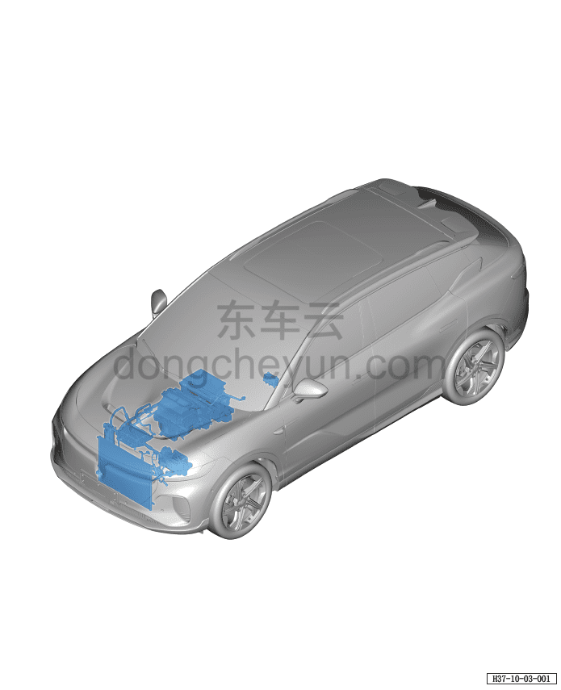

# Расположение компонентов системы кондиционирования (версия RWD)

> Кондиционер › Система охлаждения (кондиционирования) › Расположение компонентов системы кондиционирования  
> Оригинал: `空调系统位置图(两驱车型)` · [dongcheyun 56746](https://dongcheyun.com/p/56746), страница `c2cce21b451242e48a60042d6bce30f6` · [оглавление](../README.md)

