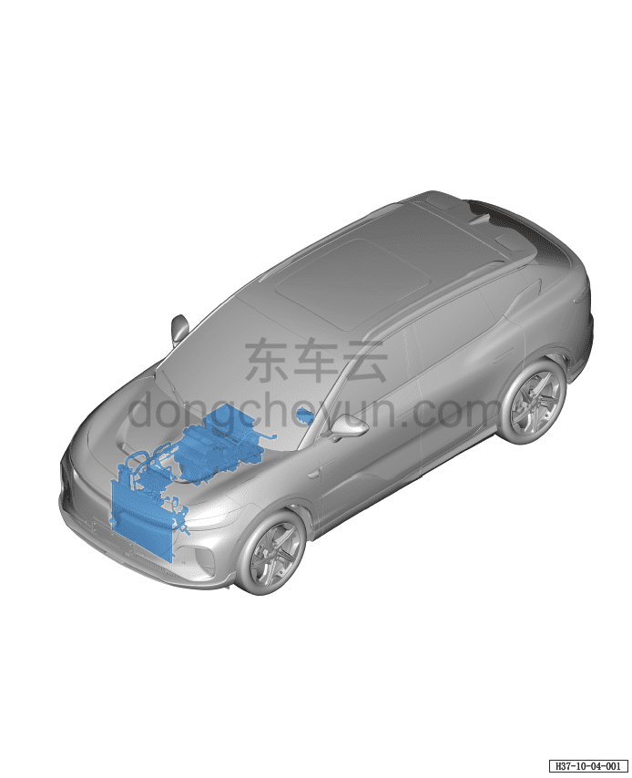

# Расположение компонентов системы кондиционирования (версия AWD)

> Кондиционер › Система охлаждения (кондиционирования) › Расположение компонентов системы кондиционирования  
> Оригинал: `空调系统位置图(四驱车型)` · [dongcheyun 56746](https://dongcheyun.com/p/56746), страница `d7a10a225d3c4fdf8a13262832a4d0e1` · [оглавление](../README.md)

