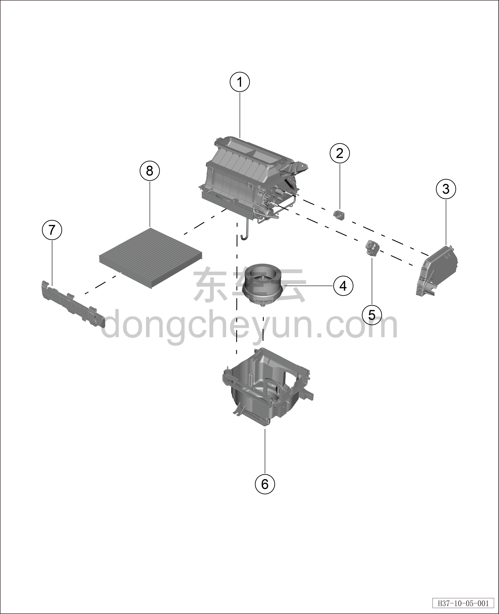

# Покомпонентный вид переднего блока вентилятора HVAC в сборе

> Кондиционер › Система охлаждения (кондиционирования) › Покомпонентный вид (деталировка)  
> Оригинал: `前HVAC鼓风机总成分解图` · [dongcheyun 56746](https://dongcheyun.com/p/56746), страница `62fea12b1ea04e2e87a0c148fc99ceb3` · [оглавление](../README.md)

| № | Наименование детали | Кол-во на автомобиль | Примечание |
|---|---|---|---|
| 1 | Верхний корпус переднего вентилятора HVAC | 1 | В моторном отсеке |
| 2 | Датчик качества воздуха | 1 |   |
| 3 | Боковой защитный кожух переднего вентилятора HVAC | 1 |   |
| 4 | Вентилятор (нагнетатель) | 1 |   |
| 5 | Электродвигатель заслонки забора воздуха | 1 |   |
| 6 | Нижний корпус переднего вентилятора HVAC | 1 |   |
| 7 | Крышка салонного фильтра | 1 |   |
| 8 | Салонный фильтр | 1 |   |
