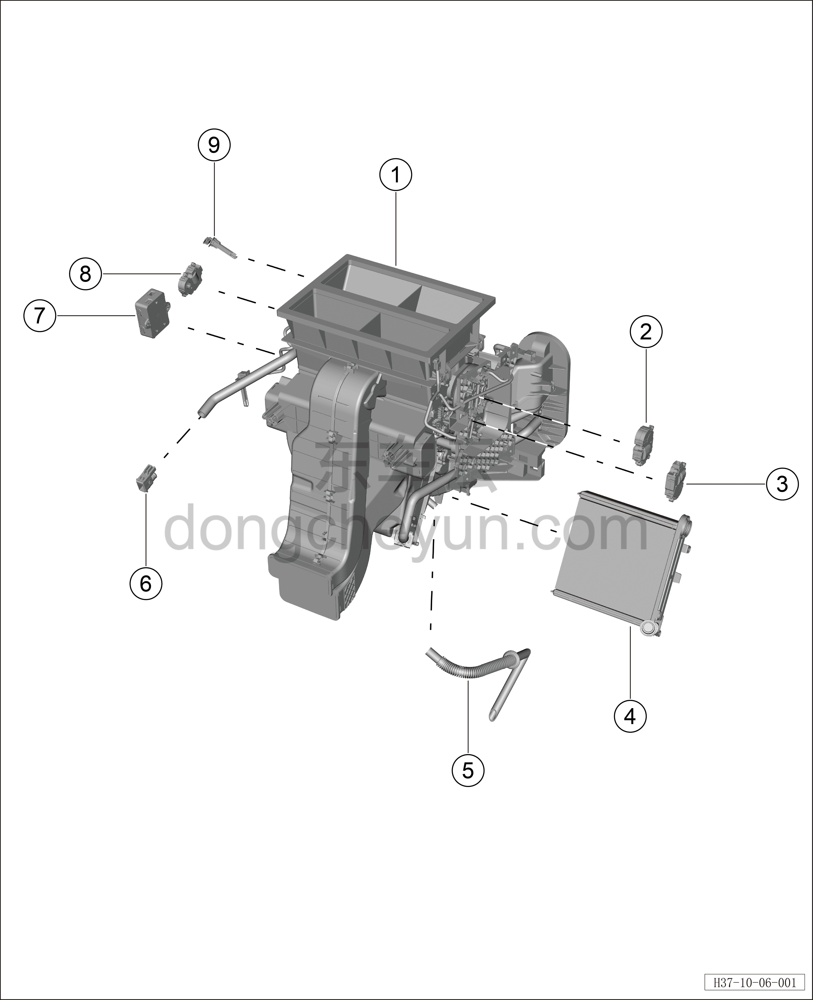

# Покомпонентный вид переднего распределителя HVAC в сборе

> Кондиционер › Система охлаждения (кондиционирования) › Покомпонентный вид (деталировка)  
> Оригинал: `前HVAC分发器总成分解图` · [dongcheyun 56746](https://dongcheyun.com/p/56746), страница `c769e02e27f4425180472712200ad46f` · [оглавление](../README.md)

| № | Наименование детали | Кол-во на автомобиль | Примечание |
|---|---|---|---|
| 1 | Передний распределитель HVAC в сборе | 1 | В салоне |
| 2 | Электродвигатель заслонки режима | 1 |   |
| 3 | Правый электродвигатель заслонки смешения | 1 |   |
| 4 | Теплообменник отопителя | 1 |   |
| 5 | Водяная трубка кондиционера | 1 |   |
| 6 | Датчик температуры в салоне | 1 |   |
| 7 | Датчик PM2.5 | 1 |   |
| 8 | Левый электродвигатель заслонки смешения | 1 |   |
| 9 | Датчик температуры испарителя | 1 |   |
