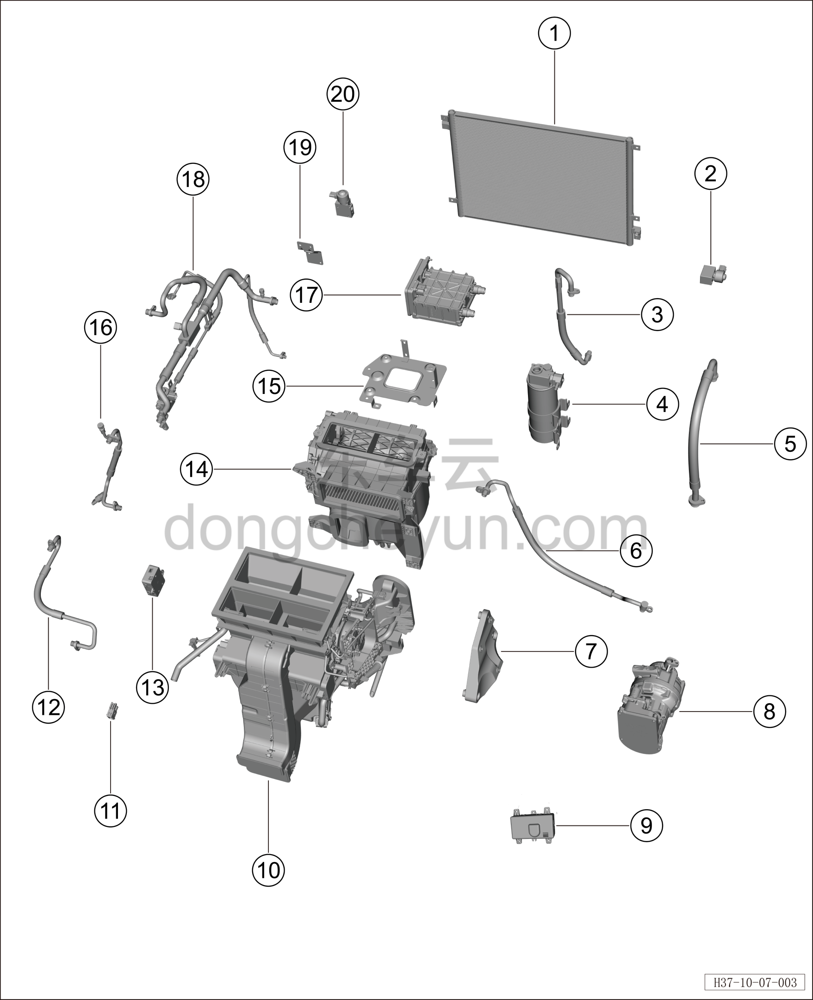

# Покомпонентный вид системы кондиционирования (версия AWD)

> Кондиционер › Система охлаждения (кондиционирования) › Покомпонентный вид (деталировка)  
> Оригинал: `空调系统分解图(四驱车型)` · [dongcheyun 56746](https://dongcheyun.com/p/56746), страница `ebdc23819f734eb2983078fd03eeb316` · [оглавление](../README.md)

| № | Наименование детали | Кол-во на автомобиль | Примечание |
|---|---|---|---|
| 1 | Наружный теплообменник | 1 |   |
| 2 | ТРВ (терморегулирующий вентиль) | 1 |   |
| 3 | Трубопровод выхода наружного теплообменника | 1 |   |
| 4 | Газожидкостный разделитель | 1 |   |
| 5 | Трубопровод всасывания компрессора | 1 |   |
| 6 | Трубка выхода компрессора | 1 |   |
| 7 | Кронштейн компрессора | 1 |   |
| 8 | Компрессор | 1 |   |
| 9 | Генератор ароматизации (парфюмер) | 1 |   |
| 10 | Передний распределитель HVAC в сборе | 1 |   |
| 11 | Датчик температуры в салоне | 1 |   |
| 12 | Трубопровод всасывания наружного теплообменника | 1 |   |
| 13 | Датчик PM2.5 | 1 |   |
| 14 | Передний вентилятор HVAC в сборе | 1 |   |
| 15 | Кронштейн высокотемпературного водяного нагревателя | 1 |   |
| 16 | Трубопровод выхода конденсатора | 1 |   |
| 17 | Водяной нагреватель PTC | 1 |   |
| 18 | Соосный трубопровод кондиционера | 1 |   |
| 19 | Кронштейн электронного ТРВ | 1 |   |
| 20 | ТРВ (терморегулирующий вентиль) | 1 |   |
