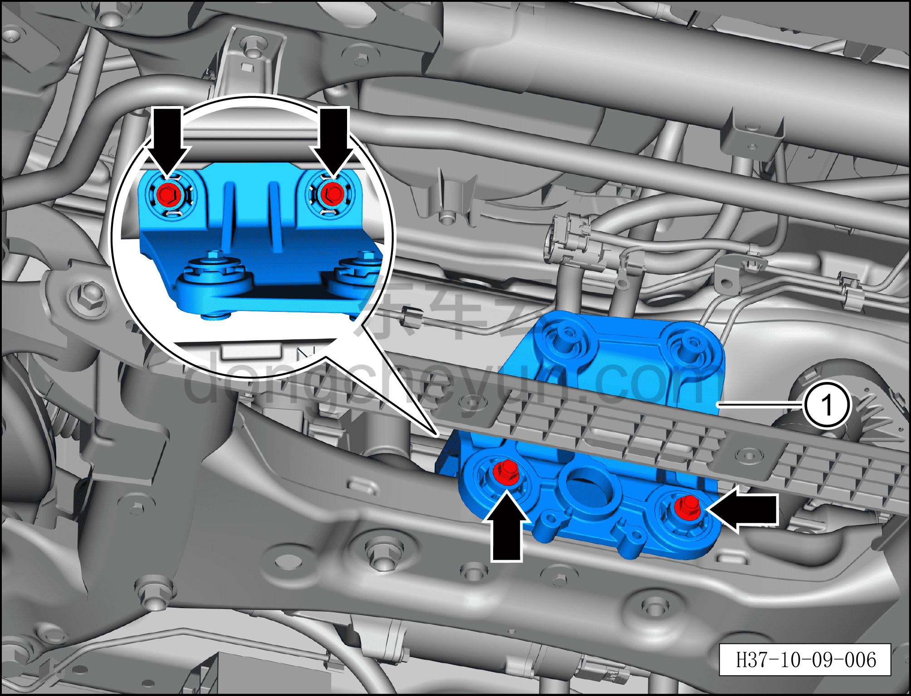

# Снятие и установка кронштейна компрессора (версия RWD)

> Кондиционер › Система охлаждения (кондиционирования) › Компоненты кондиционера  
> Оригинал: `拆卸与安装压缩机支架（两驱车型）` · [dongcheyun 56746](https://dongcheyun.com/p/56746), страница `9d4593809e0c4109b544d5b67582e647` · [оглавление](../README.md)

**Порядок снятия**

1. Выключите все электроприборы, отключите питание.

2. Выполните обесточивание автомобиля для ремонта. См. [3.1.4.1 Обесточивание автомобиля](../03-техническое-обслуживание/005-обесточивание-автомобиля.md)

3. Соберите (откачайте) хладагент. См. [10.1.6.12 Сбор/вакуумирование/заправка хладагента](045-сбор-вакуумирование-заправка-хладагента.md)

4. Снимите компрессор. См. [10.1.5.1 Снятие и установка компрессора (версия RWD)](010-снятие-и-установка-компрессора-версия-rwd-400-в.md)

5. Снятие кронштейна компрессора.

a. Торцевой головкой 13 мм выверните 4 крепёжных болта кронштейна компрессора.

Момент затяжки болта: 45±5 Н·м

b. Снимите кронштейн компрессора ①.

**Порядок установки**

Установка выполняется в обратном порядке.

**Внимание:**

**– После завершения установки выполните вакуумирование системы кондиционирования и заправку хладагентом. См. [10.1.6.12 Сбор/вакуумирование/заправка хладагента](045-сбор-вакуумирование-заправка-хладагента.md) **

**– С помощью панели управления кондиционером на мультимедийном экране проверьте и убедитесь в нормальной работе всех функций системы кондиционирования, затем подключите диагностический сканер и проверьте наличие кодов неисправностей; при их наличии найдите причину и очистите коды неисправностей.**
