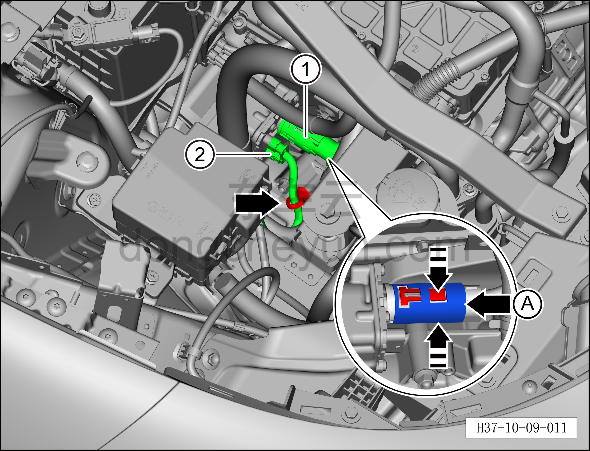
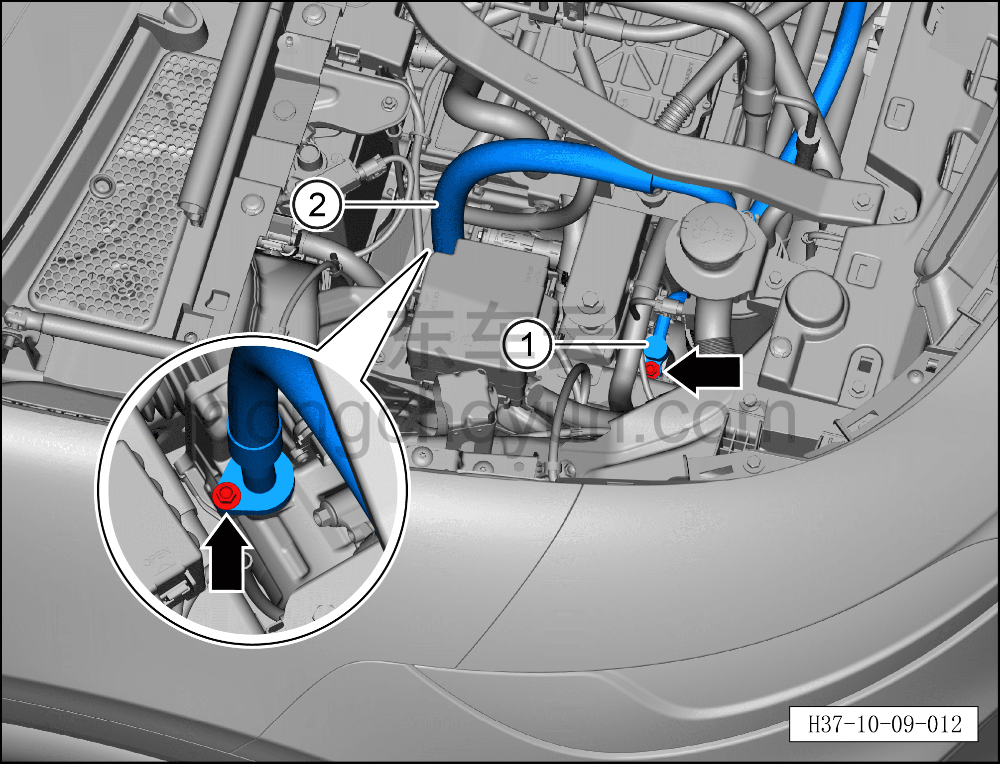
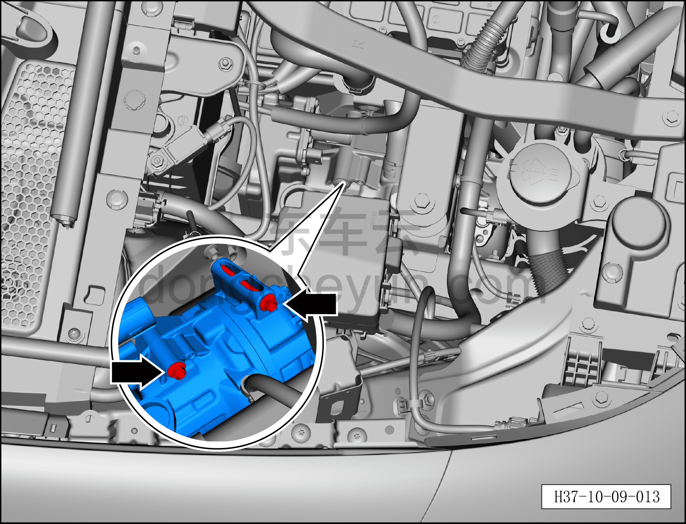
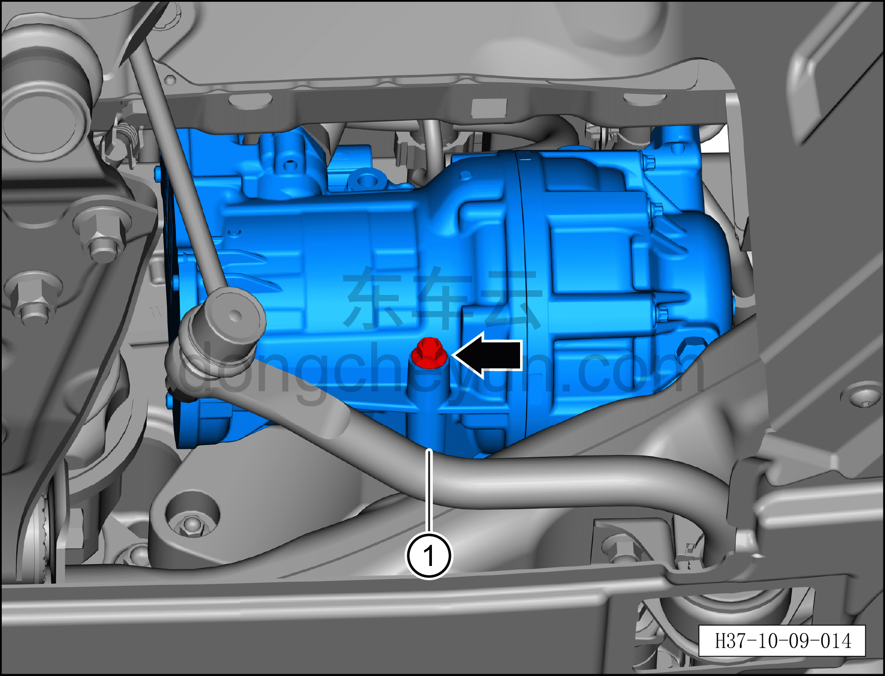

# Снятие и установка компрессора (версия AWD)

> Кондиционер › Система охлаждения (кондиционирования) › Компоненты кондиционера  
> Оригинал: `拆卸与安装压缩机（四驱车型）` · [dongcheyun 56746](https://dongcheyun.com/p/56746), страница `6b89dde1d42f4aa0a0b06e0a9b58be5a` · [оглавление](../README.md)

**Порядок снятия**

1. Выключите все электроприборы, отключите питание.

2. Выполните обесточивание автомобиля для ремонта. См. [3.1.4.1 Обесточивание автомобиля](../03-техническое-обслуживание/005-обесточивание-автомобиля.md)

3. Соберите (откачайте) хладагент. См. [10.1.6.12 Сбор/вакуумирование/заправка хладагента](045-сбор-вакуумирование-заправка-хладагента.md)

4. Снятие компрессора.

a. Потяните назад металлическое фиксирующее кольцо A, нажмите на верхний и нижний фиксаторы разъёма и отсоедините разъём высоковольтного жгута компрессора ①.

b. Извлеките фиксирующий зажим разъёма, нажмите на фиксатор разъёма и отсоедините разъём жгута проводов компрессора ②.

c. С помощью съёмника обивки отсоедините фиксирующую защёлку жгута проводов.

**Внимание:**

**– После снятия закройте разъём высоковольтного жгута компрессора чистым изолирующим защитным колпачком, чтобы предотвратить попадание посторонних предметов.**

d. Торцевой головкой 10 мм выверните крепёжный болт фитинга трубки выхода компрессора и крепёжный болт фитинга трубопровода всасывания компрессора.

Момент затяжки болтов: 10±1 Н·м

e. Отсоедините трубку выхода компрессора ①.

f. Отсоедините трубопровод всасывания компрессора ②.

**Внимание:**

**– В компрессоре может оставаться остаточное давление, при отсоединении соединений трубопровода извлекайте их медленно, чтобы не получить травму при резком высвобождении давления в компрессоре.**

**– После отсоединения соединений трубопровода закройте отверстия компрессора и трубопроводов кондиционера нетканым материалом, чтобы избежать попадания посторонних предметов и повреждения деталей.**

**– При установке трубопровода обязательно замените уплотнительное кольцо O-образного сечения на новое.**

g. Торцевой головкой 10 мм выверните 2 крепёжных болта компрессора.

Момент затяжки болта: 25 Н·м

**Внимание:**

**– Так как крепёжные болты компрессора длинные, а пространства в моторном отсеке недостаточно, извлечь их полностью не удаётся; после того как все крепёжные болты компрессора будут вывернуты, их можно извлечь вместе с компрессором.**

h. Поднимите автомобиль на подъёмнике, торцевой головкой 10 мм выверните крепёжный болт компрессора.

Момент затяжки болта: 25 Н·м

i. Снимите компрессор ①.

**Порядок установки**

Установка выполняется в обратном порядке.

**Примечание:**

**После завершения замены необходимо выполнить следующие операции с помощью диагностического сканера или удалённой диагностики:**

**- Сначала прошить программное обеспечение до последней версии;**

**- После успешного обновления программного обеспечения выполнить процедуру замены детали для контроллера.**

**Внимание:**

**– Так как крепёжные болты компрессора длинные, а пространства в моторном отсеке недостаточно, перед установкой компрессора сначала вставьте верхний крепёжный болт компрессора в верхнее монтажное отверстие компрессора.**

**– При замене уплотнительного кольца O-образного сечения на новое нанесите на него небольшое количество смазочного масла.**

**– После завершения установки выполните вакуумирование системы кондиционирования и заправку хладагентом. См. [10.1.6.12 Сбор/вакуумирование/заправка хладагента](045-сбор-вакуумирование-заправка-хладагента.md) **

**– С помощью панели управления кондиционером на мультимедийном экране проверьте и убедитесь в нормальной работе всех функций системы кондиционирования, затем подключите диагностический сканер и проверьте наличие кодов неисправностей; при их наличии найдите причину и очистите коды неисправностей.**
