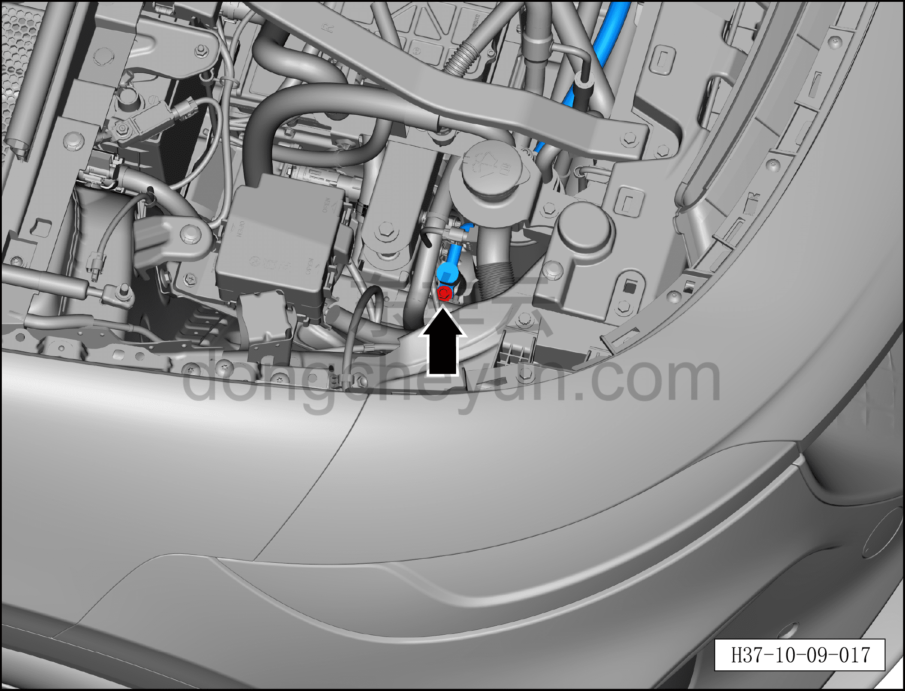
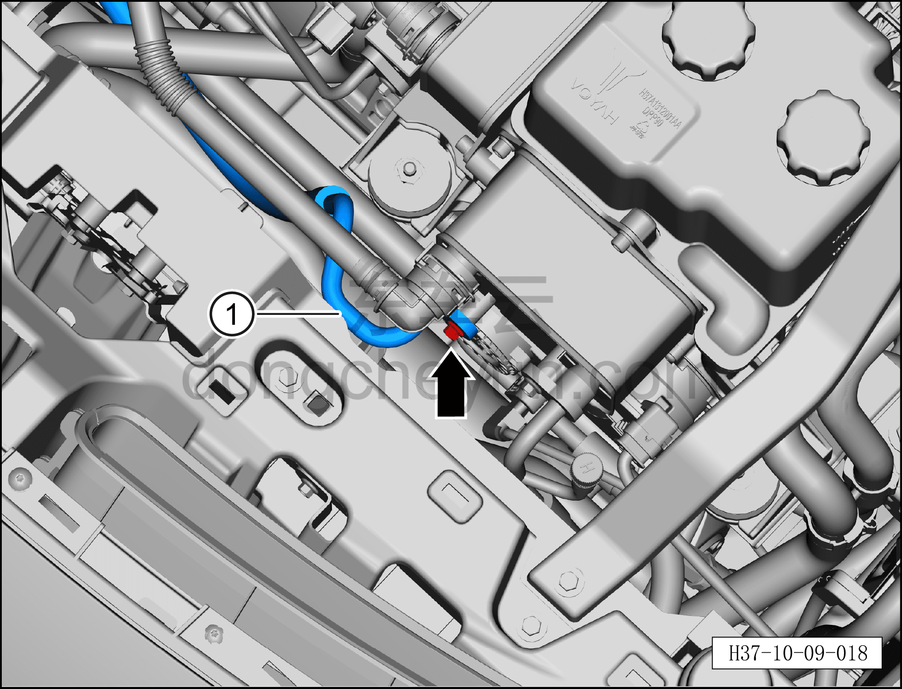

# Снятие и установка трубки выхода компрессора (версия AWD)

> Кондиционер › Система охлаждения (кондиционирования) › Компоненты кондиционера  
> Оригинал: `拆卸与安装压缩机排出管（四驱车型）` · [dongcheyun 56746](https://dongcheyun.com/p/56746), страница `fec193c88f1748a08ee518d2e0468169` · [оглавление](../README.md)

**Порядок снятия**

1. Выключите все электроприборы, отключите питание.

2. Выполните обесточивание автомобиля для ремонта. См. [3.1.4.1 Обесточивание автомобиля](../03-техническое-обслуживание/005-обесточивание-автомобиля.md)

3. Соберите (откачайте) хладагент. См. [10.1.6.12 Сбор/вакуумирование/заправка хладагента](045-сбор-вакуумирование-заправка-хладагента.md)

4. Снятие трубки выхода компрессора.

a. Торцевой головкой 10 мм выверните крепёжный болт фитинга трубки выхода компрессора, отсоедините трубку выхода компрессора.

Момент затяжки болтов: 10±1 Н·м

**Внимание:**

**– В компрессоре может оставаться остаточное давление, при отсоединении соединений трубопровода извлекайте их медленно, чтобы не получить травму при резком высвобождении давления в компрессоре.**

**– После отсоединения соединения трубопровода закройте отверстия компрессора и трубки выхода компрессора нетканым материалом, чтобы избежать попадания посторонних предметов и повреждения деталей.**

**– При установке трубопровода обязательно замените уплотнительное кольцо O-образного сечения на новое.**

b. Торцевой головкой 8 мм выверните крепёжный болт фитинга трубки выхода компрессора, отсоедините и снимите трубку выхода компрессора ①.

Момент затяжки болта: 8±1 Н·м

**Внимание:**

**– После отсоединения соединения трубопровода закройте отверстия конденсатора и трубки выхода компрессора нетканым материалом, чтобы избежать попадания посторонних предметов и повреждения деталей.**

**– При установке трубопровода обязательно замените уплотнительное кольцо O-образного сечения на новое.**

**Порядок установки**

Установка выполняется в обратном порядке.

**Внимание:**

**– При замене уплотнительного кольца O-образного сечения на новое нанесите на него небольшое количество смазочного масла.**

**– После завершения установки выполните вакуумирование системы кондиционирования и заправку хладагентом. См. [10.1.6.12 Сбор/вакуумирование/заправка хладагента](045-сбор-вакуумирование-заправка-хладагента.md) **

**– С помощью панели управления кондиционером на мультимедийном экране проверьте и убедитесь в нормальной работе всех функций системы кондиционирования, затем подключите диагностический сканер и проверьте наличие кодов неисправностей; при их наличии найдите причину и очистите коды неисправностей.**
