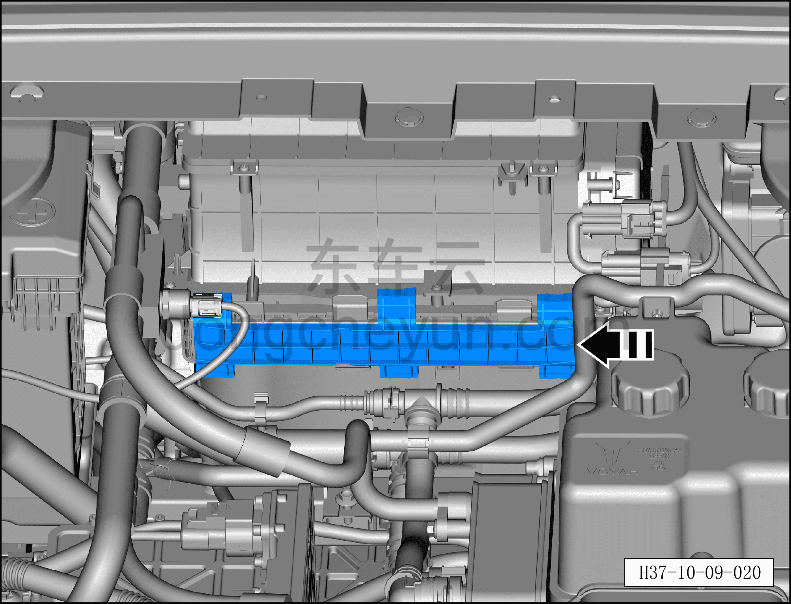
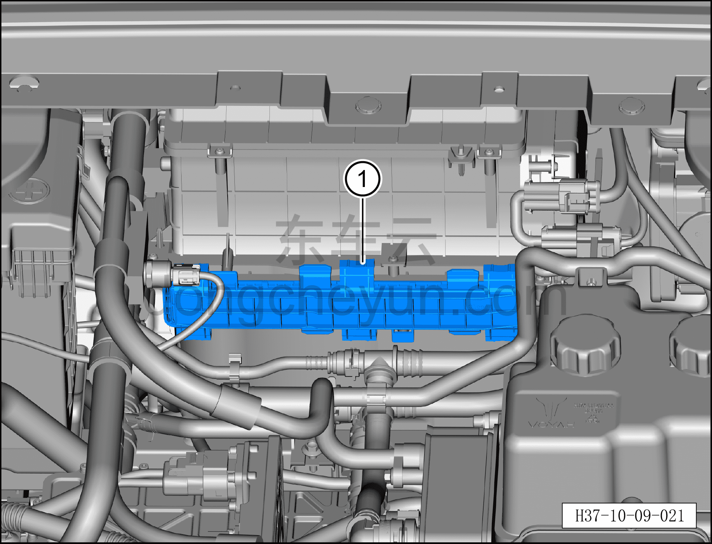
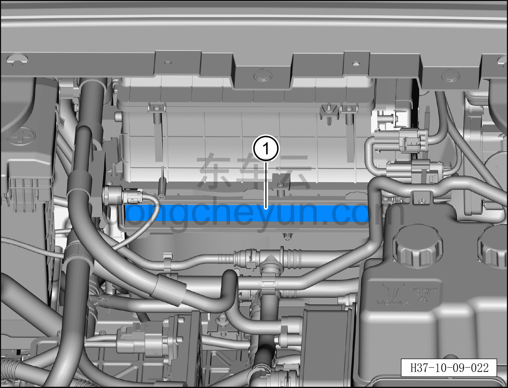

# Снятие и установка салонного фильтра

> Кондиционер › Система охлаждения (кондиционирования) › Компоненты кондиционера  
> Оригинал: `拆卸与安装空调滤芯` · [dongcheyun 56746](https://dongcheyun.com/p/56746), страница `ad4632c054a943af83f46df23f7226bb` · [оглавление](../README.md)

**Порядок снятия**

1. Выключите все электроприборы, отключите питание.

2. Выполните обесточивание автомобиля для ремонта. См. [3.1.4.1 Обесточивание автомобиля](../03-техническое-обслуживание/005-обесточивание-автомобиля.md)

3. Снятие салонного фильтра.

a. Сдвиньте фиксирующую панель крышки салонного фильтра в направлении стрелки с надписью «open» на панели.

Внимание:

**– При установке зафиксируйте фиксирующую панель крышки салонного фильтра в направлении стрелки с надписью «close» на панели.**

b. Снимите крышку салонного фильтра вместе с фиксирующей панелью ①.

c. Снимите салонный фильтр ①.

**Порядок установки**

Установка выполняется в обратном порядке.

**Внимание:**

**– Проверьте состояние салонного фильтра, в соответствии с рекомендуемым интервалом своевременно очищайте или заменяйте воздушный фильтр.**

**– При установке следите, чтобы стрелка на салонном фильтре была направлена по направлению потока воздуха.**

**– После завершения установки с помощью панели управления кондиционером на мультимедийном экране проверьте и убедитесь в нормальной работе всех функций системы кондиционирования.**
