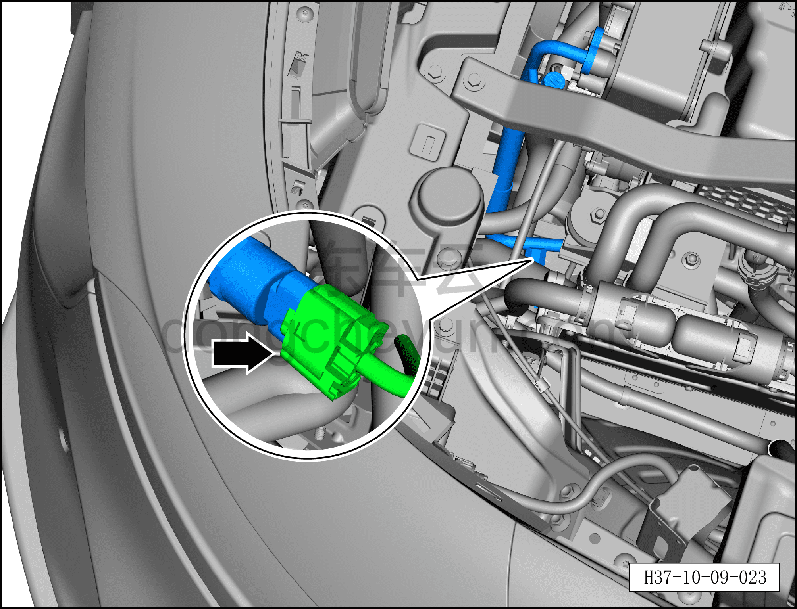
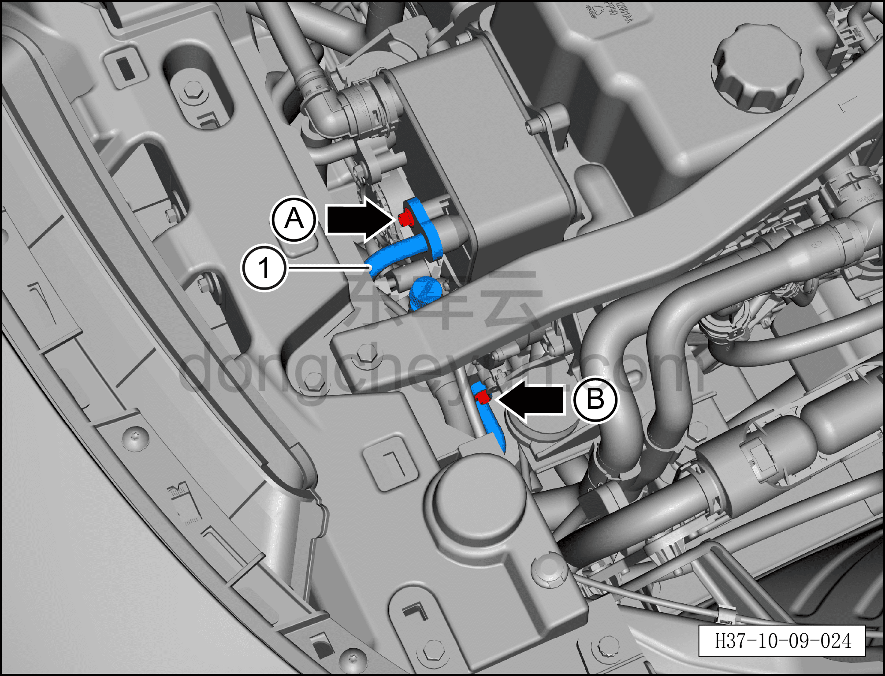

# Снятие и установка трубопровода выхода конденсатора

> Кондиционер › Система охлаждения (кондиционирования) › Компоненты кондиционера  
> Оригинал: `拆卸与安装冷凝器排出管路` · [dongcheyun 56746](https://dongcheyun.com/p/56746), страница `bb07bd040e3748a7ae5a14d351896ddd` · [оглавление](../README.md)

**Порядок снятия**

1. Выключите все электроприборы, отключите питание.

2. Выполните обесточивание автомобиля для ремонта. См. [3.1.4.1 Обесточивание автомобиля](../03-техническое-обслуживание/005-обесточивание-автомобиля.md)

3. Соберите (откачайте) хладагент. См. [10.1.6.12 Сбор/вакуумирование/заправка хладагента](045-сбор-вакуумирование-заправка-хладагента.md)

4. Снятие трубопровода выхода конденсатора.

a. Извлеките фиксирующий зажим разъёма, нажмите на фиксатор разъёма и отсоедините разъём трубопровода выхода конденсатора.

b. Торцевой головкой 8 мм выверните крепёжный болт A фитинга трубопровода выхода конденсатора, отсоедините трубопровод выхода конденсатора.

Момент затяжки болта A: 8±1 Н·м

c. Гаечным ключом 8 мм выверните крепёжный болт B фитинга трубопровода выхода конденсатора.

Момент затяжки болта B: 8±1 Н·м

d. Снимите трубопровод выхода конденсатора ①.

**Внимание:**

**– В компрессоре может оставаться остаточное давление, при отсоединении соединений трубопровода извлекайте их медленно, чтобы не получить травму при резком высвобождении давления в компрессоре**

**– После отсоединения соединения трубопровода закройте отверстия конденсатора, ТРВ и трубопроводов кондиционера нетканым материалом, чтобы избежать попадания посторонних предметов и повреждения деталей.**

**– При установке трубопровода обязательно замените уплотнительное кольцо O-образного сечения на новое.**

**Порядок установки**

Установка выполняется в обратном порядке.

**Внимание:**

**– При замене уплотнительного кольца O-образного сечения на новое нанесите на него небольшое количество смазочного масла.**

**– После завершения установки выполните вакуумирование системы кондиционирования и заправку хладагентом. См. [10.1.6.12 Сбор/вакуумирование/заправка хладагента](045-сбор-вакуумирование-заправка-хладагента.md)**

**– С помощью панели управления кондиционером на мультимедийном экране проверьте и убедитесь в нормальной работе всех функций системы кондиционирования, затем подключите диагностический сканер и проверьте наличие кодов неисправностей; при их наличии найдите причину и очистите коды неисправностей.**
