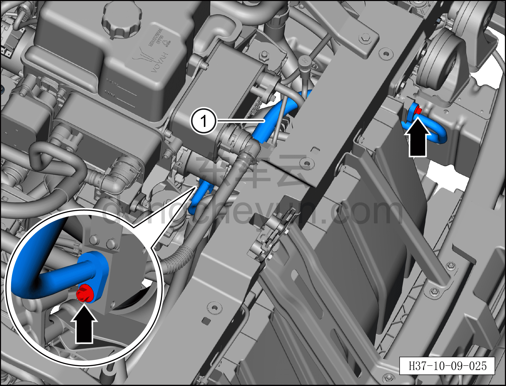

# Снятие и установка трубопровода всасывания наружного теплообменника

> Кондиционер › Система охлаждения (кондиционирования) › Компоненты кондиционера  
> Оригинал: `拆卸与安装室外换热器吸入管路` · [dongcheyun 56746](https://dongcheyun.com/p/56746), страница `fcf092a6c0d04f8eb35c6fd9f8a651f8` · [оглавление](../README.md)

**Порядок снятия**

1. Выключите все электроприборы, отключите питание.

2. Выполните обесточивание автомобиля для ремонта. См. [3.1.4.1 Обесточивание автомобиля](../03-техническое-обслуживание/005-обесточивание-автомобиля.md)

3. Соберите (откачайте) хладагент. См. [10.1.6.12 Сбор/вакуумирование/заправка хладагента](045-сбор-вакуумирование-заправка-хладагента.md)

4. Снимите передний бампер в сборе. См. [8.6.3.3 Снятие и установка переднего бампера в сборе](../08-внутренняя-и-внешняя-отделка/163-снятие-и-установка-переднего-бампера-в-сборе.md)

5. Снятие трубопровода всасывания наружного теплообменника.

a. Торцевой головкой 8 мм выверните крепёжные болты фитингов на обоих концах трубопровода всасывания наружного теплообменника, отсоедините и снимите трубопровод всасывания наружного теплообменника ①.

Момент затяжки болта: 8±1 Н·м

**Внимание:**

**– В компрессоре может оставаться остаточное давление, при отсоединении соединений трубопровода извлекайте их медленно, чтобы не получить травму при резком высвобождении давления в компрессоре.**

**– После отсоединения соединения трубопровода закройте отверстия ТРВ, наружного теплообменника и трубопровода всасывания наружного теплообменника нетканым материалом, чтобы избежать попадания посторонних предметов и повреждения деталей.**

**– При установке трубопровода обязательно замените уплотнительное кольцо O-образного сечения на новое.**

**Порядок установки**

Установка выполняется в обратном порядке.

**Внимание:**

**– При замене уплотнительного кольца O-образного сечения на новое нанесите на него небольшое количество смазочного масла.**

**– После завершения установки выполните вакуумирование системы кондиционирования и заправку хладагентом. См. [10.1.6.12 Сбор/вакуумирование/заправка хладагента](045-сбор-вакуумирование-заправка-хладагента.md)**

**– С помощью панели управления кондиционером на мультимедийном экране проверьте и убедитесь в нормальной работе всех функций системы кондиционирования, затем подключите диагностический сканер и проверьте наличие кодов неисправностей; при их наличии найдите причину и очистите коды неисправностей.**
