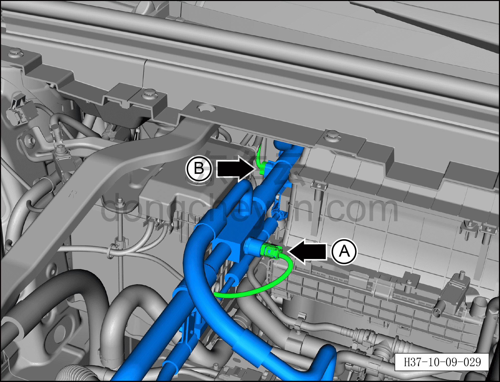
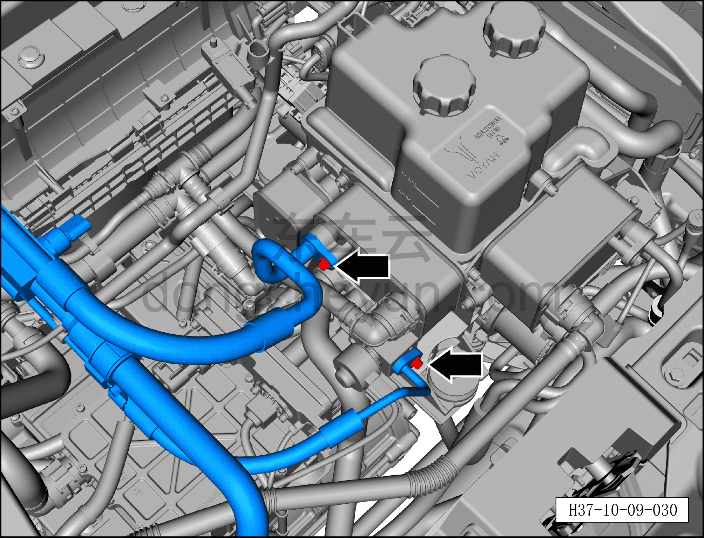
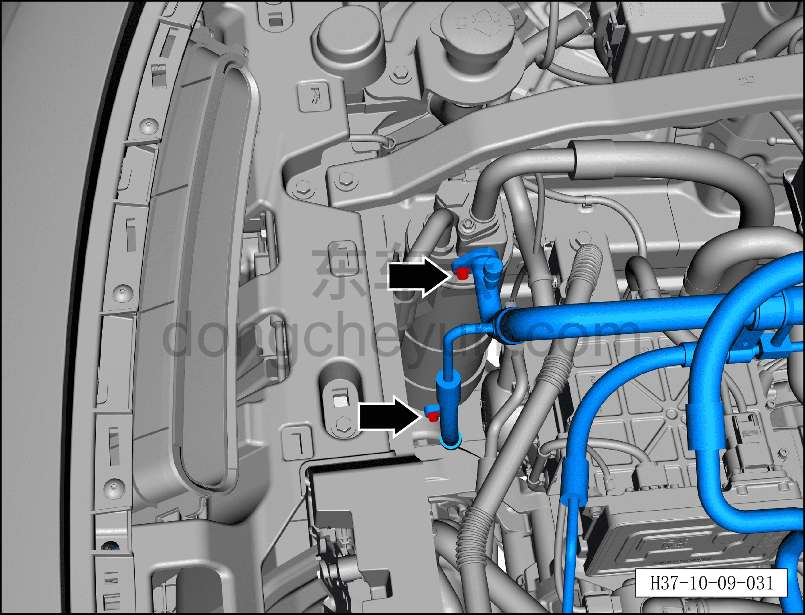
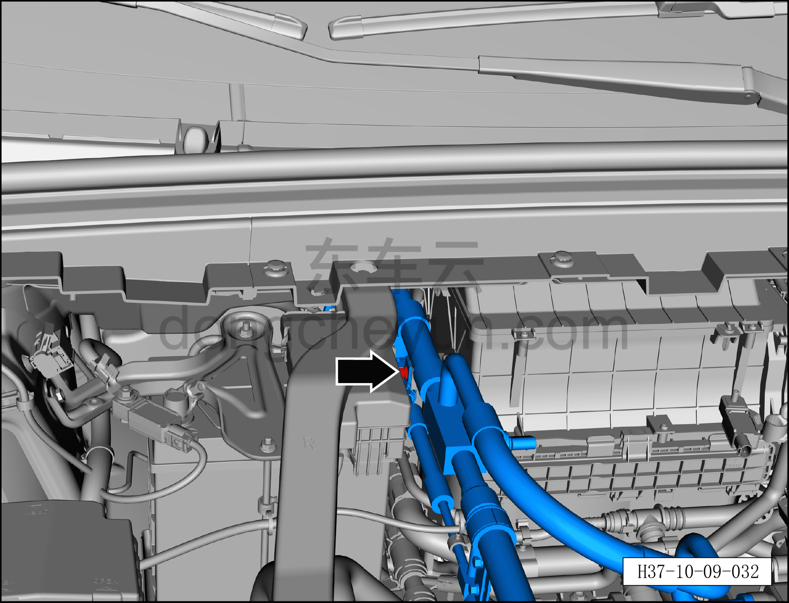
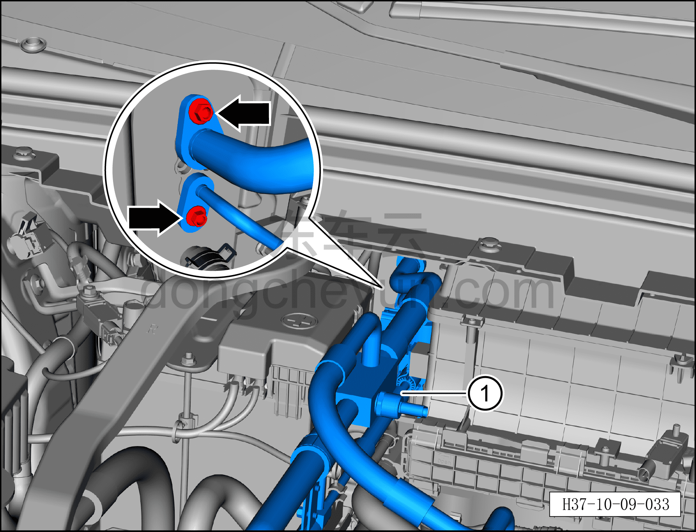

# Снятие и установка соосного трубопровода кондиционера

> Кондиционер › Система охлаждения (кондиционирования) › Компоненты кондиционера  
> Оригинал: `拆卸与安装空调同轴管路` · [dongcheyun 56746](https://dongcheyun.com/p/56746), страница `c36fdf9fd91c472da0d176c40257de65` · [оглавление](../README.md)

**Порядок снятия**

1. Выключите все электроприборы, отключите питание.

2. Выполните обесточивание автомобиля для ремонта. См. [3.1.4.1 Обесточивание автомобиля](../03-техническое-обслуживание/005-обесточивание-автомобиля.md)

3. Соберите (откачайте) хладагент. См. [10.1.6.12 Сбор/вакуумирование/заправка хладагента](045-сбор-вакуумирование-заправка-хладагента.md)

4. Снятие соосного трубопровода кондиционера.

a. Извлеките фиксирующий зажим разъёма, нажмите на фиксатор разъёма и отсоедините разъём A соосного трубопровода кондиционера.

b. Нажмите на фиксатор разъёма и отсоедините разъём B соосного трубопровода кондиционера.

c. Торцевой головкой 8 мм выверните 2 крепёжных болта фитингов соосного трубопровода кондиционера, отсоедините трубопровод.

Момент затяжки болта: 8±1 Н·м

**Внимание:**

**– В компрессоре может оставаться остаточное давление, при отсоединении соединений трубопровода извлекайте их медленно, чтобы не получить травму при резком высвобождении давления в компрессоре.**

**– После отсоединения соединения трубопровода закройте отверстия охладителя батареи, ТРВ и соосного трубопровода кондиционера нетканым материалом, чтобы избежать попадания посторонних предметов и повреждения деталей.**

**– При установке трубопровода обязательно замените уплотнительное кольцо O-образного сечения на новое.**

d. Торцевой головкой 8 мм выверните 2 крепёжных болта фитингов соосного трубопровода кондиционера, отсоедините трубопровод.

Момент затяжки болта: 8±1 Н·м

**Внимание:**

**– После отсоединения соединения трубопровода закройте отверстия газожидкостного разделителя и соосного трубопровода кондиционера нетканым материалом, чтобы избежать попадания посторонних предметов и повреждения деталей.**

**– При установке трубопровода обязательно замените уплотнительное кольцо O-образного сечения на новое.**

e. Торцевой головкой 8 мм выверните крепёжный болт соосного трубопровода кондиционера, отсоедините трубопровод.

Момент затяжки болта: 8±1 Н·м

f. Гаечным ключом 8 мм выверните 2 крепёжных болта фитингов соосного трубопровода кондиционера, отсоедините трубопровод.

Момент затяжки болта: 8±1 Н·м

g. Снимите соосный трубопровод кондиционера ①.

**Внимание:**

**– В компрессоре может оставаться остаточное давление, при отсоединении соединений трубопровода извлекайте их медленно, чтобы не получить травму при резком высвобождении давления в компрессоре.**

**– После отсоединения соединения трубопровода закройте отверстия переднего распределителя HVAC в сборе и соосного трубопровода кондиционера нетканым материалом, чтобы избежать попадания посторонних предметов и повреждения деталей.**

**– При установке трубопровода обязательно замените уплотнительное кольцо O-образного сечения на новое**.

**Порядок установки**

Установка выполняется в обратном порядке.

**Внимание:**

**– При замене уплотнительного кольца O-образного сечения на новое нанесите на него небольшое количество смазочного масла.**

**– После завершения установки выполните вакуумирование системы кондиционирования и заправку хладагентом. См. [10.1.6.12 Сбор/вакуумирование/заправка хладагента](045-сбор-вакуумирование-заправка-хладагента.md)**

**– С помощью панели управления кондиционером на мультимедийном экране проверьте и убедитесь в нормальной работе всех функций системы кондиционирования, затем подключите диагностический сканер и проверьте наличие кодов неисправностей; при их наличии найдите причину и очистите коды неисправностей.**
