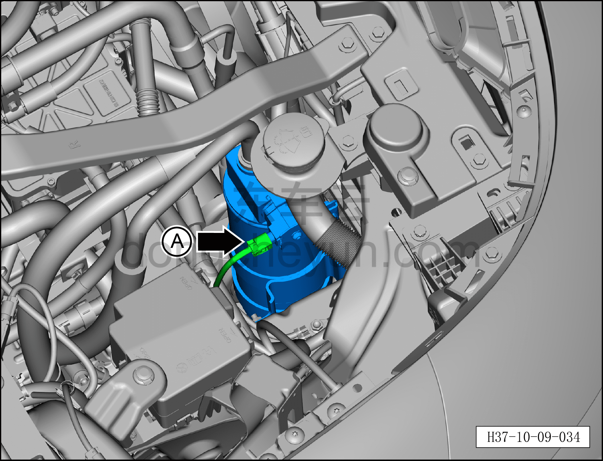
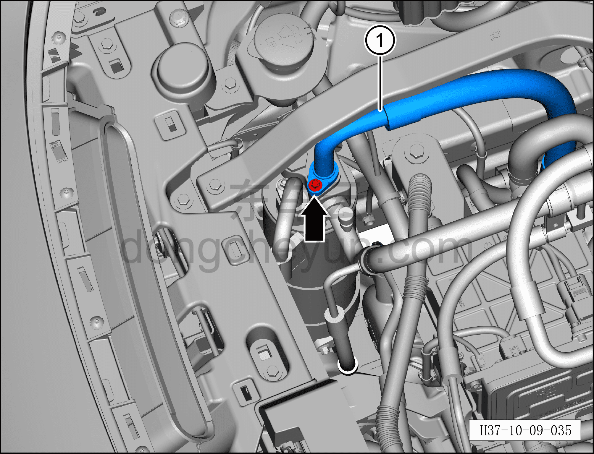
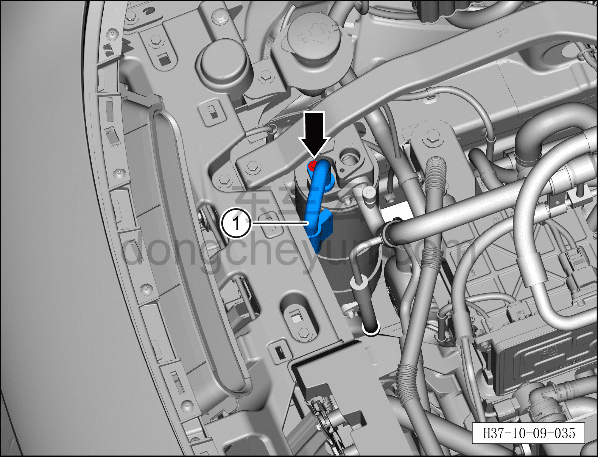
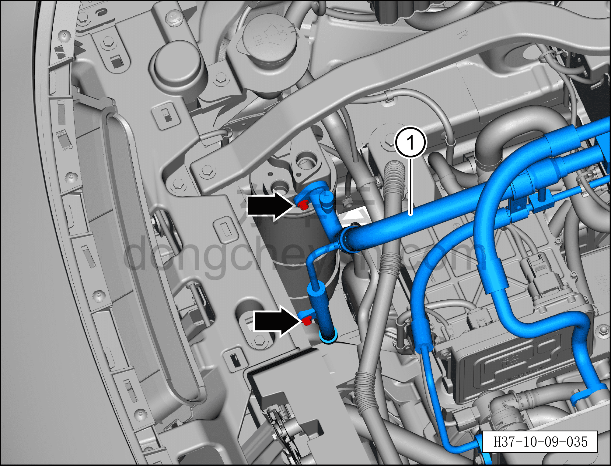
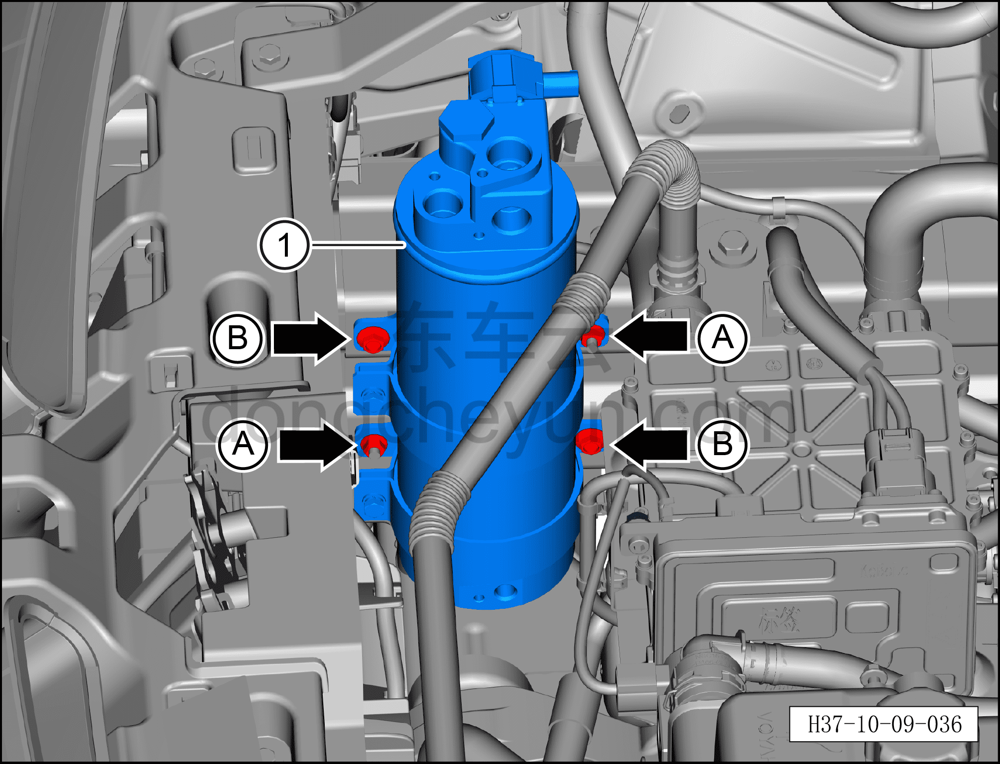

# Снятие и установка газожидкостного разделителя

> Кондиционер › Система охлаждения (кондиционирования) › Компоненты кондиционера  
> Оригинал: `拆卸与安装气液分离器` · [dongcheyun 56746](https://dongcheyun.com/p/56746), страница `fee37f33626148c5acc492946a72e138` · [оглавление](../README.md)

**Порядок снятия**

1. Выключите все электроприборы, отключите питание.

2. Выполните обесточивание автомобиля для ремонта. См. [3.1.4.1 Обесточивание автомобиля](../03-техническое-обслуживание/005-обесточивание-автомобиля.md)

3. Соберите (откачайте) хладагент. См. [10.1.6.12 Сбор/вакуумирование/заправка хладагента](045-сбор-вакуумирование-заправка-хладагента.md)

4. Снятие газожидкостного разделителя.

a. Нажмите на фиксатор разъёма и отсоедините разъём газожидкостного разделителя.

b. Торцевой головкой 8 мм выверните крепёжный болт фитинга трубопровода всасывания компрессора.

Момент затяжки болта: 8±1 Н·м

c. Отсоедините трубопровод всасывания компрессора ① и отведите его в положение, не мешающее извлечению газожидкостного разделителя.

**Внимание:**

**– В компрессоре может оставаться остаточное давление, при отсоединении соединений трубопровода извлекайте их медленно, чтобы не получить травму при резком высвобождении давления в компрессоре.**

**– После отсоединения соединения трубопровода закройте отверстия газожидкостного разделителя и трубопроводов кондиционера нетканым материалом, чтобы избежать попадания посторонних предметов и повреждения газожидкостного разделителя и трубопроводов кондиционера.**

**– При установке трубопровода обязательно замените уплотнительное кольцо O-образного сечения на новое.**

d. Торцевой головкой 8 мм выверните крепёжный болт фитинга трубопровода выхода наружного теплообменника.

Момент затяжки болта: 8±1 Н·м

e. Отсоедините трубопровод выхода наружного теплообменника ① и отведите его в положение, не мешающее извлечению газожидкостного разделителя.

**Внимание:**

**– После отсоединения соединения трубопровода закройте отверстия газожидкостного разделителя и трубопроводов кондиционера нетканым материалом, чтобы избежать попадания посторонних предметов и повреждения газожидкостного разделителя и трубопроводов кондиционера.**

**– При установке трубопровода обязательно замените уплотнительное кольцо O-образного сечения на новое.**

f. Торцевой головкой 8 мм выверните 2 крепёжных болта фитингов соосного трубопровода кондиционера.

Момент затяжки болта: 8±1 Н·м

g. Отсоедините соосный трубопровод кондиционера ① и отведите его в положение, не мешающее извлечению газожидкостного разделителя.

**Внимание:**

**– В компрессоре может оставаться остаточное давление, при отсоединении соединений трубопровода извлекайте их медленно, чтобы не получить травму при резком высвобождении давления в компрессоре. **

**– После отсоединения соединения трубопровода закройте отверстия газожидкостного разделителя и трубопроводов кондиционера нетканым материалом, чтобы избежать попадания посторонних предметов и повреждения газожидкостного разделителя и трубопроводов кондиционера.**

**– При установке трубопровода обязательно замените уплотнительное кольцо O-образного сечения на новое.**

h. Торцевой головкой 10 мм отверните 2 крепёжные гайки A газожидкостного разделителя.

Момент затяжки гайки A: 10±1 Н·м

i. Торцевой головкой 10 мм выверните 2 крепёжных болта B газожидкостного разделителя.

Момент затяжки болта B: 10±1 Н·м

j. Снимите газожидкостный разделитель ①.

**Порядок установки**

Установка выполняется в обратном порядке.

**Внимание:**

**– При замене уплотнительного кольца O-образного сечения на новое нанесите на него небольшое количество смазочного масла.**

**– После завершения установки выполните вакуумирование системы кондиционирования и заправку хладагентом. См. [10.1.6.12 Сбор/вакуумирование/заправка хладагента](045-сбор-вакуумирование-заправка-хладагента.md)**

**– С помощью панели управления кондиционером на мультимедийном экране проверьте и убедитесь в нормальной работе всех функций системы кондиционирования, затем подключите диагностический сканер и проверьте наличие кодов неисправностей; при их наличии найдите причину и очистите коды неисправностей.**
