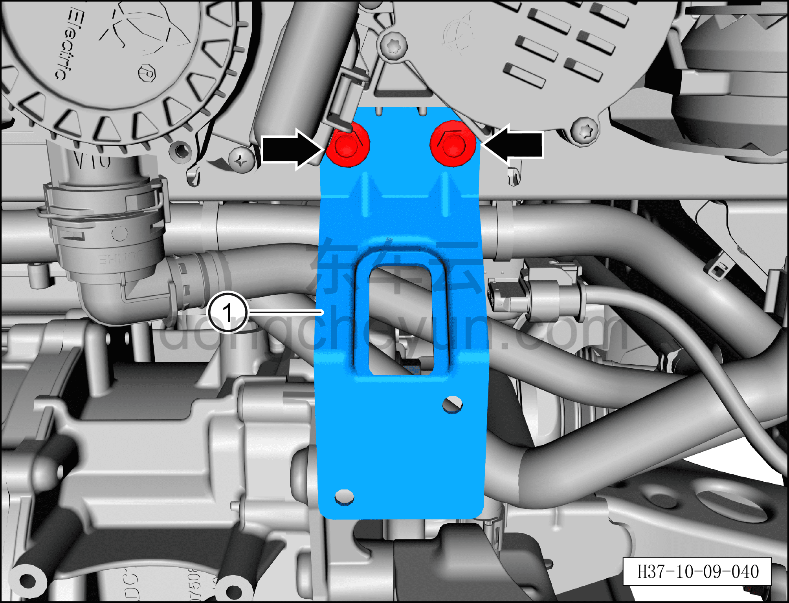

# Снятие и установка кронштейна электронного ТРВ

> Кондиционер › Система охлаждения (кондиционирования) › Компоненты кондиционера  
> Оригинал: `拆卸与安装电子膨胀阀支架` · [dongcheyun 56746](https://dongcheyun.com/p/56746), страница `1c651f1e43a84c9dab39d04970d3f706` · [оглавление](../README.md)

**Порядок снятия**

1. Выключите все электроприборы, отключите питание.

2. Выполните обесточивание автомобиля для ремонта. См. [3.1.4.1 Обесточивание автомобиля](../03-техническое-обслуживание/005-обесточивание-автомобиля.md)

3. Соберите (откачайте) хладагент. См. [10.1.6.12 Сбор/вакуумирование/заправка хладагента](045-сбор-вакуумирование-заправка-хладагента.md)

4. Снимите ТРВ (подключён к конденсатору). См. [10.1.5.15 Снятие и установка ТРВ (подключён к конденсатору)](024-снятие-и-установка-трв-подключён-к-конденсатору.md)

5. Снятие кронштейна электронного ТРВ.

a. Гаечным ключом 10 мм выверните 2 крепёжных болта кронштейна электронного ТРВ.

Момент затяжки болтов: 10±1 Н·м

b. Снимите кронштейн электронного ТРВ ①.

**Порядок установки**

Установка выполняется в обратном порядке.

**Внимание:**

**– При замене уплотнительного кольца O-образного сечения на новое нанесите на него небольшое количество смазочного масла.**

**– После завершения установки выполните вакуумирование системы кондиционирования и заправку хладагентом. См. [10.1.6.12 Сбор/вакуумирование/заправка хладагента](045-сбор-вакуумирование-заправка-хладагента.md)**

**– С помощью панели управления кондиционером на мультимедийном экране проверьте и убедитесь в нормальной работе всех функций системы кондиционирования, затем подключите диагностический сканер и проверьте наличие кодов неисправностей; при их наличии найдите причину и очистите коды неисправностей.**
