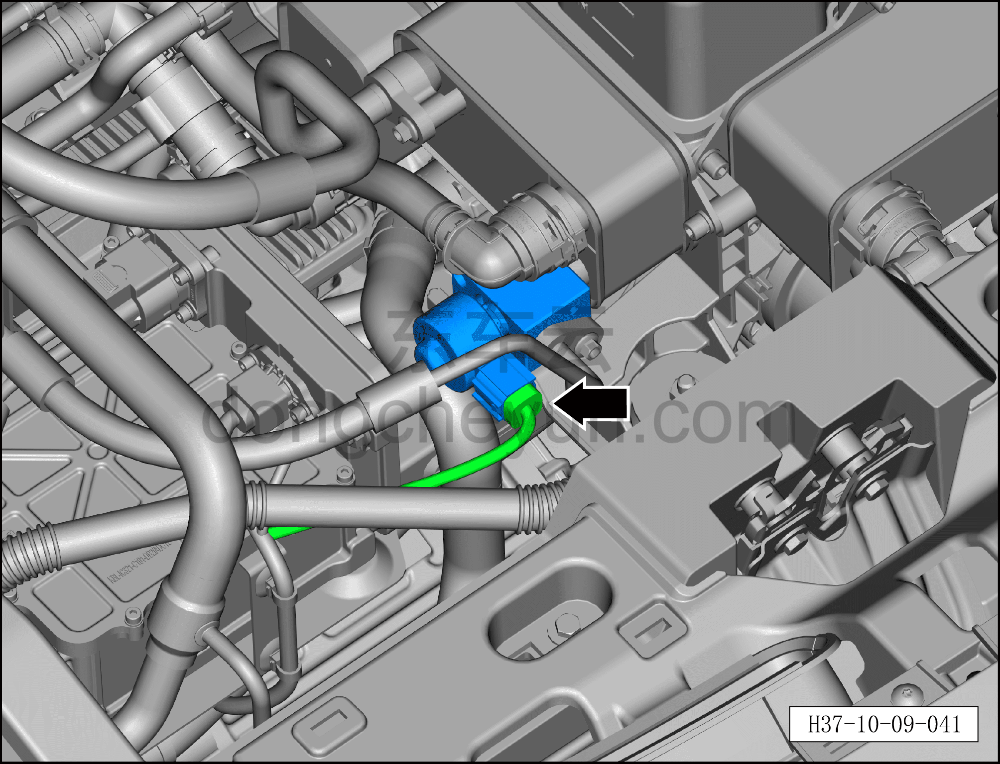
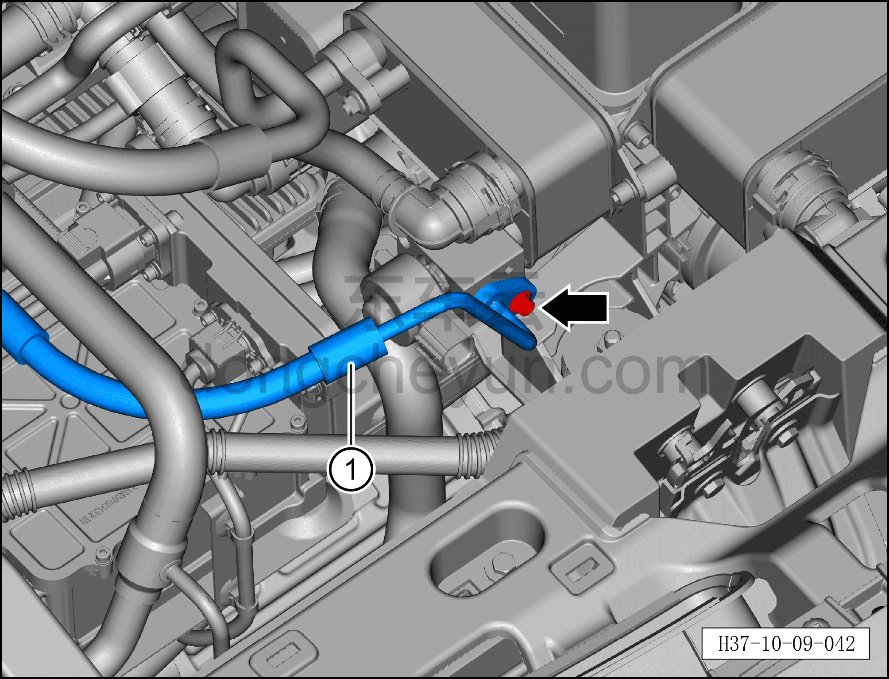
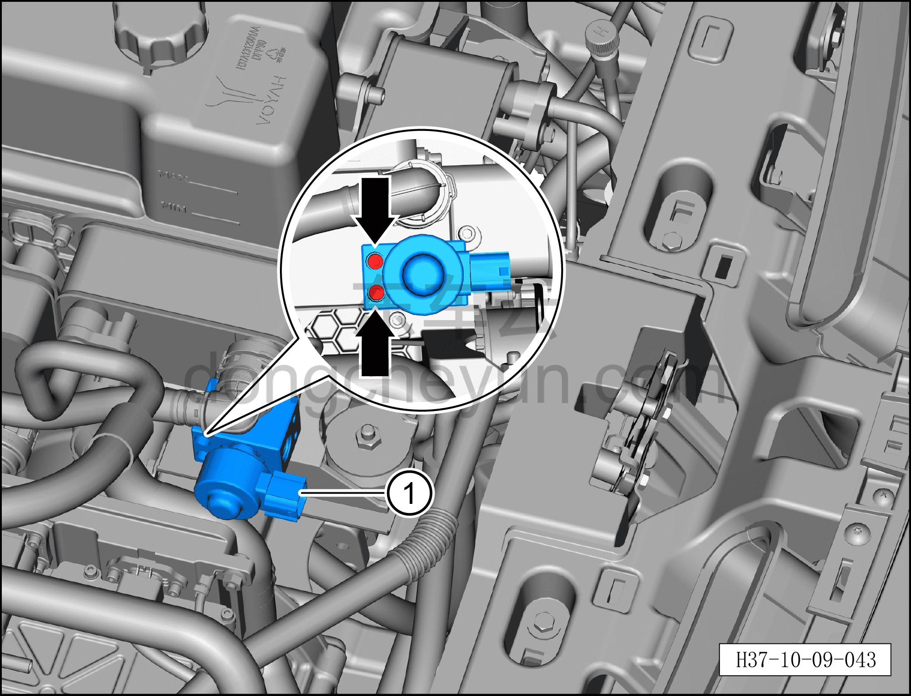

# Снятие и установка ТРВ (подключён к охладителю батареи)

> Кондиционер › Система охлаждения (кондиционирования) › Компоненты кондиционера  
> Оригинал: `拆卸与安装膨胀阀（连接电池冷却器）` · [dongcheyun 56746](https://dongcheyun.com/p/56746), страница `af0c2e559d014e76a974adb3519fc70f` · [оглавление](../README.md)

**Порядок снятия**

1. Выключите все электроприборы, отключите питание.

2. Выполните обесточивание автомобиля для ремонта. См. [3.1.4.1 Обесточивание автомобиля](../03-техническое-обслуживание/005-обесточивание-автомобиля.md)

3. Соберите (откачайте) хладагент. См. [10.1.6.12 Сбор/вакуумирование/заправка хладагента](045-сбор-вакуумирование-заправка-хладагента.md)

4. Снятие ТРВ.

a. Нажмите на фиксатор разъёма и отсоедините разъём ТРВ.

b. Гаечным ключом 8 мм выверните крепёжный болт фитинга соосного трубопровода кондиционера.

Момент затяжки болта: 8±1 Н·м

c. Отсоедините соосный трубопровод кондиционера ①.

**Внимание:**

**– В компрессоре может оставаться остаточное давление, при отсоединении соединений трубопровода извлекайте их медленно, чтобы не получить травму при резком высвобождении давления в компрессоре.**

**– После отсоединения соединения трубопровода закройте отверстия ТРВ и трубопроводов кондиционера нетканым материалом, чтобы избежать попадания посторонних предметов и повреждения деталей.**

**– При установке трубопровода обязательно замените уплотнительное кольцо O-образного сечения на новое.**

d. Шестигранным ключом 4 мм выверните 2 крепёжных болта ТРВ.

e. Снимите ТРВ ①.

**Внимание:**

**– После отсоединения ТРВ закройте отверстия ТРВ и охладителя батареи нетканым материалом, чтобы избежать попадания посторонних предметов и повреждения деталей.**

**Порядок установки**

Установка выполняется в обратном порядке.

**Внимание:**

**– При замене уплотнительного кольца O-образного сечения на новое нанесите на него небольшое количество смазочного масла.**

**– После завершения установки выполните вакуумирование системы кондиционирования и заправку хладагентом. См. [10.1.6.12 Сбор/вакуумирование/заправка хладагента](045-сбор-вакуумирование-заправка-хладагента.md)**

**– С помощью панели управления кондиционером на мультимедийном экране проверьте и убедитесь в нормальной работе всех функций системы кондиционирования, затем подключите диагностический сканер и проверьте наличие кодов неисправностей; при их наличии найдите причину и очистите коды неисправностей.**
