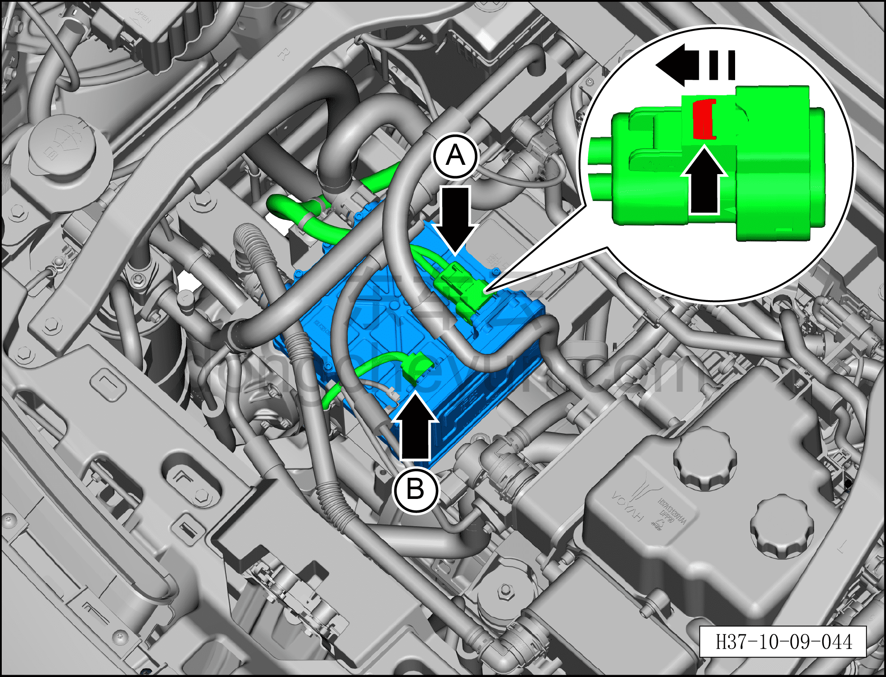
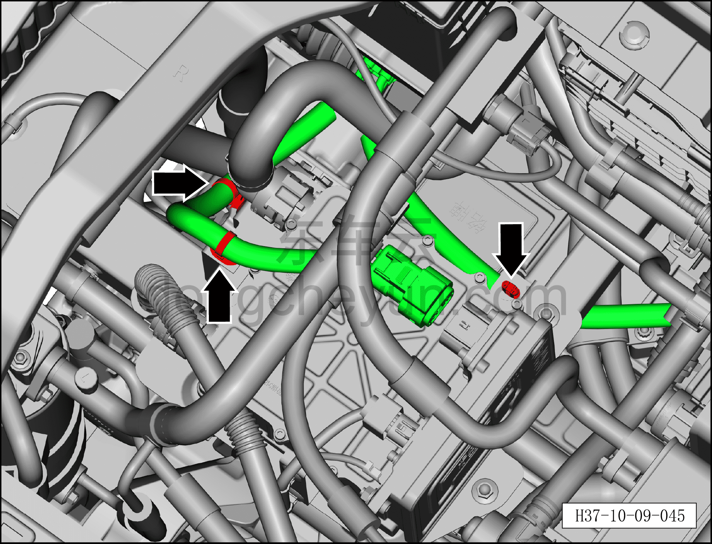
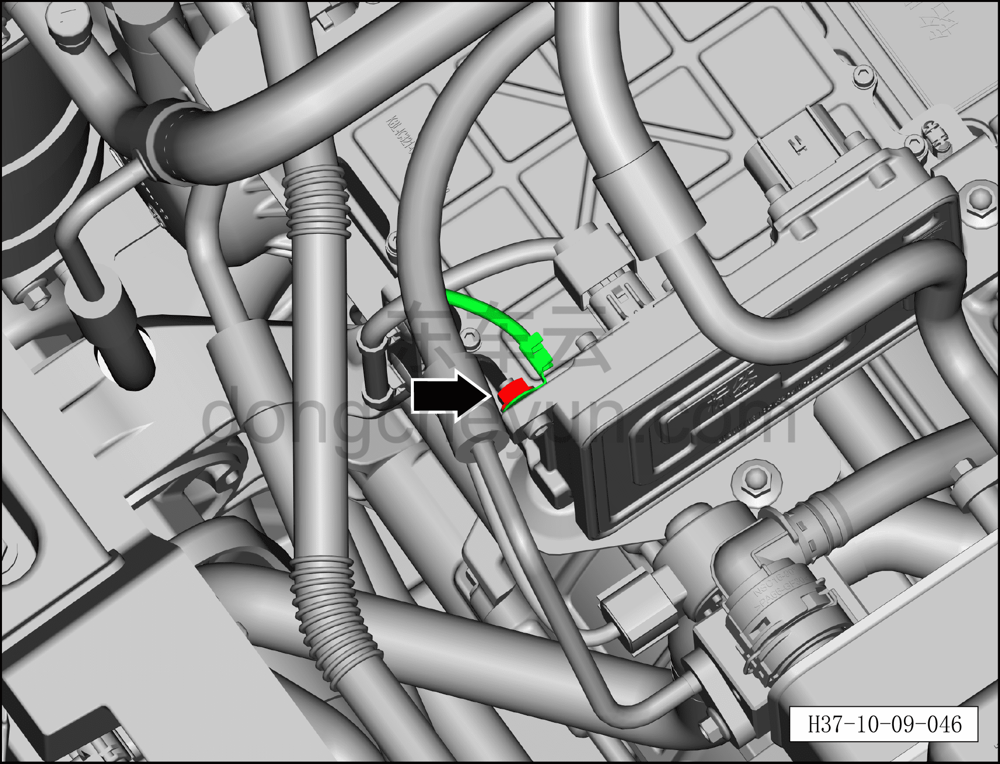
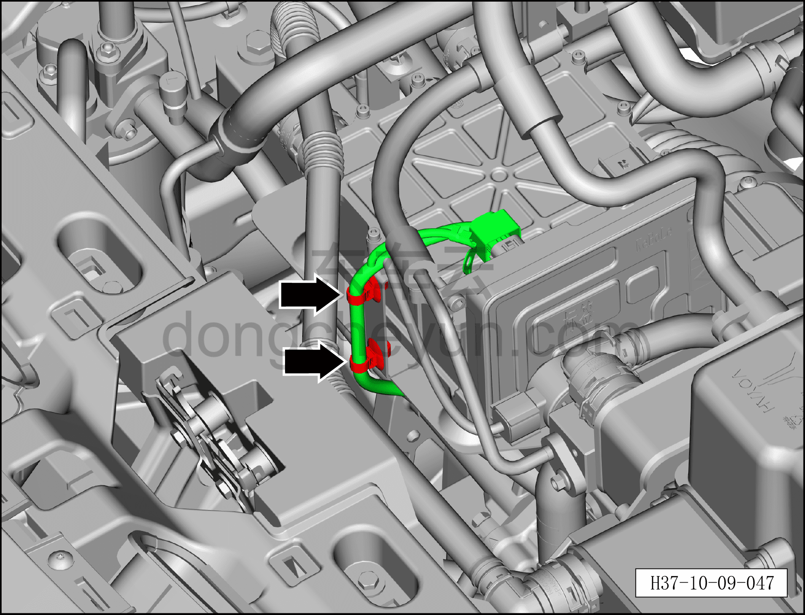
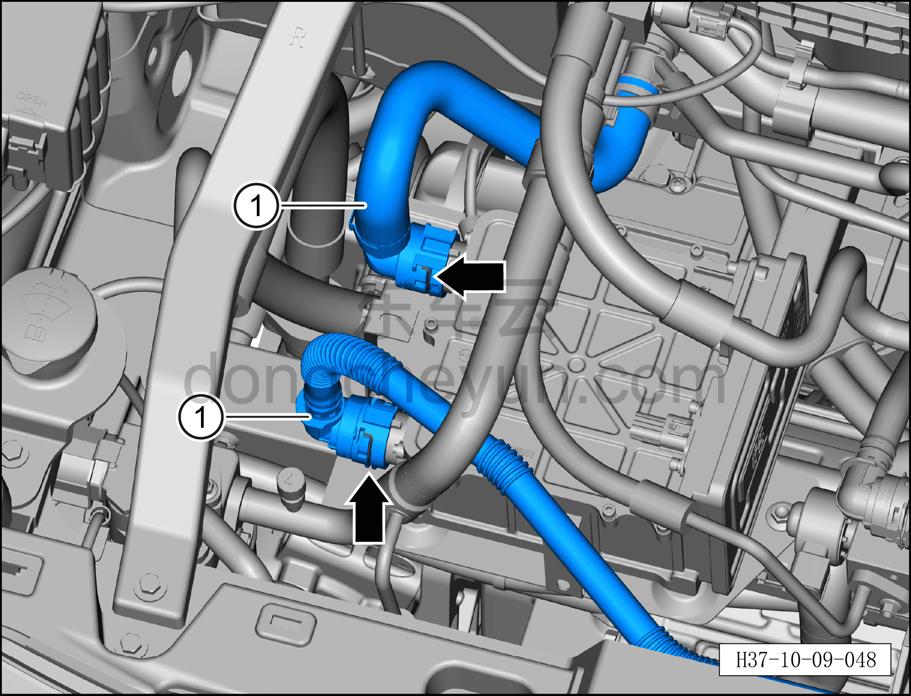
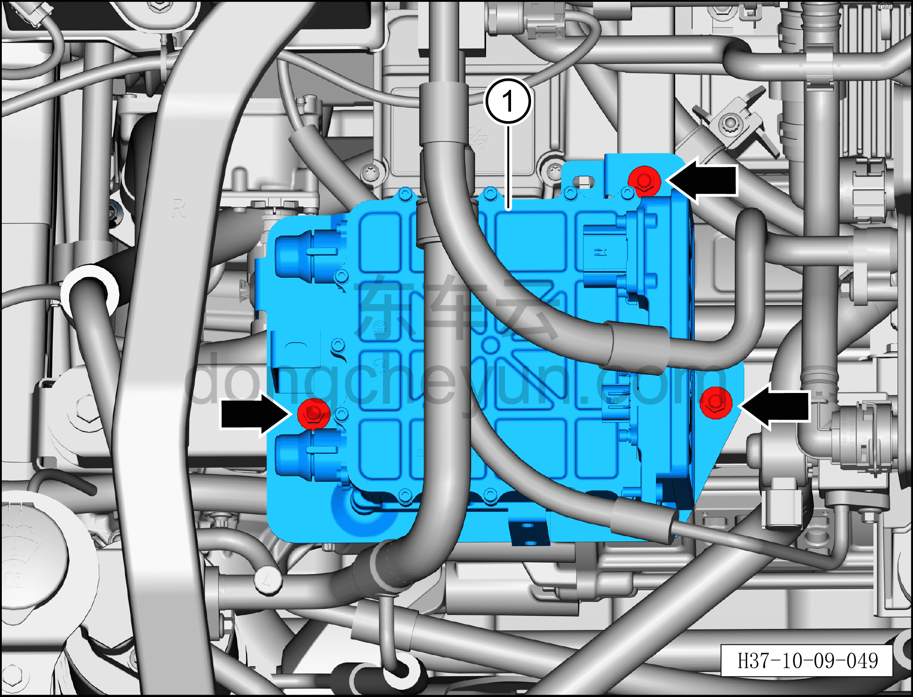
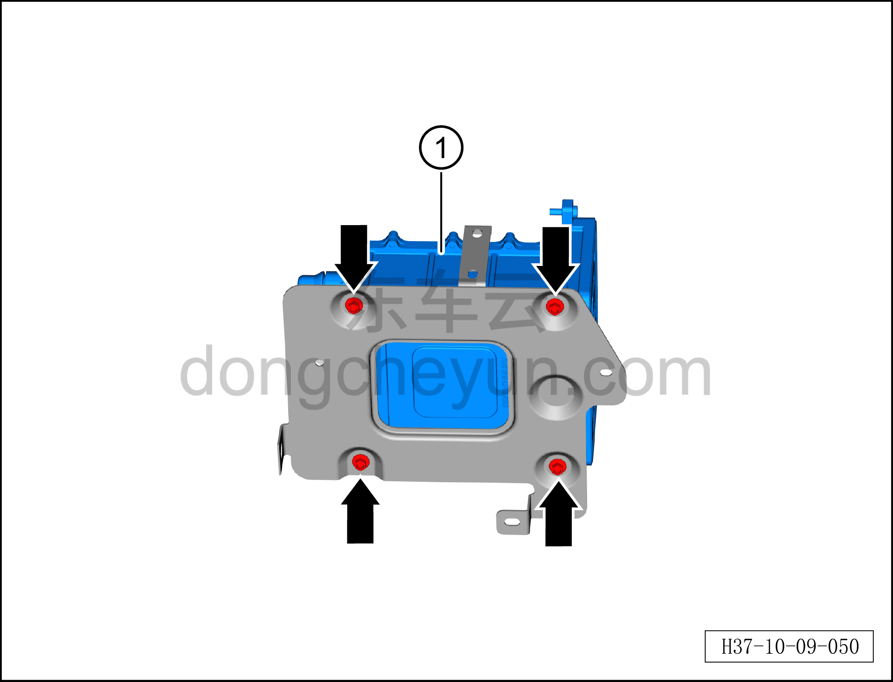

# Снятие и установка водяного нагревателя PTC (версия 400 В)

> Кондиционер › Система охлаждения (кондиционирования) › Компоненты кондиционера  
> Оригинал: `拆卸与安装PTC水加热器（400V车型）` · [dongcheyun 56746](https://dongcheyun.com/p/56746), страница `a47412ed01dd4ffeab30e066467239ce` · [оглавление](../README.md)

**Порядок снятия**

**Внимание:**

**- Перед выполнением ремонтных работ подождите, пока температура охлаждающей жидкости снизится ниже 60°C.**

1. Выключите все электроприборы, отключите питание.

2. Выполните обесточивание автомобиля для ремонта. См. [3.1.4.1 Обесточивание автомобиля](../03-техническое-обслуживание/005-обесточивание-автомобиля.md)

3. Слейте охлаждающую жидкость тягового электродвигателя и тяговой батареи. См. [3.1.5.1 Замена охлаждающей жидкости тягового электродвигателя и тяговой батареи](../03-техническое-обслуживание/006-замена-охлаждающей-жидкости-тягового-электродвигателя.md)

4. Слейте охлаждающую жидкость HVAC. См. [3.1.5.2 Замена охлаждающей жидкости HVAC](../03-техническое-обслуживание/007-замена-охлаждающей-жидкости-hvac.md)

5. Снятие водяного нагревателя PTC.

a. Извлеките фиксирующий зажим разъёма в направлении стрелки, затем нажмите на фиксирующий зажим разъёма и отсоедините разъём A высоковольтного жгута водяного нагревателя PTC.

b. Нажмите на фиксатор разъёма и отсоедините разъём B жгута проводов водяного нагревателя PTC.

**Внимание:**

**– После снятия закройте разъём высоковольтного жгута водяного нагревателя PTC чистым изолирующим защитным колпачком, чтобы предотвратить попадание посторонних предметов.**

c. С помощью съёмника обивки отсоедините 3 фиксирующие защёлки высоковольтного жгута PTC.

d. Торцевой головкой 10 мм отверните крепёжную гайку жгута заземления водяного нагревателя PTC, отсоедините жгут заземления водяного нагревателя PTC.

Момент затяжки гайки: 8±1 Н·м

e. С помощью съёмника обивки отсоедините 2 фиксирующие защёлки жгута проводов переднего отсека в сборе.

f. Плоской отвёрткой отогните 2 кольцевых хомута крепления водяных трубок водяного нагревателя PTC.

g. Отсоедините 2 водяные трубки водяного нагревателя PTC ①.

**Внимание:**

**– После отсоединения водяных трубок закройте их отверстия нетканым материалом, чтобы избежать попадания посторонних предметов и повреждения деталей.**

h. Торцевой головкой 10 мм выверните 3 крепёжных болта водяного нагревателя PTC вместе с крепёжным кронштейном.

Момент затяжки болтов: 10±1 Н·м

i. Снимите водяной нагреватель PTC вместе с крепёжным кронштейном ①.

j. Торцевой головкой 10 мм выверните 4 крепёжных болта водяного нагревателя PTC.

Момент затяжки болта: 8±1 Н·м

k. Снимите водяной нагреватель PTC ①.

**Порядок установки**

Установка выполняется в обратном порядке.

**Внимание:**

**– После завершения установки залейте охлаждающую жидкость и выполните удаление воздуха из системы охлаждения. См. [3.1.5.1 Замена охлаждающей жидкости тягового электродвигателя и тяговой батареи](../03-техническое-обслуживание/006-замена-охлаждающей-жидкости-тягового-электродвигателя.md) и [3.1.5.2 Замена охлаждающей жидкости HVAC](../03-техническое-обслуживание/007-замена-охлаждающей-жидкости-hvac.md)**

**– После завершения установки запустите автомобиль и проверьте соединения трубопроводов на отсутствие утечки охлаждающей жидкости.**

**– После завершения установки проверьте и убедитесь в нормальной работе водяного нагревателя PTC, затем подключите диагностический сканер и проверьте наличие кодов неисправностей; при их наличии найдите причину и очистите коды неисправностей.**
