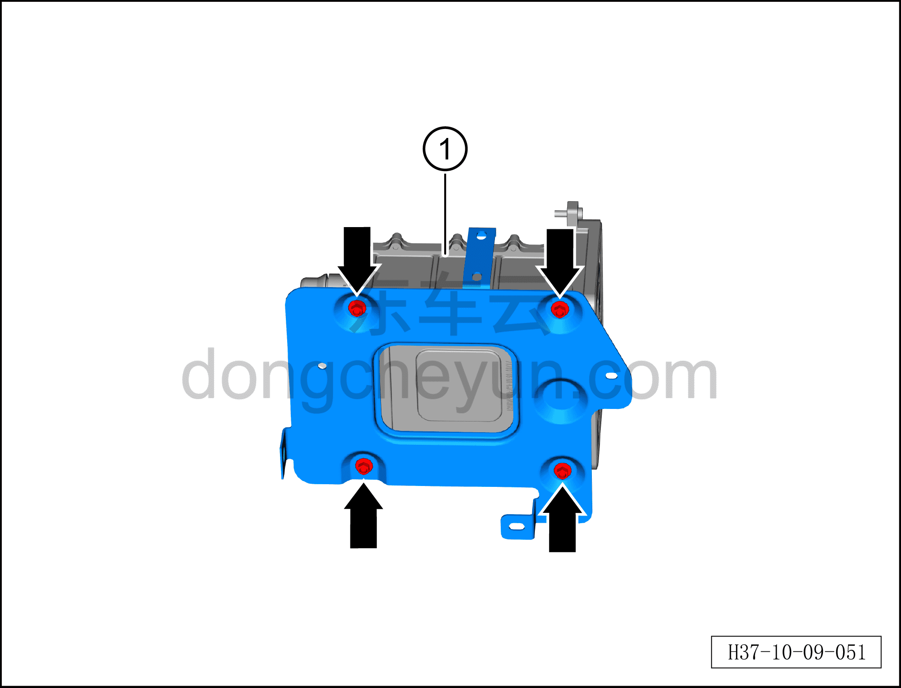

# Снятие и установка кронштейна высокотемпературного водяного нагревателя

> Кондиционер › Система охлаждения (кондиционирования) › Компоненты кондиционера  
> Оригинал: `拆卸与安装高温水加热器支架` · [dongcheyun 56746](https://dongcheyun.com/p/56746), страница `0aa4785634e3469f9863d08fb0a77066` · [оглавление](../README.md)

**Порядок снятия**

**Внимание:**

**- Перед выполнением ремонтных работ подождите, пока температура охлаждающей жидкости снизится ниже 60°C.**

1. Выключите все электроприборы, отключите питание.

2. Выполните обесточивание автомобиля для ремонта. См. [3.1.4.1 Обесточивание автомобиля](../03-техническое-обслуживание/005-обесточивание-автомобиля.md)

3. Слейте охлаждающую жидкость тягового электродвигателя и тяговой батареи. См. [3.1.5.1 Замена охлаждающей жидкости тягового электродвигателя и тяговой батареи](../03-техническое-обслуживание/006-замена-охлаждающей-жидкости-тягового-электродвигателя.md)

4. Слейте охлаждающую жидкость HVAC. См. [3.1.5.2 Замена охлаждающей жидкости HVAC](../03-техническое-обслуживание/007-замена-охлаждающей-жидкости-hvac.md)

5. Снимите водяной нагреватель PTC. См. [10.1.5.18 Снятие и установка водяного нагревателя PTC](027-снятие-и-установка-водяного-нагревателя-ptc-версия-400.md)

6. Снятие кронштейна высокотемпературного водяного нагревателя.

a. Торцевой головкой 10 мм выверните 4 крепёжных болта водяного нагревателя PTC.

b. Снимите кронштейн высокотемпературного водяного нагревателя ①.

Момент затяжки болта: 8±1 Н·м

**Порядок установки**

Установка выполняется в обратном порядке.

**Внимание:**

**– После завершения установки залейте охлаждающую жидкость и выполните удаление воздуха из системы охлаждения. См. [3.1.5.1 Замена охлаждающей жидкости тягового электродвигателя и тяговой батареи](../03-техническое-обслуживание/006-замена-охлаждающей-жидкости-тягового-электродвигателя.md) и [3.1.5.2 Замена охлаждающей жидкости HVAC](../03-техническое-обслуживание/007-замена-охлаждающей-жидкости-hvac.md) **

**– После завершения установки запустите автомобиль и проверьте соединения трубопроводов на отсутствие утечки охлаждающей жидкости.**

**– После завершения установки проверьте и убедитесь в нормальной работе водяного нагревателя PTC, затем подключите диагностический сканер и проверьте наличие кодов неисправностей; при их наличии найдите причину и очистите коды неисправностей.**
