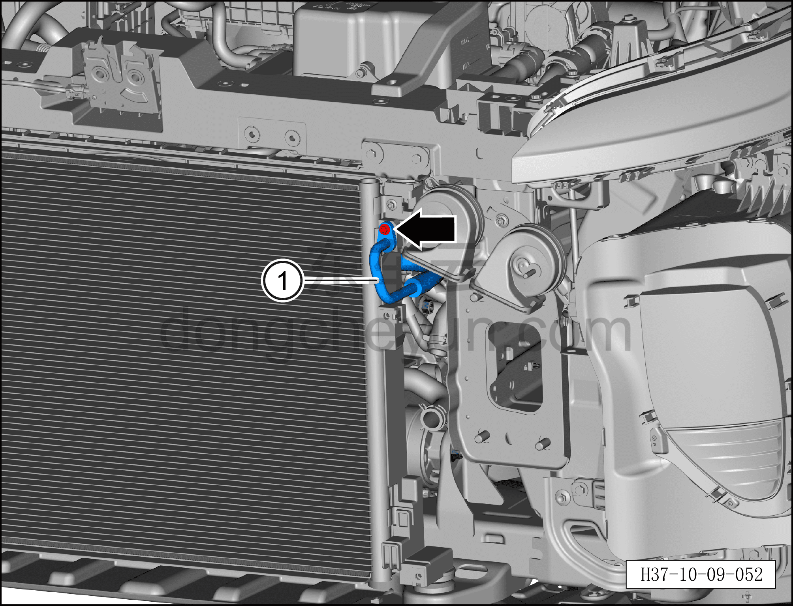
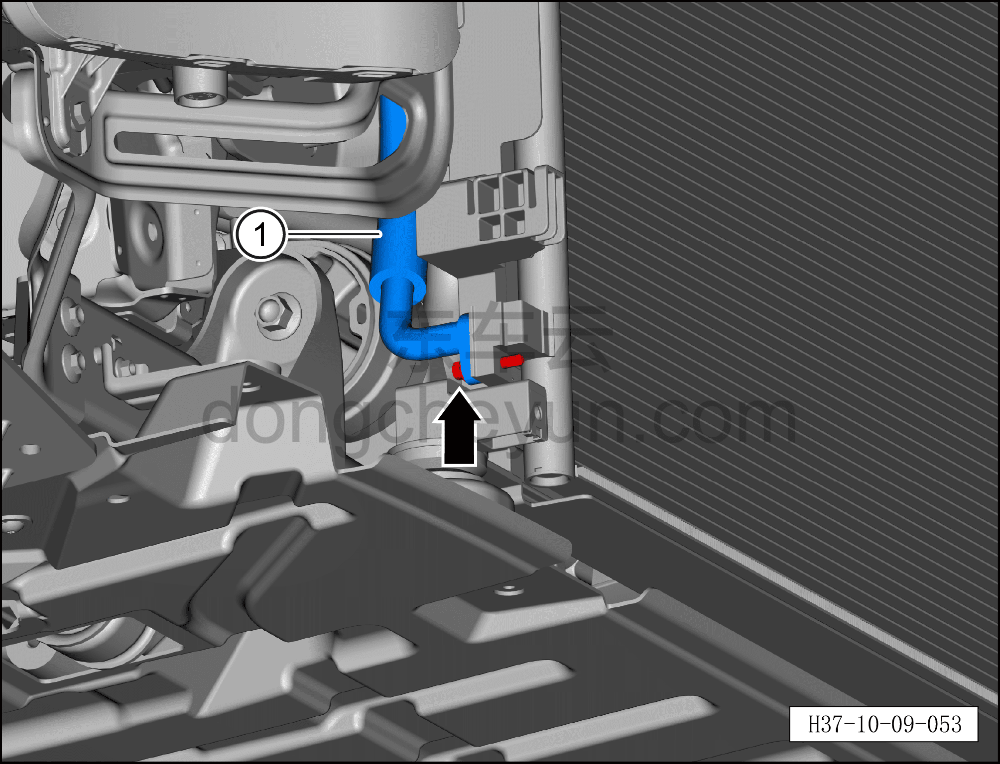
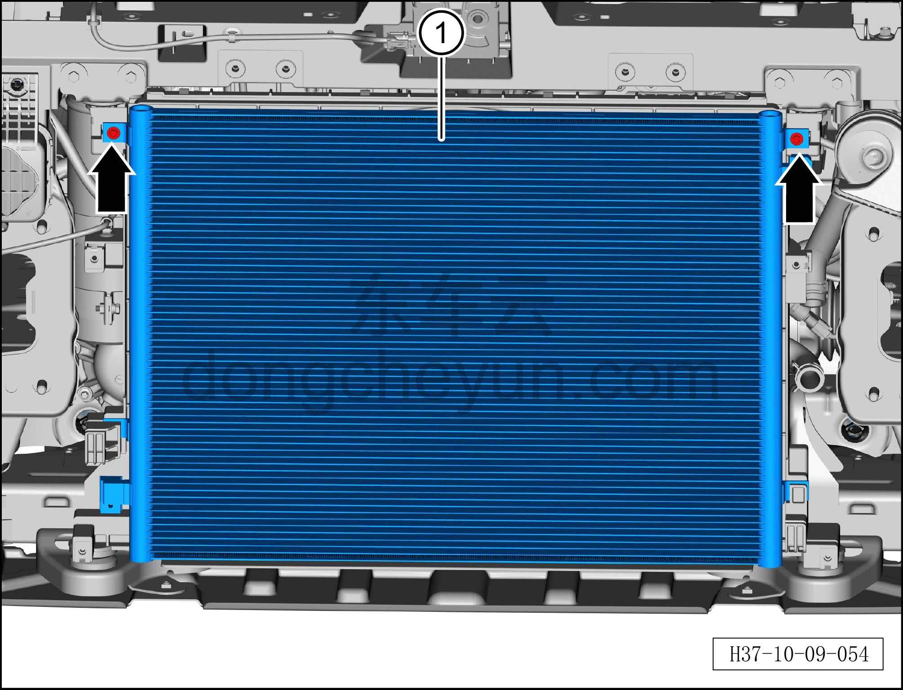

# Снятие и установка наружного теплообменника

> Кондиционер › Система охлаждения (кондиционирования) › Компоненты кондиционера  
> Оригинал: `拆卸与安装室外换热器` · [dongcheyun 56746](https://dongcheyun.com/p/56746), страница `c97fa585d89042d180e0fb791503904a` · [оглавление](../README.md)

**Порядок снятия**

**Внимание:**

**- Перед выполнением ремонтных работ подождите, пока температура охлаждающей жидкости снизится ниже 60°C.**

1. Выключите все электроприборы, отключите питание.

2. Выполните обесточивание автомобиля для ремонта. См. [3.1.4.1 Обесточивание автомобиля](../03-техническое-обслуживание/005-обесточивание-автомобиля.md)

3. Соберите (откачайте) хладагент. См. [10.1.6.12 Сбор/вакуумирование/заправка хладагента](045-сбор-вакуумирование-заправка-хладагента.md)

4. Слейте охлаждающую жидкость тягового электродвигателя и тяговой батареи. См. [3.1.5.1 Замена охлаждающей жидкости тягового электродвигателя и тяговой батареи](../03-техническое-обслуживание/006-замена-охлаждающей-жидкости-тягового-электродвигателя.md)

5. Снимите передний бампер в сборе. См. [8.6.3.3 Снятие и установка переднего бампера в сборе](../08-внутренняя-и-внешняя-отделка/163-снятие-и-установка-переднего-бампера-в-сборе.md)

6. Снимите передний усилитель бампера в сборе. См. [12.1.9.1 Снятие и установка переднего усилителя бампера в сборе](../12-кузовные-жестяные-работы-окраска/034-снятие-и-установка-переднего-противоударного-бруса-в.md)

7. Снимите передний радар миллиметрового диапазона. См. [9.10.3.2 Снятие и установка переднего радара миллиметрового диапазона](../09-электрическая-и-электронная-система/096-снятие-и-установка-переднего-радара-миллиметрового.md)

8. Снимите активную решётку воздухозаборника. См. [8.6.3.23 Снятие и установка активной решётки воздухозаборника](../08-внутренняя-и-внешняя-отделка/183-снятие-и-установка-активной-решётки-воздухозаборника.md)

9. Снимите дефлектор потока воздуха в сборе. См. [8.6.3.19 Снятие и установка дефлектора потока воздуха в сборе](../08-внутренняя-и-внешняя-отделка/184-снятие-и-установка-дефлектора-в-сборе.md)

10. Снимите низкотемпературный радиатор. См. [4.1.7.2 Снятие и установка низкотемпературного радиатора](../04-интегрированная-силовая-система/021-снятие-и-установка-низкотемпературного-радиатора.md)

11. Снятие наружного теплообменника.

a. Торцевой головкой 8 мм выверните крепёжные болты фитингов на обоих концах трубопровода всасывания наружного теплообменника.

Момент затяжки болта: 8±1 Н·м

b. Отсоедините трубопровод всасывания наружного теплообменника ①.

**Внимание:**

**– В компрессоре может оставаться остаточное давление, при отсоединении соединений трубопровода извлекайте их медленно, чтобы не получить травму при резком высвобождении давления в компрессоре.**

**– После отсоединения соединения трубопровода закройте отверстия наружного теплообменника и трубопровода всасывания наружного теплообменника нетканым материалом, чтобы избежать попадания посторонних предметов и повреждения деталей.**

**– При установке трубопровода обязательно замените уплотнительное кольцо O-образного сечения на новое.**

c. Торцевой головкой 8 мм выверните крепёжный болт фитинга трубопровода выхода наружного теплообменника.

Момент затяжки болта: 8±1 Н·м

d. Отсоедините трубопровод выхода наружного теплообменника в сборе ①.

**Внимание:**

**– После отсоединения соединения трубопровода закройте отверстия наружного теплообменника и трубопровода выхода наружного теплообменника нетканым материалом, чтобы избежать попадания посторонних предметов и повреждения деталей.**

**– При установке трубопровода обязательно замените уплотнительное кольцо O-образного сечения на новое.**

e. Торцевой головкой 8 мм выверните 2 крепёжных болта наружного теплообменника.

Момент затяжки болта: 6±1 Н·м

f. Поднимите наружный теплообменник вверх до тех пор, пока кронштейны с обеих его сторон не выйдут из пазов, и снимите наружный теплообменник ①.

**Порядок установки**

Установка выполняется в обратном порядке.

**Внимание:**

**– При замене уплотнительного кольца O-образного сечения на новое нанесите на него небольшое количество смазочного масла.**

**– После завершения установки выполните вакуумирование системы кондиционирования и заправку хладагентом. См. [10.1.6.12 Сбор/вакуумирование/заправка хладагента](045-сбор-вакуумирование-заправка-хладагента.md)**

**– После завершения установки залейте охлаждающую жидкость и выполните удаление воздуха из системы охлаждения. См. [3.1.5.1 Замена охлаждающей жидкости тягового электродвигателя и тяговой батареи](../03-техническое-обслуживание/006-замена-охлаждающей-жидкости-тягового-электродвигателя.md)**

**– После завершения установки запустите автомобиль и проверьте соединения трубопроводов на отсутствие утечки охлаждающей жидкости.**

**– С помощью панели управления кондиционером на мультимедийном экране проверьте и убедитесь в нормальной работе всех функций системы кондиционирования, затем подключите диагностический сканер и проверьте наличие кодов неисправностей; при их наличии найдите причину и очистите коды неисправностей.**
