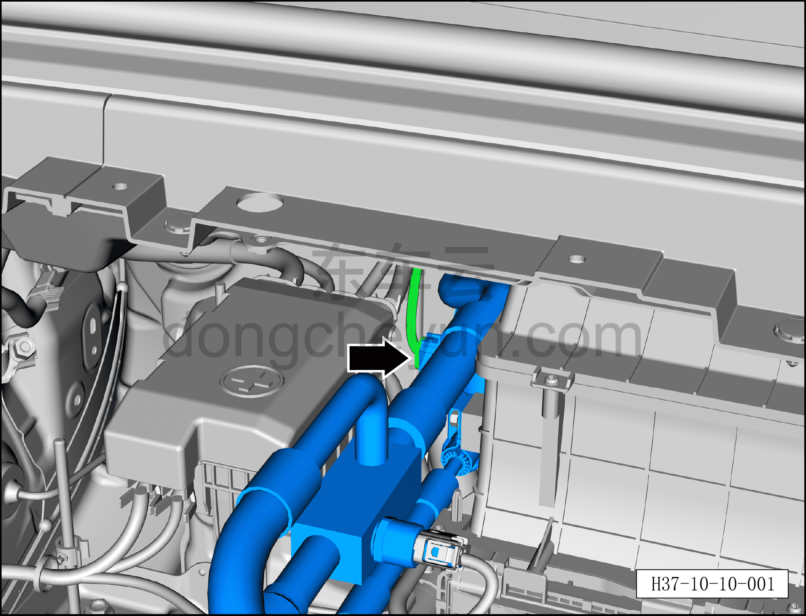
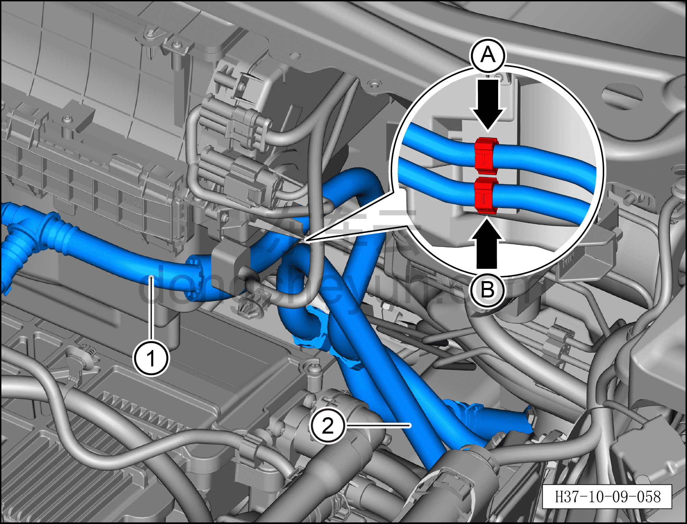
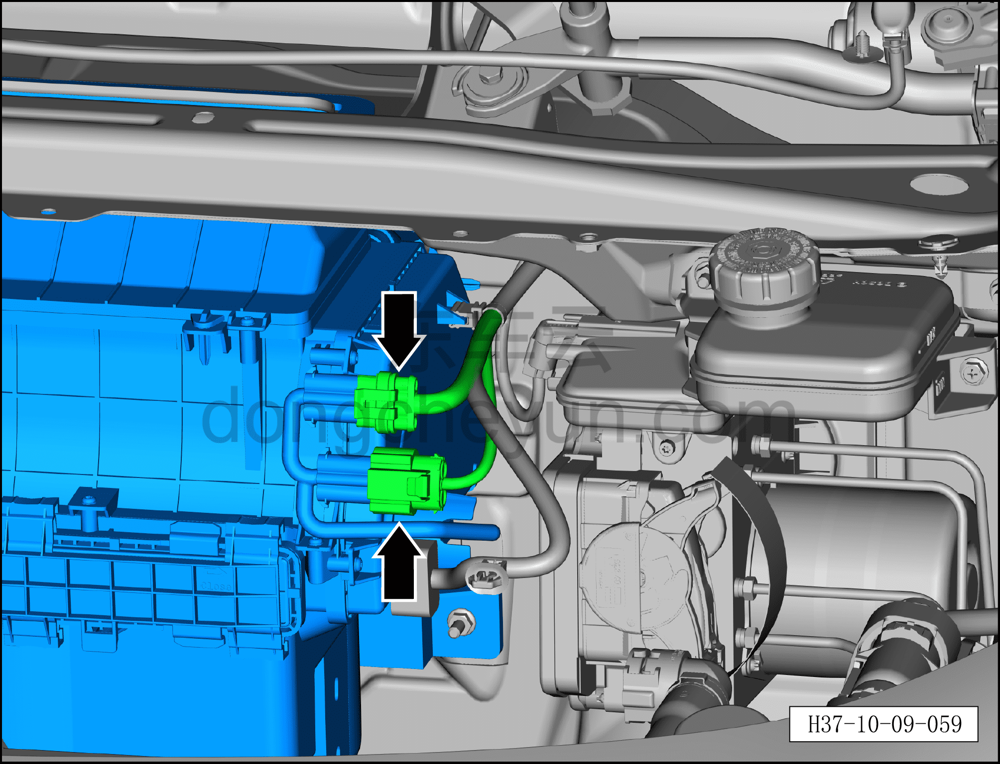
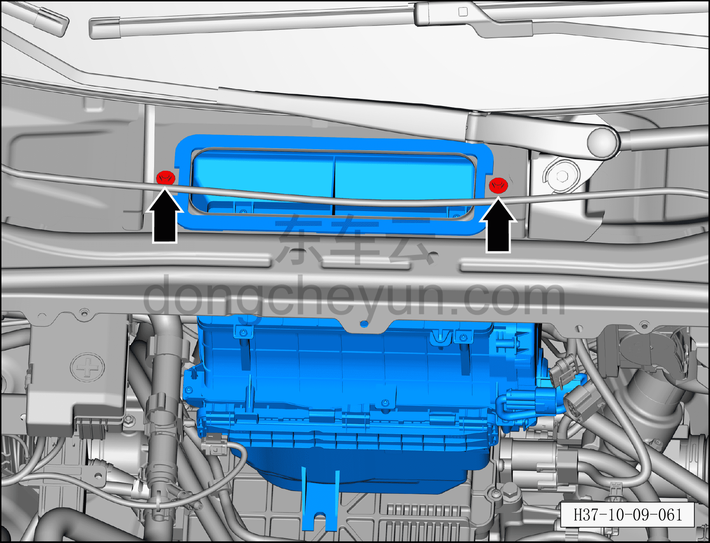
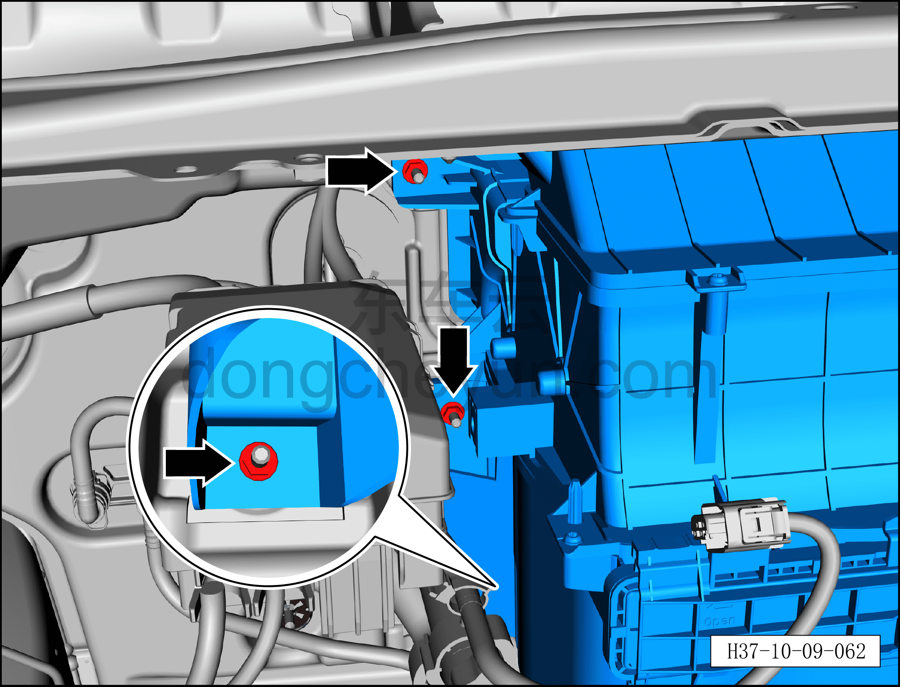
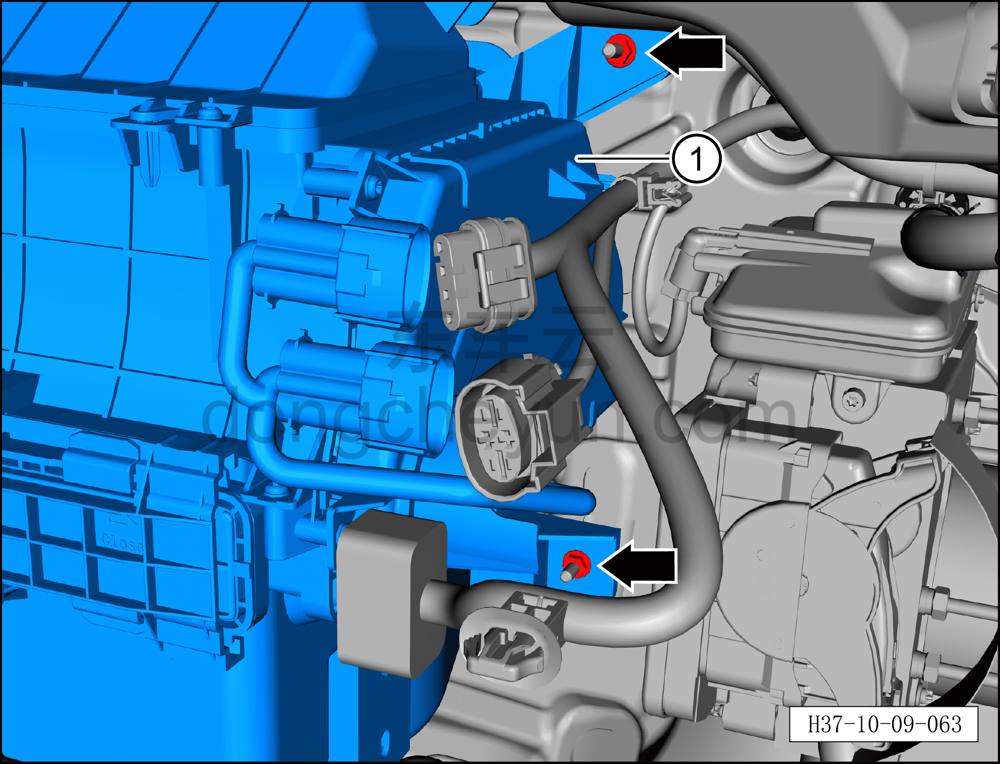

# Снятие и установка переднего вентилятора HVAC в сборе

> Кондиционер › Система охлаждения (кондиционирования) › Компоненты кондиционера  
> Оригинал: `拆卸与安装前HVAC鼓风机总成` · [dongcheyun 56746](https://dongcheyun.com/p/56746), страница `9e66a6666fc34099af538a7eac47073d` · [оглавление](../README.md)

**Порядок снятия**

**Внимание:**

**- Перед выполнением ремонтных работ подождите, пока температура охлаждающей жидкости снизится ниже 60°C.**

1. Выключите все электроприборы, отключите питание.

2. Выполните обесточивание автомобиля для ремонта. См. [3.1.4.1 Обесточивание автомобиля](../03-техническое-обслуживание/005-обесточивание-автомобиля.md)

3. Соберите (откачайте) хладагент. См. [10.1.6.12 Сбор/вакуумирование/заправка хладагента](045-сбор-вакуумирование-заправка-хладагента.md)

4. Слейте охлаждающую жидкость тягового электродвигателя и тяговой батареи. См. [3.1.5.1 Замена охлаждающей жидкости тягового электродвигателя и тяговой батареи](../03-техническое-обслуживание/006-замена-охлаждающей-жидкости-тягового-электродвигателя.md)

5. Слейте охлаждающую жидкость HVAC. См. [3.1.5.2 Замена охлаждающей жидкости HVAC](../03-техническое-обслуживание/007-замена-охлаждающей-жидкости-hvac.md)

6. Снимите водяной нагреватель PTC. См. [10.1.5.18 Снятие и установка водяного нагревателя PTC](027-снятие-и-установка-водяного-нагревателя-ptc-версия-400.md)

7. Снимите конденсатор. См. [4.1.7.24 Снятие и установка конденсатора](../04-интегрированная-силовая-система/043-снятие-и-установка-конденсатора.md)

8. Снимите охладитель батареи. См. [4.1.7.25 Снятие и установка охладителя батареи](../04-интегрированная-силовая-система/044-снятие-и-установка-охладителя-батареи.md)

9. Снимите кронштейн электронного ТРВ. См. [10.1.5.16 Снятие и установка кронштейна электронного ТРВ](025-снятие-и-установка-кронштейна-электронного-трв.md)

10. Снимите интегрированный расширительный бачок. См. [4.1.7.27 Снятие и установка интегрированного расширительного бачка](../04-интегрированная-силовая-система/046-снятие-и-установка-интегрированного-расширительного.md)

11. Снимите аккумуляторную батарею 12 В. См. [9.4.4.1 Снятие и установка аккумуляторной батареи 12 В](../09-электрическая-и-электронная-система/029-снятие-и-установка-аккумуляторной-батареи-12-в.md)

12. Снимите соосный трубопровод кондиционера. См. [10.1.5.13 Снятие и установка соосного трубопровода кондиционера](022-снятие-и-установка-соосного-трубопровода-кондиционера.md)

13. Снимите левую нижнюю декоративную накладку лобового стекла. См. [8.6.7.7 Снятие и установка левой нижней декоративной накладки лобового стекла](../08-внутренняя-и-внешняя-отделка/244-снятие-и-установка-крышки-стеклоочистителя-в-сборе.md)

14. Снимите правую нижнюю декоративную накладку лобового стекла. См. [8.6.7.6 Снятие и установка правой нижней декоративной накладки лобового стекла](../08-внутренняя-и-внешняя-отделка/243-снятие-и-установка-крышки-стеклоочистителя-в-сборе.md)

15. Снятие переднего вентилятора HVAC в сборе.

a. Нажмите на фиксатор разъёма и отсоедините разъём соосного трубопровода кондиционера.

b. Торцевой головкой 8 мм выверните 2 крепёжных болта A фитингов соосного трубопровода кондиционера.

Момент затяжки болта A: 8±1 Н·м

c. Торцевой головкой 8 мм выверните крепёжный болт B соосного трубопровода кондиционера.

Момент затяжки болта B: 8±1 Н·м

d. Отсоедините соосный трубопровод кондиционера ① и отведите его в положение, не мешающее извлечению переднего вентилятора HVAC в сборе.

**Внимание:**

**– В компрессоре может оставаться остаточное давление, при отсоединении соединений трубопровода извлекайте их медленно, чтобы не получить травму при резком высвобождении давления в компрессоре.**

**– После отсоединения соединения трубопровода закройте отверстия переднего распределителя HVAC в сборе и соосного трубопровода кондиционера нетканым материалом, чтобы избежать попадания посторонних предметов и повреждения деталей.**

**– При установке трубопровода обязательно замените уплотнительное кольцо O-образного сечения на новое.**

e. Отсоедините фиксатор A подающей водяной трубки батарейного блока.

f. Отсоедините фиксатор B отводящей водяной трубки батарейного блока.

g. Отведите подающую водяную трубку батарейного блока ① и отводящую водяную трубку батарейного блока ② в положение, не мешающее извлечению переднего вентилятора HVAC в сборе.

h. Нажмите на фиксатор разъёма и отсоедините 2 разъёма переднего вентилятора HVAC в сборе.

i. Отсоедините фиксирующую защёлку жгута разъёма переднего вентилятора HVAC в сборе.

j. Уберите водяные трубки и жгуты проводов рядом с передним вентилятором HVAC в сборе, чтобы они не мешали его извлечению.

k. Торцевой головкой 10 мм выверните 2 верхних крепёжных болта переднего вентилятора HVAC в сборе.

Момент затяжки болта: 8±1 Н·м

l. Торцевой головкой 10 мм отверните 3 левые крепёжные гайки переднего вентилятора HVAC в сборе.

Момент затяжки гайки: 6±1 Н·м

m. Торцевой головкой 10 мм отверните 2 правые крепёжные гайки переднего вентилятора HVAC в сборе.

Момент затяжки гайки: 6±1 Н·м

n. Снимите передний вентилятор HVAC в сборе ①.

**Порядок установки**

Установка выполняется в обратном порядке.

**Внимание:**

**– После завершения установки выполните вакуумирование системы кондиционирования и заправку хладагентом. См. [10.1.6.12 Сбор/вакуумирование/заправка хладагента](045-сбор-вакуумирование-заправка-хладагента.md) **

**– После завершения установки залейте охлаждающую жидкость и выполните удаление воздуха из системы охлаждения. См. [3.1.5.1 Замена охлаждающей жидкости тягового электродвигателя и тяговой батареи](../03-техническое-обслуживание/006-замена-охлаждающей-жидкости-тягового-электродвигателя.md) и [3.1.5.2 Замена охлаждающей жидкости HVAC](../03-техническое-обслуживание/007-замена-охлаждающей-жидкости-hvac.md) **

**– После завершения установки запустите автомобиль и проверьте соединения трубопроводов на отсутствие утечки охлаждающей жидкости.**

**– С помощью панели управления кондиционером на мультимедийном экране проверьте и убедитесь в нормальной работе всех функций системы кондиционирования, затем подключите диагностический сканер и проверьте наличие кодов неисправностей; при их наличии найдите причину и очистите коды неисправностей.**
