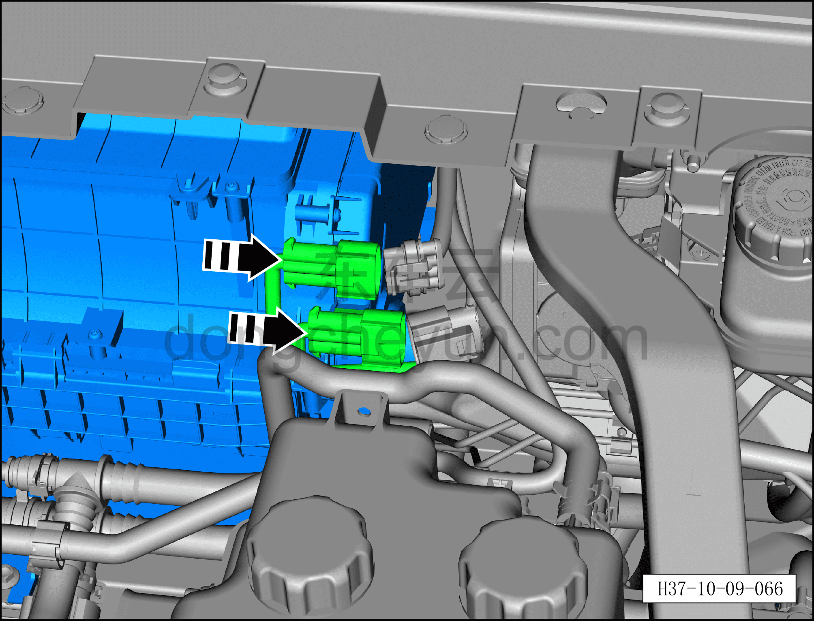
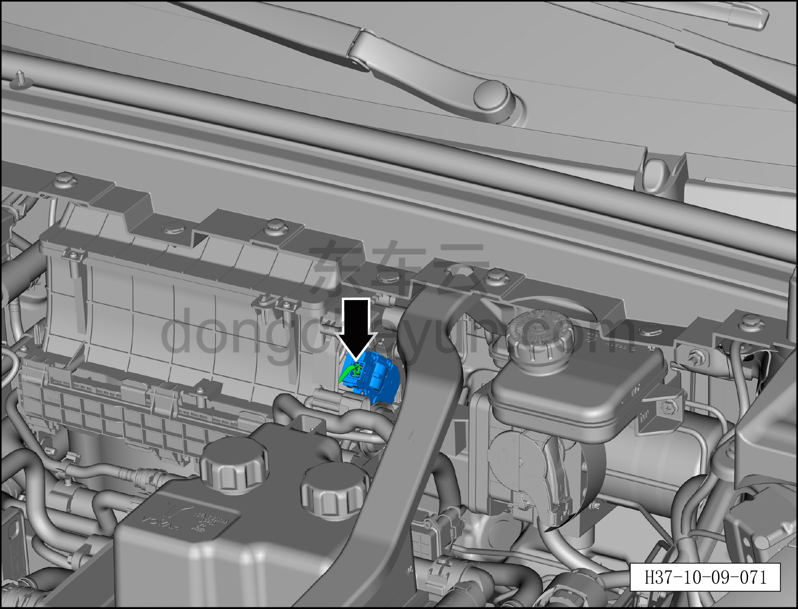
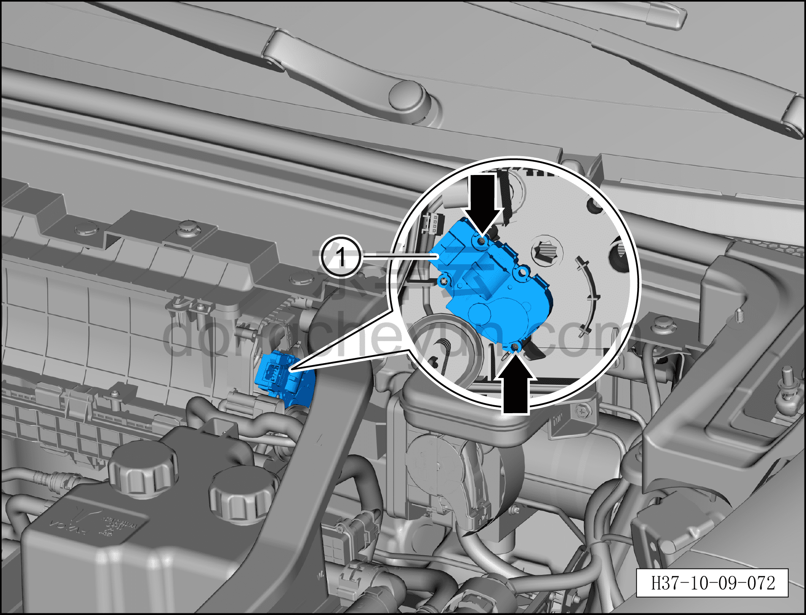

# Снятие и установка электродвигателя заслонки забора воздуха

> Кондиционер › Система охлаждения (кондиционирования) › Компоненты кондиционера  
> Оригинал: `拆卸与安装吸气风门马达` · [dongcheyun 56746](https://dongcheyun.com/p/56746), страница `fa2c3b1749e8421387dc7e3ef9322660` · [оглавление](../README.md)

**Порядок снятия**

1. Выключите все электроприборы, отключите питание.

2. Выполните обесточивание автомобиля для ремонта. См. [3.1.4.1 Обесточивание автомобиля](../03-техническое-обслуживание/005-обесточивание-автомобиля.md)

3. Снятие электродвигателя заслонки забора воздуха.

a. Нажмите на фиксатор разъёма и отсоедините 2 разъёма переднего вентилятора HVAC в сборе.

b. С помощью съёмника обивки отсоедините фиксирующую защёлку жгута разъёма переднего вентилятора HVAC в сборе.

c. В направлении стрелки отсоедините разъём от точки фиксации.

d. Битой T20 выверните 5 крепёжных винтов бокового защитного кожуха переднего вентилятора HVAC в сборе.

e. Извлеките боковой защитный кожух переднего вентилятора HVAC в сборе ①.

**Внимание:**

**– После извлечения бокового защитного кожуха переднего вентилятора HVAC в сборе к нему всё ещё подключён жгут проводов, не тяните его с усилием.**

f. Плоской отвёрткой отсоедините водозащитную заглушку жгута проводов, пропустите жгут проводов через боковой защитный кожух переднего вентилятора HVAC в сборе.

g. Снимите боковой защитный кожух переднего вентилятора HVAC в сборе ①.

**Внимание:**

**– Водозащитный чехол жгута проводов закреплён достаточно плотно; если его трудно снять напрямую, можно с помощью плоской отвёртки отжать его по краю.**

h. Нажмите на фиксатор разъёма электродвигателя заслонки забора воздуха и отсоедините разъём электродвигателя заслонки забора воздуха.

i. Битой T20 выверните 2 крепёжных винта электродвигателя заслонки забора воздуха.

j. Снимите электродвигатель заслонки забора воздуха ①.

**Порядок установки**

Установка выполняется в обратном порядке.

**Внимание:**

**– С помощью панели управления кондиционером на мультимедийном экране проверьте и убедитесь в нормальной работе всех функций системы кондиционирования, затем подключите диагностический сканер и проверьте наличие кодов неисправностей; при их наличии найдите причину и очистите коды неисправностей.**
