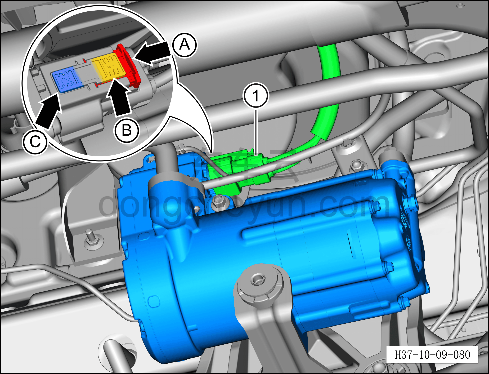
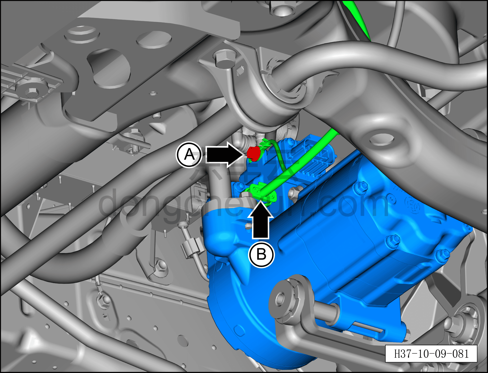
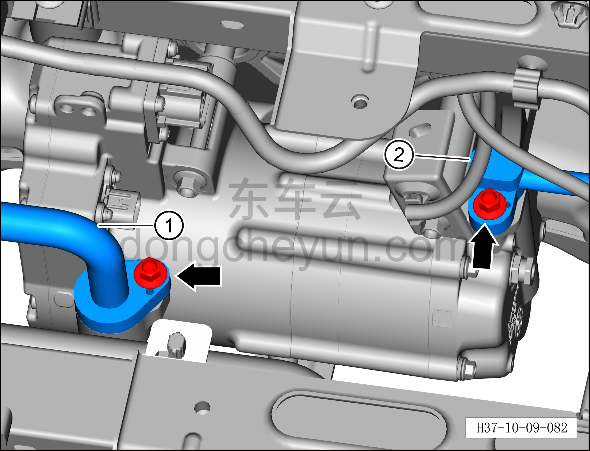
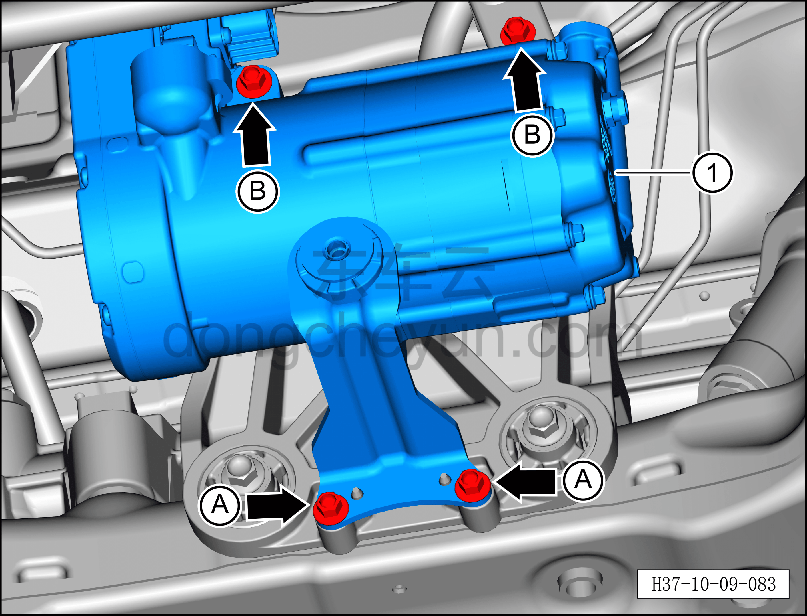
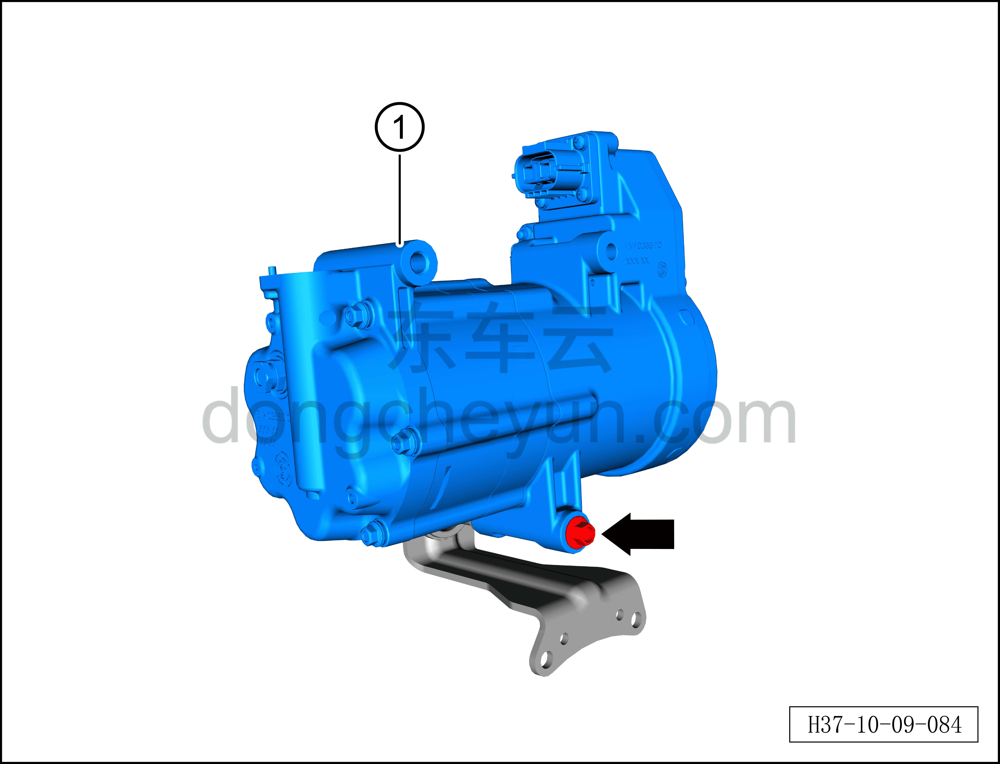

# Снятие и установка компрессора (версия RWD 800 В)

> Кондиционер › Система охлаждения (кондиционирования) › Компоненты кондиционера  
> Оригинал: `拆卸与安装压缩机（两驱800V车型）` · [dongcheyun 56746](https://dongcheyun.com/p/56746), страница `732b6559945049a09f11e461e69f951c` · [оглавление](../README.md)

**Порядок снятия**

1. Выключите все электроприборы, отключите питание.

2. Выполните обесточивание автомобиля для ремонта. См. [3.1.4.1 Обесточивание автомобиля](../03-техническое-обслуживание/005-обесточивание-автомобиля.md)

3. Соберите (откачайте) хладагент. См. [10.1.6.12 Сбор/вакуумирование/заправка хладагента](045-сбор-вакуумирование-заправка-хладагента.md)

4. Снимите передний нижний защитный щиток. См. [8.6.4.3 Снятие и установка переднего нижнего защитного щитка](../08-внутренняя-и-внешняя-отделка/193-снятие-и-установка-переднего-нижнего-защитного-щитка.md)

5. Снятие компрессора.

a. Извлеките фиксирующий зажим разъёма A, нажмите на фиксирующий зажим разъёма B и одновременно выведите разъём назад, затем нажмите на фиксирующий зажим разъёма C и отсоедините разъём высоковольтного жгута компрессора ①.

**Внимание:**

**– После снятия закройте разъём высоковольтного жгута компрессора чистым изолирующим защитным колпачком, чтобы предотвратить попадание посторонних предметов.**

b. Торцевой головкой 10 мм выверните крепёжный болт A жгута заземления компрессора, отсоедините жгут заземления компрессора.

c. Отсоедините разъём B компрессора.

Момент затяжки болта: 8±1 Н·м

d. Торцевой головкой 10 мм выверните крепёжные болты фитинга трубки выхода компрессора и фитинга трубопровода всасывания компрессора.

Момент затяжки болтов: 10±1 Н·м

e. Отсоедините трубопровод всасывания компрессора ①.

f. Отсоедините трубку выхода компрессора ②.

**Внимание:**

**– В компрессоре может оставаться остаточное давление, при отсоединении соединений трубопровода извлекайте их медленно, чтобы не получить травму при резком высвобождении давления в компрессоре.**

**– После отсоединения соединений трубопровода закройте отверстия компрессора и трубопроводов кондиционера нетканым материалом, чтобы избежать попадания посторонних предметов и повреждения деталей.**

**– При установке трубопровода обязательно замените уплотнительное кольцо O-образного сечения на новое.**

g. Торцевой головкой 10 мм выверните 2 крепёжных болта A крепёжного кронштейна компрессора.

Момент затяжки болта A: 20±2 Н·м

h. Торцевой головкой 10 мм выверните 2 крепёжных болта B кронштейна компрессора.

Момент затяжки болта B: 25±2 Н·м

i. Извлеките компрессор вместе с крепёжным кронштейном ①.

j. Торцевой головкой 10 мм выверните крепёжный болт кронштейна компрессора.

Момент затяжки болта: 25±2 Н·м

k. Снимите компрессор ①.

**Порядок установки**

Установка выполняется в обратном порядке.

**Примечание:**

**После завершения замены необходимо выполнить следующие операции с помощью диагностического сканера или удалённой диагностики:**

**- Сначала прошить программное обеспечение до последней версии;**

**- После успешного обновления программного обеспечения выполнить процедуру замены детали для контроллера.**

**Внимание:**

**– При замене уплотнительного кольца O-образного сечения на новое нанесите на него небольшое количество смазочного масла.**

**– После завершения установки выполните вакуумирование системы кондиционирования и заправку хладагентом. См. [10.1.6.12 Сбор/вакуумирование/заправка хладагента](045-сбор-вакуумирование-заправка-хладагента.md) **

**– С помощью панели управления кондиционером на мультимедийном экране проверьте и убедитесь в нормальной работе всех функций системы кондиционирования, затем подключите диагностический сканер и проверьте наличие кодов неисправностей; при их наличии найдите причину и очистите коды неисправностей.**
