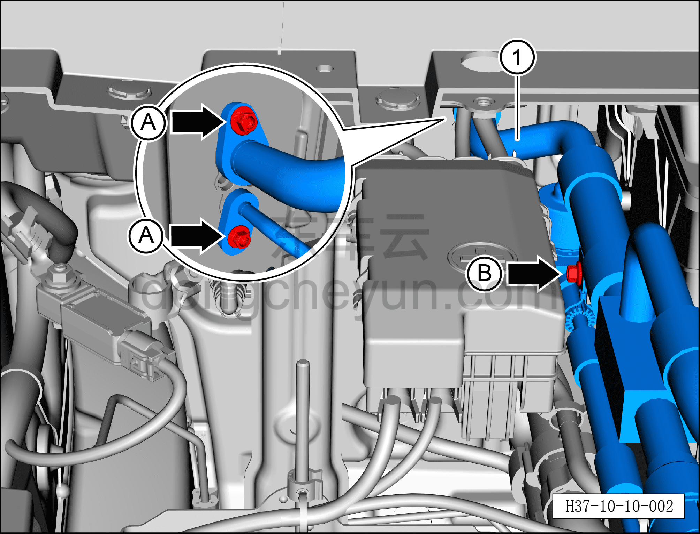
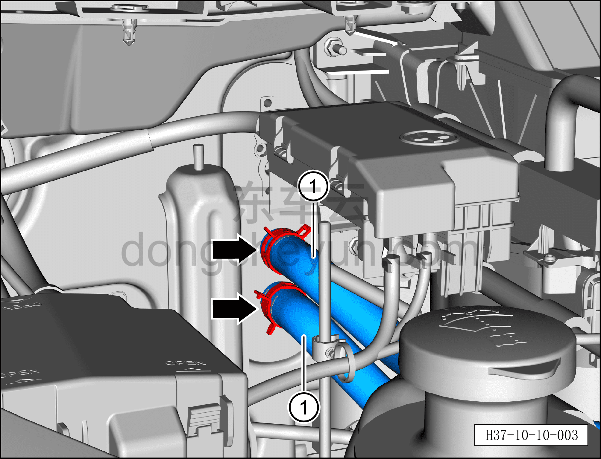
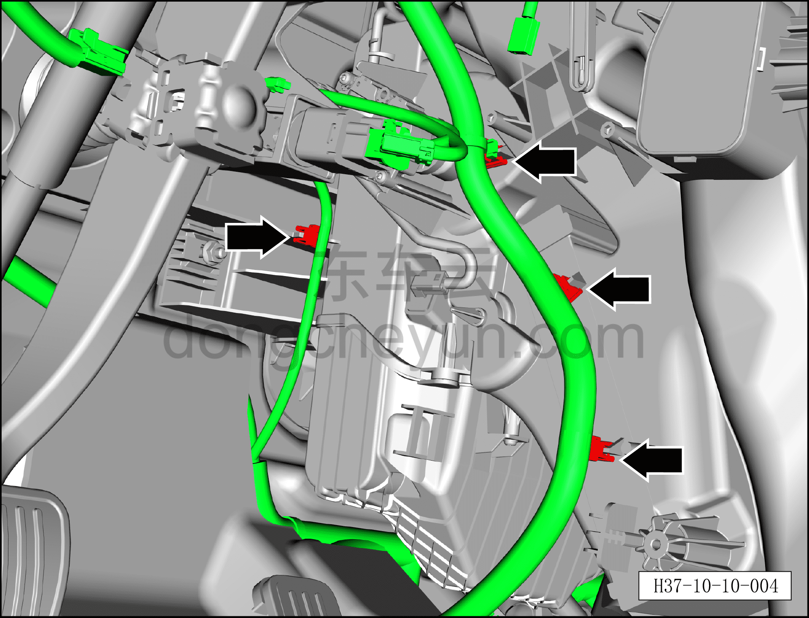
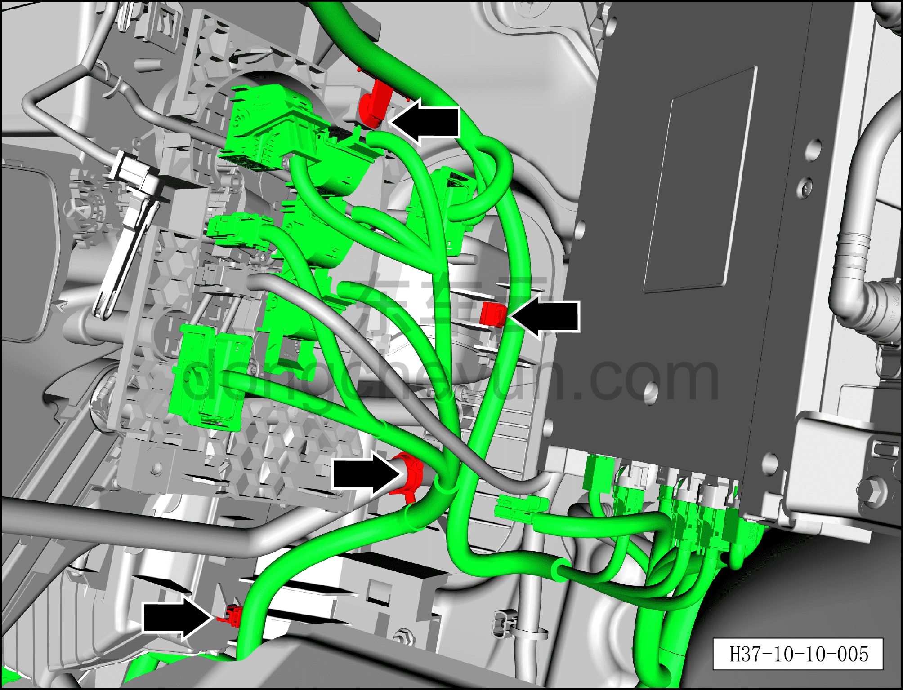
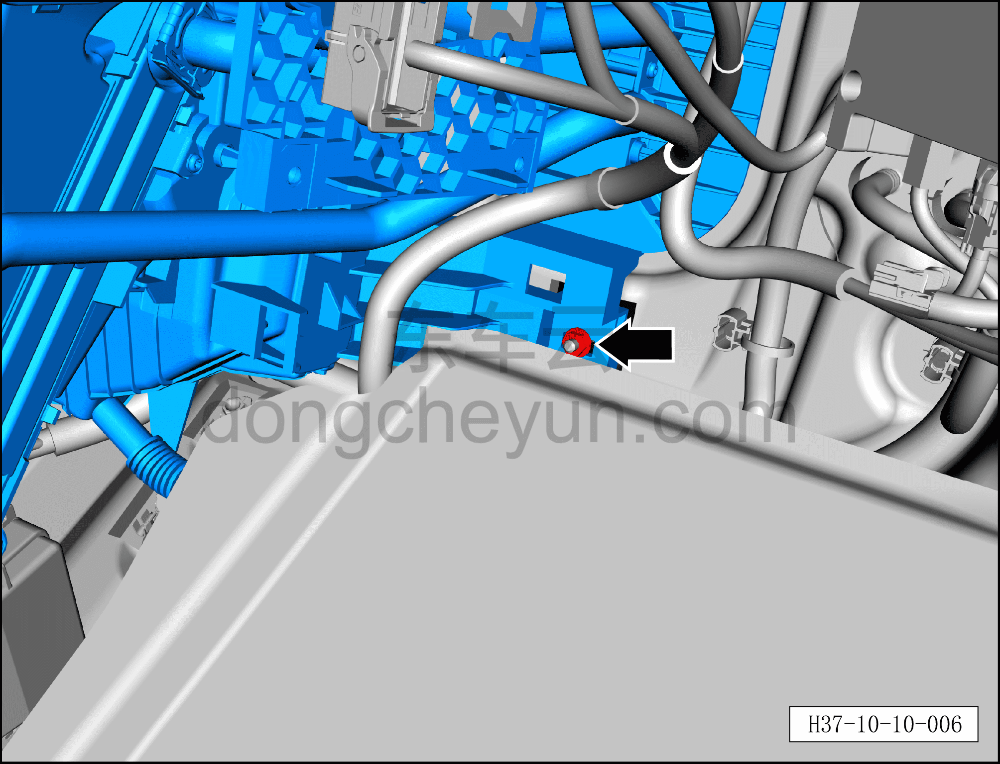
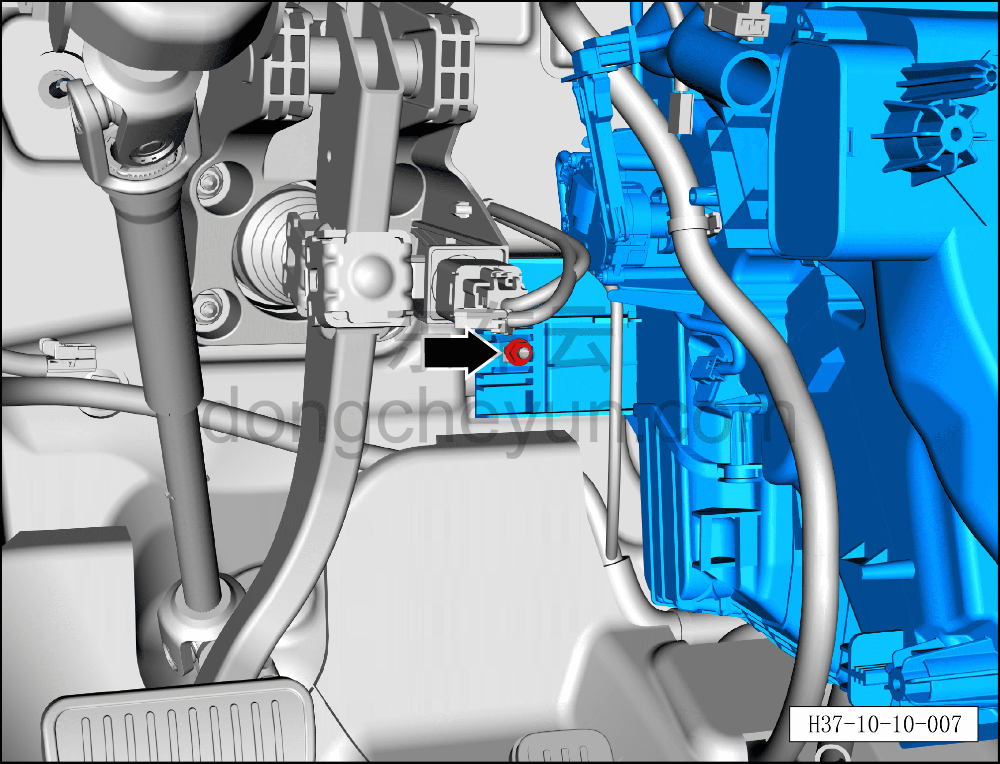
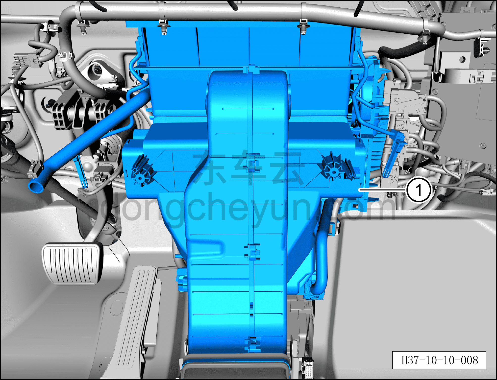

# Снятие и установка переднего распределителя HVAC в сборе

> Кондиционер › Система охлаждения (кондиционирования) › Компоненты управления климатом салона  
> Оригинал: `拆卸与安装前HVAC分发器总成` · [dongcheyun 56746](https://dongcheyun.com/p/56746), страница `3276515c204245598a4f212b5ccdefd4` · [оглавление](../README.md)

**Порядок снятия**

**Внимание:**

**- Перед выполнением ремонтных работ подождите, пока температура охлаждающей жидкости снизится ниже 60°C.**

1. Выключите все электроприборы, отключите питание.

2. Выполните операцию обесточивания автомобиля для ремонта. См. [3.1.4.1 Обесточивание автомобиля](../03-техническое-обслуживание/005-обесточивание-автомобиля.md)

3. Соберите (откачайте) хладагент. См. [10.1.6.12 Сбор/вакуумирование/заправка хладагента](045-сбор-вакуумирование-заправка-хладагента.md)

4. Слейте охлаждающую жидкость HVAC. См. [3.1.5.2 Замена охлаждающей жидкости HVAC](../03-техническое-обслуживание/007-замена-охлаждающей-жидкости-hvac.md)

5. Снимите аккумуляторную батарею 12 В. См. [9.4.4.1 Снятие и установка аккумуляторной батареи 12 В](../09-электрическая-и-электронная-система/029-снятие-и-установка-аккумуляторной-батареи-12-в.md)

6. Снимите датчик температуры в салоне. См. [10.1.6.11 Снятие и установка датчика температуры в салоне](044-снятие-и-установка-датчика-температуры-в-салоне.md)

7. Снимите датчик PM2.5. См. [10.1.6.6 Снятие и установка датчика PM2.5](039-снятие-и-установка-датчика-pm2-5.md)

8. Снимите правый воздуховод обдува ног. См. [8.2.4.26 Снятие и установка правого воздуховода обдува ног](../08-внутренняя-и-внешняя-отделка/079-снятие-и-установка-правого-воздуховода-обдува-ног.md)

9. Снимите правый зональный контроллер салона (VIU). См. [9.5.4.7 Снятие и установка правого зонального контроллера салона (VIU)](../09-электрическая-и-электронная-система/044-снятие-и-установка-правого-зонального-контроллера.md)

10. Снятие переднего распределителя HVAC в сборе.

a. Нажмите на фиксатор разъёма и отсоедините разъём соосного трубопровода кондиционера.

b. Торцевой головкой 8 мм выверните 2 крепёжных болта A фитингов соосного трубопровода кондиционера.

Момент затяжки болта A: 8±1 Н·м

c. Торцевой головкой 8 мм выверните крепёжный болт B соосного трубопровода кондиционера.

Момент затяжки болта B: 8±1 Н·м

d. Отсоедините соосный трубопровод кондиционера ①.

**Внимание:**

**– После отсоединения соединения трубопровода закройте отверстия переднего распределителя HVAC в сборе и соосного трубопровода кондиционера нетканым материалом, чтобы избежать попадания посторонних предметов и повреждения деталей.**

**– При установке трубопровода обязательно замените уплотнительное кольцо O-образного сечения на новое.**

e. Специальными клещами для хомутов водяных трубок отсоедините хомуты крепления обратной водяной трубки отопителя в сборе и водяной трубки от PTC к переднему сердечнику отопителя.

f. Отсоедините обратную водяную трубку отопителя в сборе ① и водяную трубку от PTC к переднему сердечнику отопителя ②.

**Внимание:**

**– После отсоединения водяных трубок закройте отверстия переднего распределителя HVAC и водяных трубок нетканым материалом, чтобы избежать попадания посторонних предметов и повреждения деталей.**

**– После отсоединения водяных трубок вытрите охлаждающую жидкость, вытекшую в местах соединений трубок, чтобы облегчить проверку после завершения установки.**

**– При установке трубопровода обязательно замените уплотнительное кольцо O-образного сечения на новое.**

g. С помощью съёмника обивки отсоедините 4 фиксирующие защёлки, соединяющие левую сторону переднего распределителя HVAC в сборе с жгутом проводов.

h. Уберите жгут проводов, переместив его в положение, не мешающее извлечению переднего распределителя HVAC в сборе.

i. С помощью съёмника обивки отсоедините 4 фиксирующие защёлки, соединяющие правую сторону переднего распределителя HVAC в сборе с жгутом проводов.

j. Уберите жгут проводов, переместив его в положение, не мешающее извлечению переднего распределителя HVAC в сборе.

k. Торцевой головкой 10 мм отверните правую крепёжную гайку переднего распределителя HVAC в сборе.

Момент затяжки гайки: 4±0,5 Н·м

l. Торцевой головкой 10 мм отверните левую крепёжную гайку переднего распределителя HVAC в сборе.

Момент затяжки гайки: 4±0,5 Н·м

m. Извлеките передний распределитель HVAC в сборе ①.

**Порядок установки**

Установка выполняется в обратном порядке.

**Внимание:**

**– При замене уплотнительного кольца O-образного сечения на новое нанесите на него небольшое количество смазочного масла.**

**– После завершения установки выполните вакуумирование системы кондиционирования и заправку хладагентом. См. [10.1.6.12 Сбор/вакуумирование/заправка хладагента](045-сбор-вакуумирование-заправка-хладагента.md)**

**– После завершения установки залейте охлаждающую жидкость и выполните удаление воздуха из системы охлаждения. См. [3.1.5.2 Замена охлаждающей жидкости HVAC](../03-техническое-обслуживание/007-замена-охлаждающей-жидкости-hvac.md)**

**– После завершения установки запустите автомобиль и проверьте соединения трубопроводов на отсутствие утечки охлаждающей жидкости.**

**– С помощью панели управления кондиционером на мультимедийном экране проверьте и убедитесь в нормальной работе всех функций системы кондиционирования, затем подключите диагностический сканер и проверьте наличие кодов неисправностей; при их наличии найдите причину и очистите коды неисправностей.**
