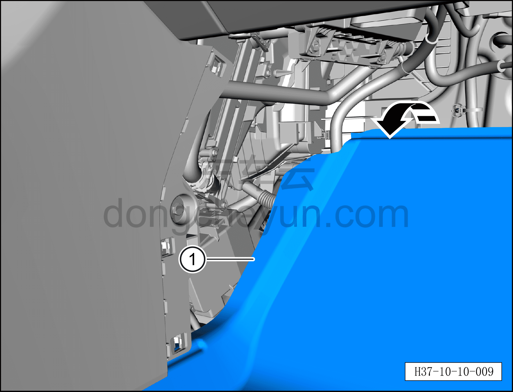
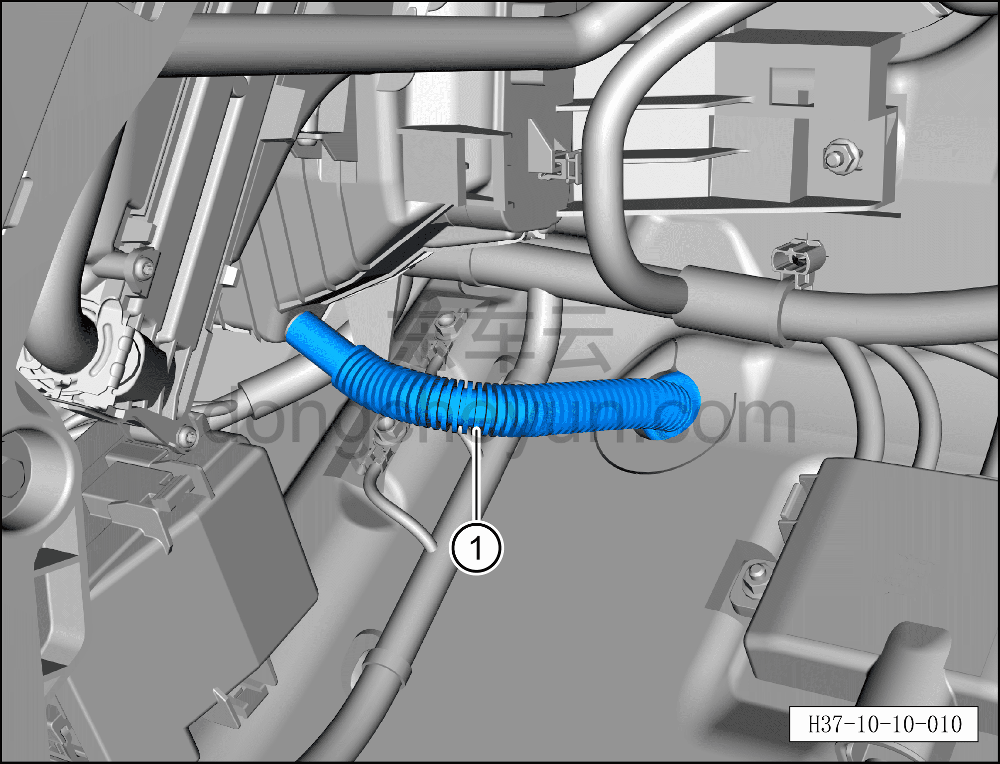

# Снятие и установка водяной трубки кондиционера

> Кондиционер › Система охлаждения (кондиционирования) › Компоненты управления климатом салона  
> Оригинал: `拆卸与安装空调水管` · [dongcheyun 56746](https://dongcheyun.com/p/56746), страница `08db662bc3d842609a56aa7f68b0ee78` · [оглавление](../README.md)

**Порядок снятия**

1. Выключите все электроприборы, отключите питание.

2. Выполните операцию обесточивания автомобиля для ремонта. См. [3.1.4.1 Обесточивание автомобиля](../03-техническое-обслуживание/005-обесточивание-автомобиля.md)

3. Снимите правую нижнюю панель торпедо. См. [8.2.4.4 Снятие и установка правой нижней панели торпедо](../08-внутренняя-и-внешняя-отделка/057-снятие-и-установка-правой-нижней-панели-панели-приборов.md)

4. Правая передняя удлинительная панель. См. [8.3.4.2 Снятие и установка правой передней удлинительной панели](../08-внутренняя-и-внешняя-отделка/092-снятие-и-установка-правой-передней-расширительной.md)

5. Снятие водяной трубки кондиционера.

a. Приподнимите передний ковёр переднего пола ①.

b. Извлеките водяную трубку кондиционера ①.

**Порядок установки**

Установка выполняется в обратном порядке.

**Внимание:**

**– При установке ориентируйте коническую сторону водяной трубки кондиционера наружу автомобиля.**

**– После завершения установки проверьте, что водяная трубка кондиционера установлена правильно.**

**– После завершения установки с помощью панели управления кондиционером на мультимедийном экране проверьте и убедитесь в нормальном отводе воды через водяную трубку кондиционера, затем подключите диагностический сканер и проверьте наличие кодов неисправностей; при их наличии найдите причину и очистите коды неисправностей.**
