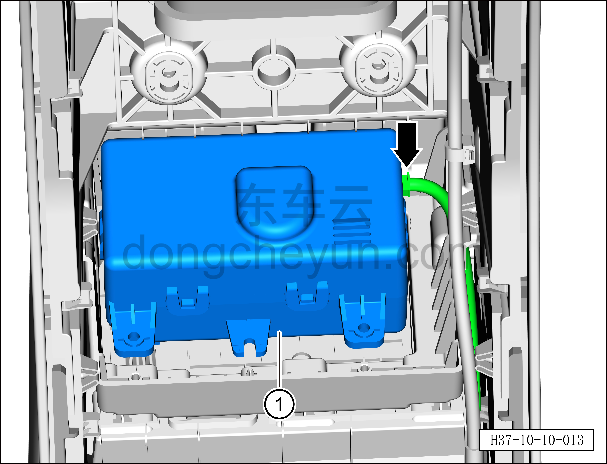

# Снятие и установка генератора ароматизации

> Кондиционер › Система охлаждения (кондиционирования) › Компоненты управления климатом салона  
> Оригинал: `拆卸与安装香氛发生器` · [dongcheyun 56746](https://dongcheyun.com/p/56746), страница `b81615dd86834a53bbd6f21b84eded6b` · [оглавление](../README.md)

**Порядок снятия**

1. Выключите все электроприборы, отключите питание.

2. Выполните операцию обесточивания автомобиля для ремонта. См. [3.1.4.1 Обесточивание автомобиля](../03-техническое-обслуживание/005-обесточивание-автомобиля.md)

3. Снимите центральную консоль в сборе. См. [8.3.4.8 Снятие и установка центральной консоли в сборе](../08-внутренняя-и-внешняя-отделка/102-снятие-и-установка-задней-крышки.md)

4. Снятие генератора ароматизации.

a. Крестовой отвёрткой выверните 4 крепёжных винта генератора ароматизации.

b. Отсоедините генератор ароматизации ①.

c. Отсоедините разъём жгута проводов генератора ароматизации.

d. Снимите генератор ароматизации ①.

**Порядок установки**

Установка выполняется в обратном порядке.

**Внимание:**

**– После завершения установки с помощью панели управления кондиционером на мультимедийном экране проверьте и убедитесь в нормальной работе функции ароматизации**.
