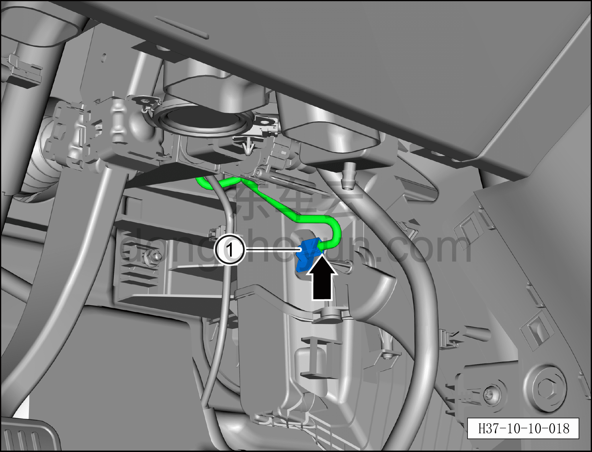

# Снятие и установка датчика температуры испарителя

> Кондиционер › Система охлаждения (кондиционирования) › Компоненты управления климатом салона  
> Оригинал: `拆卸与安装蒸发器温度传感器` · [dongcheyun 56746](https://dongcheyun.com/p/56746), страница `76f4a6d2dee04b4b94487248db9cbd84` · [оглавление](../README.md)

**Порядок снятия**

1. Выключите все электроприборы, отключите питание.

2. Выполните операцию обесточивания автомобиля для ремонта. См. [3.1.4.1 Обесточивание автомобиля](../03-техническое-обслуживание/005-обесточивание-автомобиля.md)

3. Снимите левую нижнюю панель торпедо. См. [8.2.4.3 Снятие и установка левой нижней панели торпедо](../08-внутренняя-и-внешняя-отделка/056-снятие-и-установка-левой-нижней-панели-панели-приборов.md)

4. Снимите левую переднюю удлинительную панель. См. [8.3.4.1 Снятие и установка левой передней удлинительной панели](../08-внутренняя-и-внешняя-отделка/091-снятие-и-установка-левой-передней-расширительной-панели.md)

5. Снятие датчика температуры испарителя.

a. Небольшой плоской отвёрткой нажмите на фиксатор разъёма и отсоедините разъём датчика температуры испарителя.

b. Снимите датчик температуры испарителя ①.

**Порядок установки**

Установка выполняется в обратном порядке.

Внимание:

– С помощью панели управления кондиционером на мультимедийном экране проверьте и убедитесь в нормальной работе всех функций системы кондиционирования, затем подключите диагностический сканер и проверьте наличие кодов неисправностей; при их наличии найдите причину и очистите коды неисправностей.
