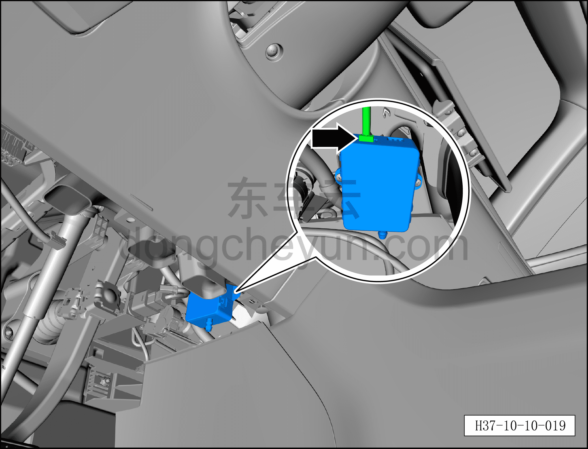
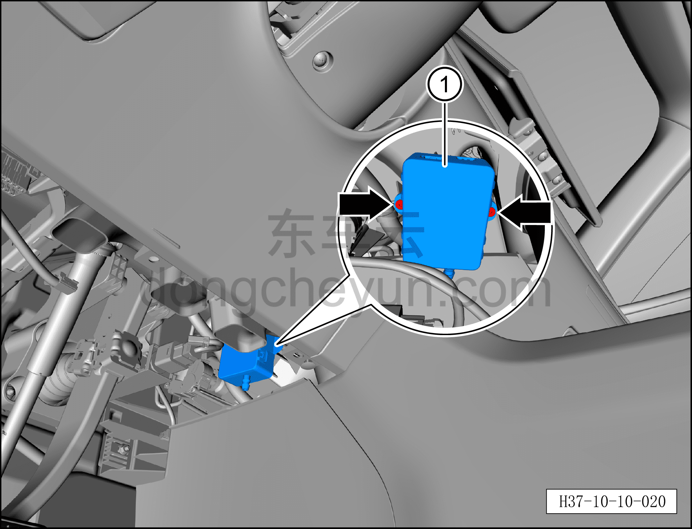

# Снятие и установка датчика PM2.5

> Кондиционер › Система охлаждения (кондиционирования) › Компоненты управления климатом салона  
> Оригинал: `拆卸与安装PM2.5传感器` · [dongcheyun 56746](https://dongcheyun.com/p/56746), страница `d22340787db54066ad297d517aff5178` · [оглавление](../README.md)

**Порядок снятия**

1. Выключите все электроприборы, отключите питание.

2. Выполните операцию обесточивания автомобиля для ремонта. См. [3.1.4.1 Обесточивание автомобиля](../03-техническое-обслуживание/005-обесточивание-автомобиля.md)

3. Снимите левую нижнюю панель торпедо. См. [8.2.4.3 Снятие и установка левой нижней панели торпедо](../08-внутренняя-и-внешняя-отделка/056-снятие-и-установка-левой-нижней-панели-панели-приборов.md)

4. Снятие датчика PM2.5.

a. Нажмите на фиксатор разъёма и отсоедините разъём датчика PM2.5.

b. Крестовой отвёрткой выверните 2 крепёжных винта датчика PM2.5.

Момент затяжки винта: 1,0±0,1 Н·м

c. Снимите датчик PM2.5 ①.

**Порядок установки**

Установка выполняется в обратном порядке.

**Внимание:**

**– После завершения установки с помощью панели управления кондиционером на мультимедийном экране проверьте и убедитесь в нормальной работе всех функций системы кондиционирования.**
