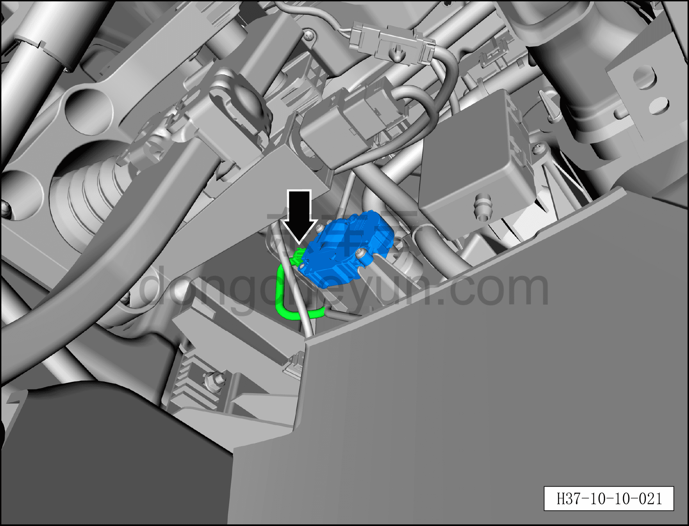
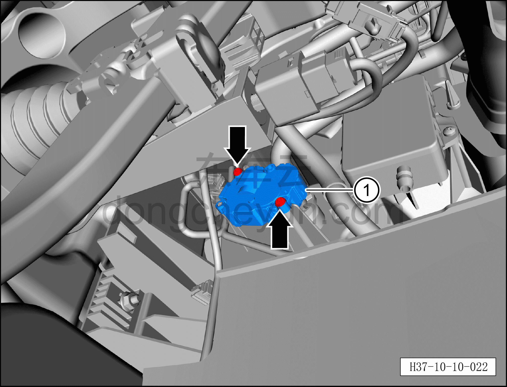

# Снятие и установка левого электродвигателя заслонки смешения

> Кондиционер › Система охлаждения (кондиционирования) › Компоненты управления климатом салона  
> Оригинал: `拆卸与安装左混合风门电机` · [dongcheyun 56746](https://dongcheyun.com/p/56746), страница `70c5bbfd34b74d869c6c66895b89041c` · [оглавление](../README.md)

**Порядок снятия**

1. Выключите все электроприборы, отключите питание.

2. Выполните операцию обесточивания автомобиля для ремонта. См. [3.1.4.1 Обесточивание автомобиля](../03-техническое-обслуживание/005-обесточивание-автомобиля.md)

3. Снимите левую нижнюю панель торпедо. См. [8.2.4.3 Снятие и установка левой нижней панели торпедо](../08-внутренняя-и-внешняя-отделка/056-снятие-и-установка-левой-нижней-панели-панели-приборов.md)

4. Снятие левого электродвигателя заслонки смешения.

a. Нажмите на фиксатор разъёма и отсоедините разъём левого электродвигателя заслонки смешения.

b. Битой T20 выверните 2 крепёжных винта левого электродвигателя заслонки смешения.

c. Снимите левый электродвигатель заслонки смешения ①.

**Порядок установки**

Установка выполняется в обратном порядке.

**Внимание:**

**– После завершения установки с помощью панели управления кондиционером на мультимедийном экране проверьте и убедитесь в нормальной работе всех функций системы кондиционирования, затем подключите диагностический сканер и проверьте наличие кодов неисправностей; при их наличии найдите причину и очистите коды неисправностей.**
