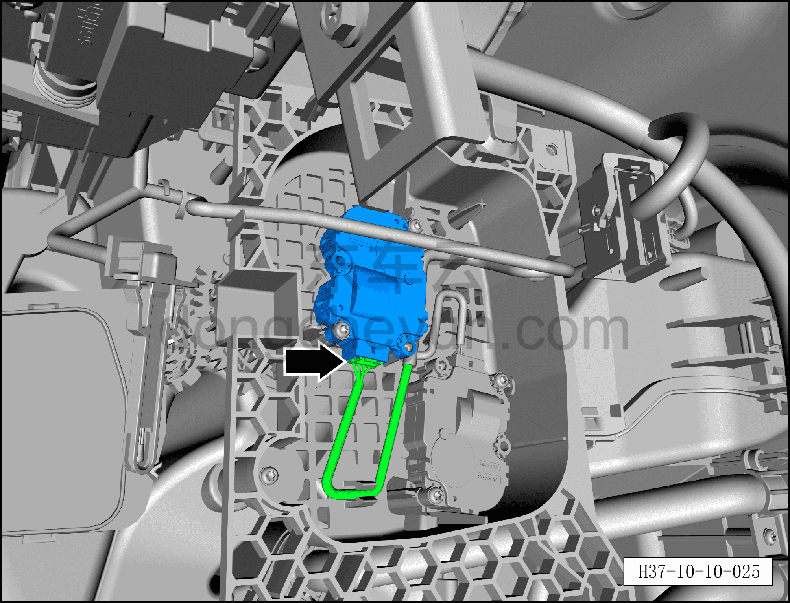
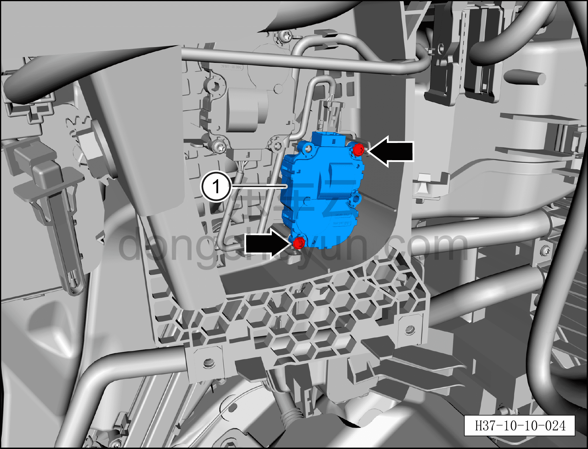

# Снятие и установка электродвигателя заслонки режима

> Кондиционер › Система охлаждения (кондиционирования) › Компоненты управления климатом салона  
> Оригинал: `拆卸与安装模式风门电机` · [dongcheyun 56746](https://dongcheyun.com/p/56746), страница `b370475344a44e4fa02a1d7f7a88189b` · [оглавление](../README.md)

**Порядок снятия**

1. Выключите все электроприборы, отключите питание.

2. Выполните операцию обесточивания автомобиля для ремонта. См. [3.1.4.1 Обесточивание автомобиля](../03-техническое-обслуживание/005-обесточивание-автомобиля.md)

3. Снимите правую нижнюю панель торпедо. См. [8.2.4.4 Снятие и установка правой нижней панели торпедо](../08-внутренняя-и-внешняя-отделка/057-снятие-и-установка-правой-нижней-панели-панели-приборов.md)

4. Снимите правую переднюю удлинительную панель. См. [8.3.4.2 Снятие и установка правой передней удлинительной панели](../08-внутренняя-и-внешняя-отделка/092-снятие-и-установка-правой-передней-расширительной.md)

5. Снимите центральную консоль в сборе. См. [8.3.4.13 Снятие и установка центральной консоли в сборе](../08-внутренняя-и-внешняя-отделка/098-снятие-и-установка-центральной-консоли-в-сборе.md)

6. Снимите правую центральную защитную панель. См. [8.2.4.21 Снятие и установка правой центральной защитной панели](../08-внутренняя-и-внешняя-отделка/074-снятие-и-установка-центрально-правой-накладки.md)

7. Снимите перчаточный ящик. См. [8.2.4.7 Снятие и установка перчаточного ящика](../08-внутренняя-и-внешняя-отделка/060-снятие-и-установка-перчаточного-ящика.md)

8. Снимите правый воздуховод обдува ног. См. [8.2.4.26 Снятие и установка правого воздуховода обдува ног](../08-внутренняя-и-внешняя-отделка/079-снятие-и-установка-правого-воздуховода-обдува-ног.md)

9. Снимите правый зональный контроллер салона (VIU). См. [9.5.4.7 Снятие и установка правого зонального контроллера салона (VIU)](../09-электрическая-и-электронная-система/044-снятие-и-установка-правого-зонального-контроллера.md)

10. Снятие электродвигателя заслонки режима.

a. Нажмите на фиксатор разъёма и отсоедините разъём электродвигателя заслонки режима.

b. Битой T20 выверните 2 крепёжных винта электродвигателя заслонки режима.

c. Снимите электродвигатель заслонки режима ①.

**Порядок установки**

Установка выполняется в обратном порядке.

**Внимание:**

**– После завершения установки с помощью панели управления кондиционером на мультимедийном экране проверьте и убедитесь в нормальной работе всех функций системы кондиционирования, затем подключите диагностический сканер и проверьте наличие кодов неисправностей; при их наличии найдите причину и очистите коды неисправностей.**
