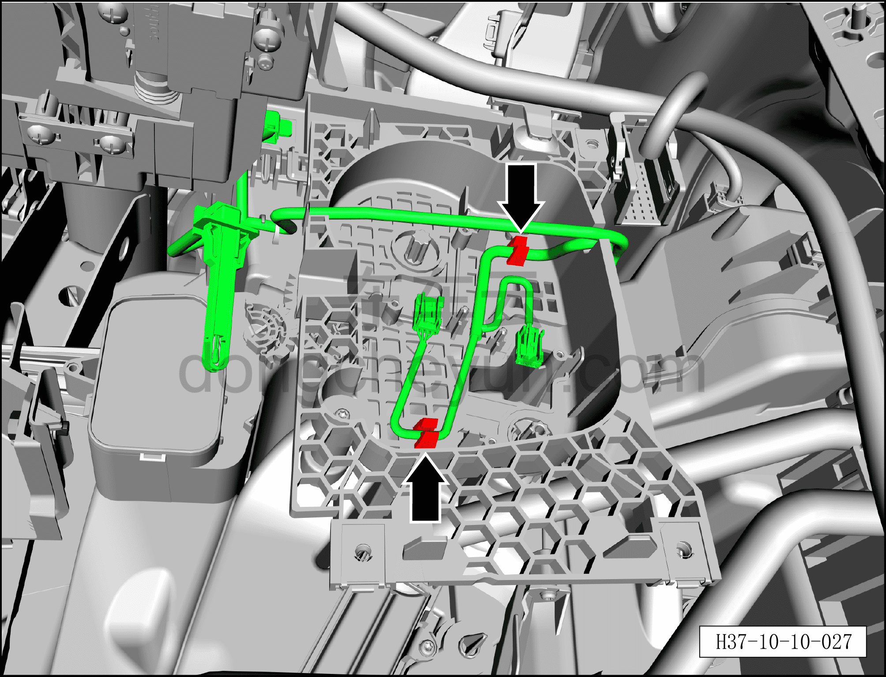
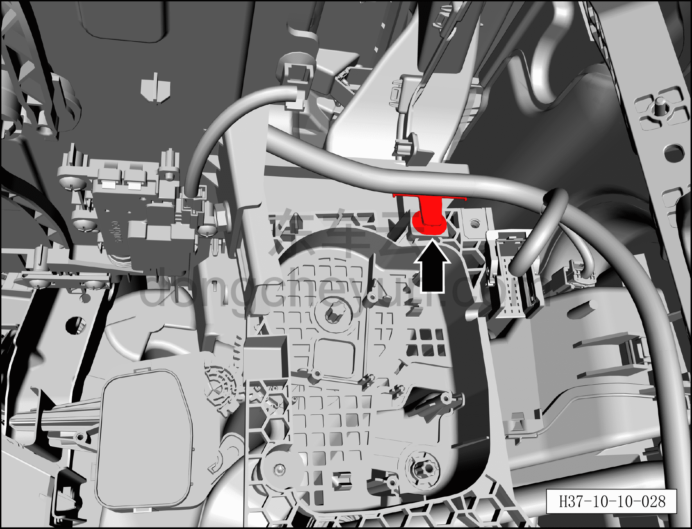
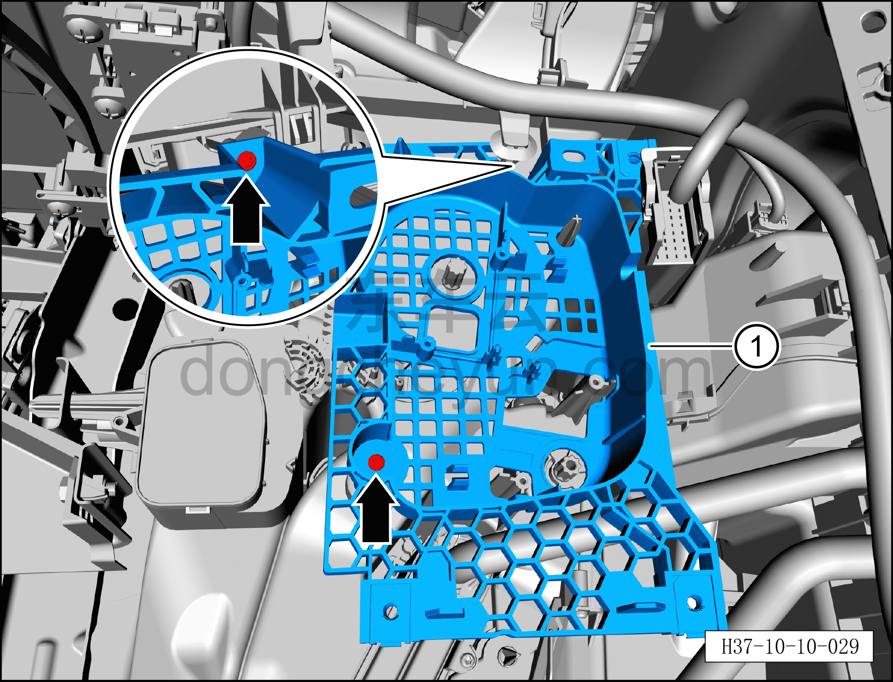
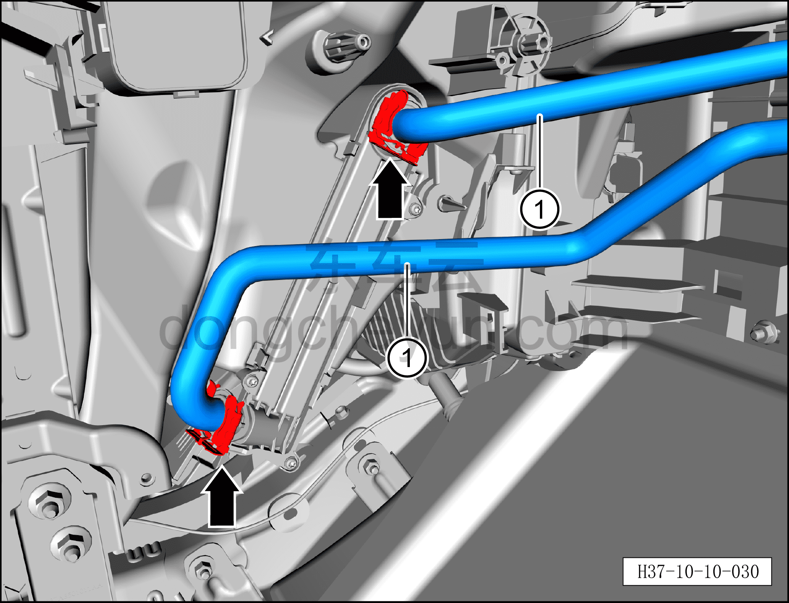
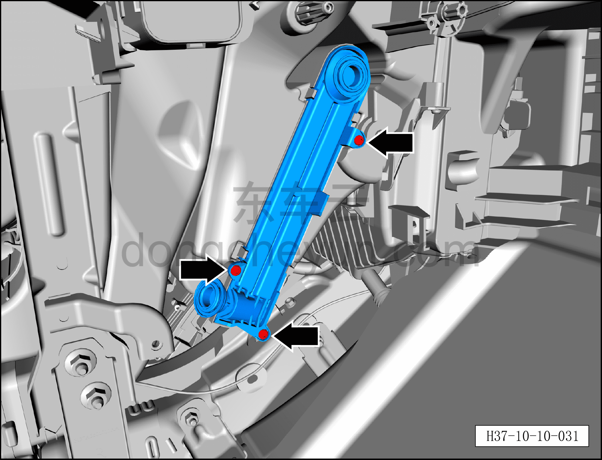
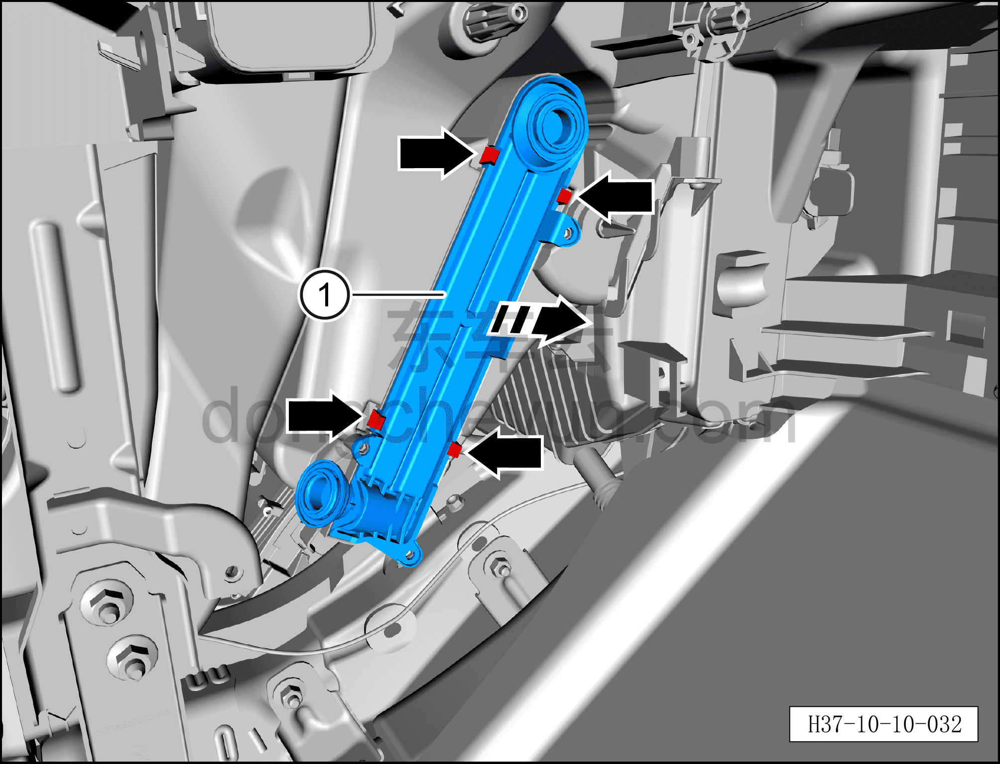

# Снятие и установка сердцевины отопителя

> Кондиционер › Система охлаждения (кондиционирования) › Компоненты управления климатом салона  
> Оригинал: `拆卸与安装暖风芯体` · [dongcheyun 56746](https://dongcheyun.com/p/56746), страница `a2ee75ffdf1241a19c57acf6976115e7` · [оглавление](../README.md)

**Порядок снятия**

**Внимание:**

**- Перед выполнением ремонтных работ подождите, пока температура охлаждающей жидкости снизится ниже 60°C.**

1. Выключите все электроприборы, отключите питание.

2. Выполните операцию обесточивания автомобиля для ремонта. См. [3.1.4.1 Обесточивание автомобиля](../03-техническое-обслуживание/005-обесточивание-автомобиля.md)

3. Слейте охлаждающую жидкость HVAC. См. [3.1.5.2 Замена охлаждающей жидкости HVAC](../03-техническое-обслуживание/007-замена-охлаждающей-жидкости-hvac.md)

4. Снимите правую нижнюю панель торпедо. См. [8.2.4.4 Снятие и установка правой нижней панели торпедо](../08-внутренняя-и-внешняя-отделка/057-снятие-и-установка-правой-нижней-панели-панели-приборов.md)

5. Снимите правую переднюю удлинительную панель. См. [8.3.4.2 Снятие и установка правой передней удлинительной панели](../08-внутренняя-и-внешняя-отделка/092-снятие-и-установка-правой-передней-расширительной.md)

6. Снимите центральную консоль в сборе. См. [8.3.4.13 Снятие и установка центральной консоли в сборе](../08-внутренняя-и-внешняя-отделка/098-снятие-и-установка-центральной-консоли-в-сборе.md)

7. Снимите правую центральную защитную панель. См. [8.2.4.21 Снятие и установка правой центральной защитной панели](../08-внутренняя-и-внешняя-отделка/074-снятие-и-установка-центрально-правой-накладки.md)

8. Снимите перчаточный ящик. См. [8.2.4.7 Снятие и установка перчаточного ящика](../08-внутренняя-и-внешняя-отделка/060-снятие-и-установка-перчаточного-ящика.md)

9. Снимите правый воздуховод обдува ног. См. [8.2.4.26 Снятие и установка правого воздуховода обдува ног](../08-внутренняя-и-внешняя-отделка/079-снятие-и-установка-правого-воздуховода-обдува-ног.md)

10. Снимите правый зональный контроллер салона (VIU). См. [9.5.4.7 Снятие и установка правого зонального контроллера салона (VIU)](../09-электрическая-и-электронная-система/044-снятие-и-установка-правого-зонального-контроллера.md)

11. Снимите правый электродвигатель заслонки смешения. См. [10.1.6.8 Снятие и установка правого электродвигателя заслонки смешения](041-снятие-и-установка-правого-электродвигателя-заслонки.md)

12. Снимите электродвигатель заслонки режима. См. [10.1.6.9 Снятие и установка электродвигателя заслонки режима](042-снятие-и-установка-электродвигателя-заслонки-режима.md)

13. Снятие сердцевины отопителя.

a. Отсоедините 2 фиксирующие защёлки жгута проводов переднего распределителя HVAC в сборе.

b. Переместите жгут проводов переднего распределителя HVAC в сборе в положение, не мешающее извлечению правого кронштейна переднего распределителя HVAC в сборе.

c. С помощью съёмника обивки отсоедините фиксирующую защёлку жгута проводов панели приборов в сборе.

d. Битой T20 выверните 2 крепёжных винта правого кронштейна переднего распределителя HVAC в сборе.

e. Снимите правый кронштейн переднего распределителя HVAC в сборе ①.

f. Разведите оба конца защёлки в стороны и отсоедините 2 фиксирующие защёлки водяных трубок переднего распределителя HVAC в сборе.

g. Отсоедините 2 водяные трубки переднего распределителя HVAC в сборе ①.

**Внимание:**

**– После отсоединения водяных трубок закройте отверстия трубок и сердцевины отопителя нетканым материалом, чтобы избежать попадания посторонних предметов и повреждения деталей.**

**– После отсоединения водяных трубок вытрите всё вокруг них, чтобы облегчить проверку.**

h. Битой T20 выверните 3 крепёжных винта переднего сердечника отопителя.

Момент затяжки винта: 4±0,5 Н·м

i. В направлении стрелки отсоедините 4 фиксирующие защёлки сердцевины отопителя.

j. Сдвиньте наружу и извлеките сердцевину отопителя ①.

**Порядок установки**

Установка выполняется в обратном порядке.

**Внимание:**

**– После завершения установки залейте охлаждающую жидкость и выполните удаление воздуха из системы охлаждения. См. [3.1.5.2 Замена охлаждающей жидкости HVAC](../03-техническое-обслуживание/007-замена-охлаждающей-жидкости-hvac.md) **

**– После завершения установки запустите автомобиль и проверьте соединения трубопроводов на отсутствие утечки охлаждающей жидкости. **

**– После завершения установки с помощью панели управления кондиционером на мультимедийном экране проверьте и убедитесь в нормальной работе всех функций системы кондиционирования, затем подключите диагностический сканер и проверьте наличие кодов неисправностей; при их наличии найдите причину и очистите коды неисправностей.**
