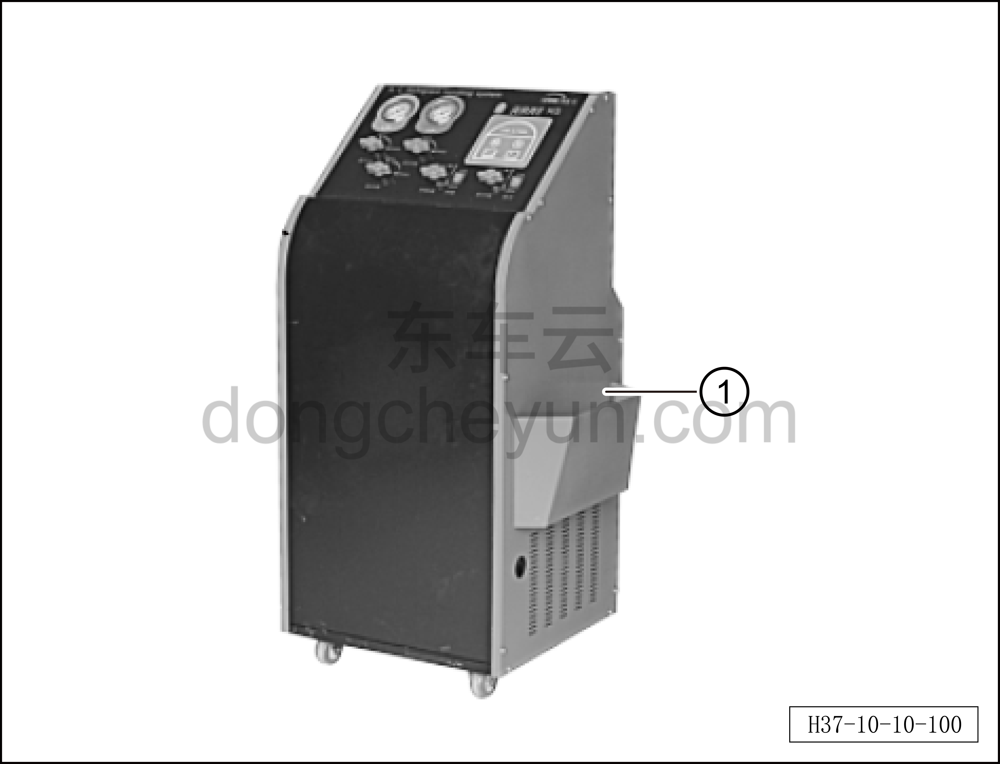
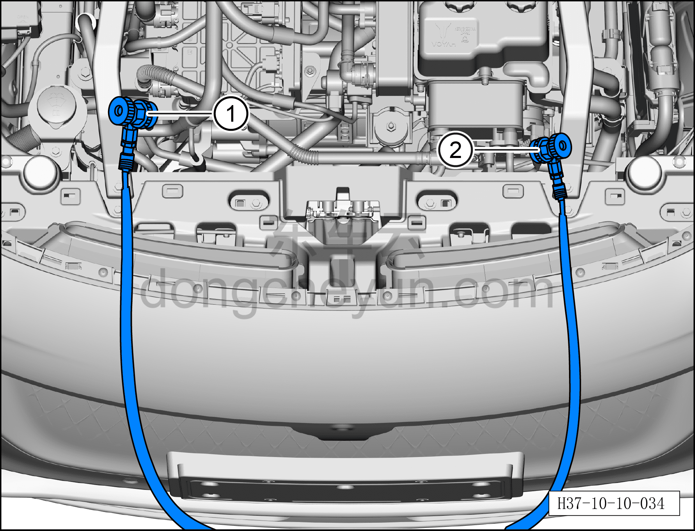
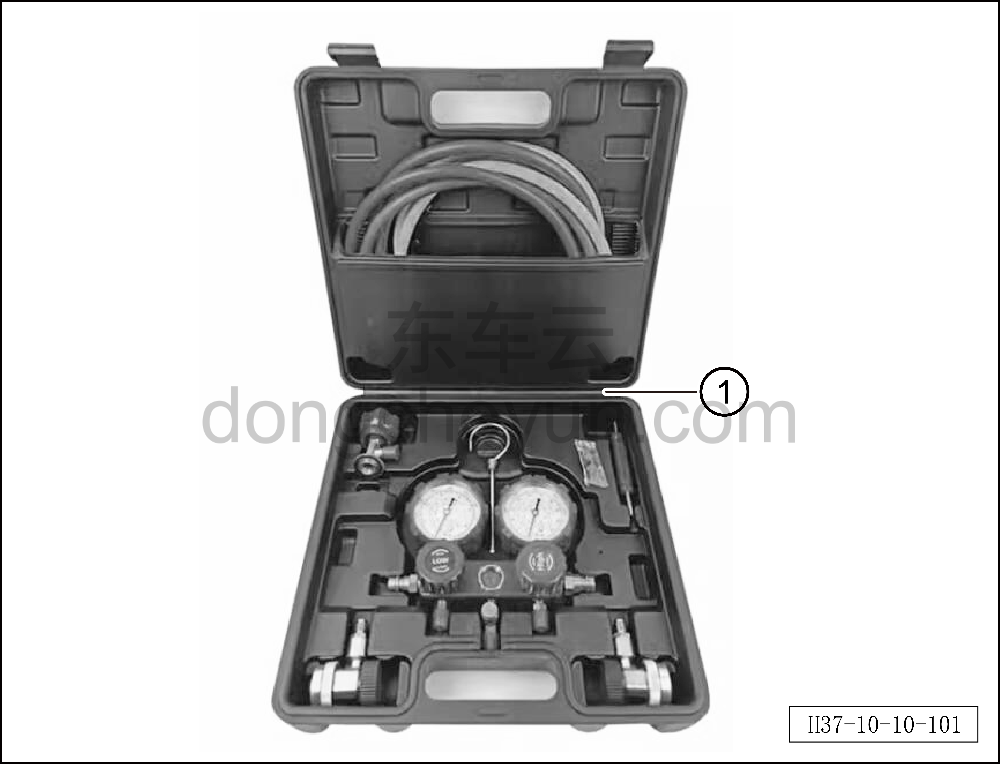

# Сбор/вакуумирование/заправка хладагента

> Кондиционер › Система охлаждения (кондиционирования) › Компоненты управления климатом салона  
> Оригинал: `回收/抽空/加注制冷剂` · [dongcheyun 56746](https://dongcheyun.com/p/56746), страница `232820fe0b5a461885749c2401ce5a46` · [оглавление](../README.md)

1. Сбор (откачка) хладагента.

a. Подключите трубопроводы высокого и низкого давления контура охлаждения.

b. Откройте вентиль низкого давления ① и вентиль высокого давления ② оборудования.

c. Выберите на оборудовании режим сбора хладагента, запустите оборудование и начните сбор.

d. Наблюдайте за показанием манометра низкого давления оборудования; когда стрелка манометра дойдёт до нуля, выключите оборудование и прекратите сбор.

2. Вакуумирование системы кондиционирования.

Вакуумирование с помощью станции сбора и заправки хладагента:

a. Подключите трубопроводы высокого и низкого давления контура охлаждения.

b. Откройте вентиль низкого давления ① и вентиль высокого давления ② оборудования, запустите вакуумный насос, откройте ручные вентили манометров высокого и низкого давления; после того как давление в системе достигнет требуемой степени вакуума 98,7~99,99 кПа, сначала закройте ручные вентили высокого и низкого давления, затем выключите вакуумный насос и наблюдайте, поднимается ли показание манометра.

c. Если требуемая степень вакуума не достигнута, необходимо повторить процедуру вакуумирования для продолжения откачки.

d. Если давление поднимается, это означает недостаточную герметичность системы и наличие утечки; необходимо немедленно проверить место утечки, устранить его, а затем повторить вакуумирование.

3. Заправка хладагентом.

Способ с использованием станции заправки хладагента:

- станция заправки хладагента ①.

Заправляйте хладагент в соответствии со следующими нормативами.

| Тип хладагента | Объём заправки хладагента |
|---|---|
| R134a | 1200g |

**Примечание:**

**– Перед заправкой хладагента необходимо выполнить вакуумирование системы кондиционирования.**

**– Заправку хладагента следует выполнять после пополнения масла компрессора кондиционера.**

Заправка с помощью станции сбора и заправки хладагента:

a. Подключите трубопроводы высокого и низкого давления контура охлаждения.

b. Выберите на оборудовании режим пополнения хладагента, настройте объём заправки.

c. Откройте вентиль низкого давления ①, закройте вентиль высокого давления ②, запустите оборудование для заправки.

d. Наблюдайте за экраном оборудования; когда объём заправки достигнет заданного значения, на экране оборудования появится сообщение о завершении заправки.

e. Закройте вентиль, заправка завершена.

Если оборудование показывает слишком низкую скорость заправки, воспользуйтесь следующим способом заправки:

– Отсоедините соединение высокого давления контура охлаждения, подключите только сторону низкого давления.

– Закройте вентили высокого и низкого давления оборудования.

– Переведите автомобиль в положение парковки, включите питание автомобиля, включите кондиционер, установите режим низкой температуры.

– Откройте вентиль низкого давления оборудования, хладагент будет поступать в трубопровод охлаждения через сторону низкого давления.

– Когда манометр покажет достижение стандартного значения низкого давления, отсоедините соединение стороны низкого давления.

– Заправка хладагента завершена.

Способ с использованием манометрического коллектора для заправки хладагента:

- манометрический коллектор для заправки хладагента ①.

Заправляйте хладагент в соответствии со следующими нормативами.

| Тип хладагента | Объём заправки хладагента |
|---|---|
| R134a | 1200g |

**Примечание:**

**– Перед заправкой хладагента необходимо выполнить вакуумирование системы кондиционирования.**

**– Заправку хладагента следует выполнять после пополнения масла компрессора кондиционера.**

**Предупреждение:**

**– При заправке хладагента со стороны высокого давления запуск компрессора не допускается, чтобы избежать гидроудара.**

**– При заправке хладагента баллон с хладагентом должен быть перевёрнут.**

Ручная заправка со стороны высокого давления:

a. Подключите трубопроводы высокого и низкого давления контура охлаждения.

b. Откройте запорный вентиль баллона с хладагентом.

c. Немного ослабьте гайку фитинга среднего заправочного шланга манометрического коллектора, пока не начнёт выходить хладагент, чтобы удалить воздух из трубки.

d. Откройте ручной вентиль стороны высокого давления манометрического коллектора, переверните баллон с хладагентом, чтобы жидкий хладагент поступал в систему через сторону высокого давления.

e. Наблюдайте, поднимается ли стрелка манометра низкого давления вместе со стрелкой манометра высокого давления; если стрелка манометра низкого давления не поднимается или поднимается медленно, это означает засорение внутреннего трубопровода — необходимо немедленно прекратить заправку и провести ремонт.

f. Если стрелка манометра низкого давления поднимается вместе со стрелкой манометра высокого давления, это означает нормальную работу системы; после завершения заправки хладагента закройте ручной вентиль стороны высокого давления и запорный вентиль баллона с хладагентом, выполните пробный запуск системы.

Ручная заправка со стороны низкого давления:

a. Подключите трубопроводы высокого и низкого давления контура охлаждения.

b. Откройте запорный вентиль баллона с хладагентом.

c. Немного ослабьте гайку фитинга среднего заправочного шланга манометрического коллектора, пока не начнёт выходить хладагент, чтобы удалить воздух из трубки.

d. Откройте ручной вентиль стороны низкого давления манометрического коллектора, установите баллон с хладагентом вертикально, чтобы газообразный хладагент поступал в систему через сторону низкого давления.

e. Запустите автомобиль, включите режим охлаждения кондиционера, установите максимальную скорость вентилятора.

f. После завершения заправки хладагента закройте ручной вентиль стороны низкого давления и запорный вентиль баллона с хладагентом.
