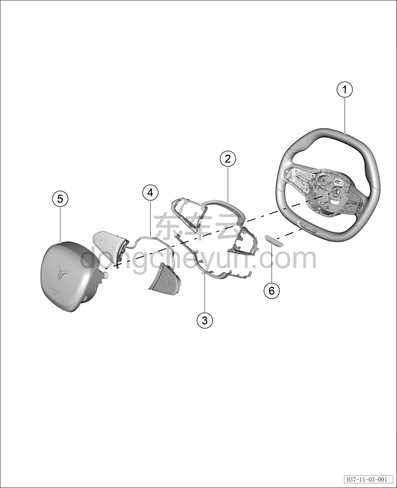

# Покомпонентный вид рулевого колеса

> Система безопасности › Система безопасности  
> Оригинал: `方向盘分解图` · [dongcheyun 56746](https://dongcheyun.com/p/56746), страница `5a7546897d7447bd9cd34118d49057b9` · [оглавление](../README.md)

| № | Наименование детали | Кол-во на автомобиль | Примечание |
|---|---|---|---|
| 1 | Рулевое колесо | 1 |   |
| 2 | Декоративная накладка рулевого колеса | 1 | Верхняя часть |
| 3 | Декоративная накладка рулевого колеса | 1 | Нижняя часть |
| 4 | Кнопки быстрого доступа на рулевом колесе | 1 |   |
| 5 | Подушка безопасности водителя | 1 |   |
| 6 | Подсветка рулевого колеса | 1 |   |
