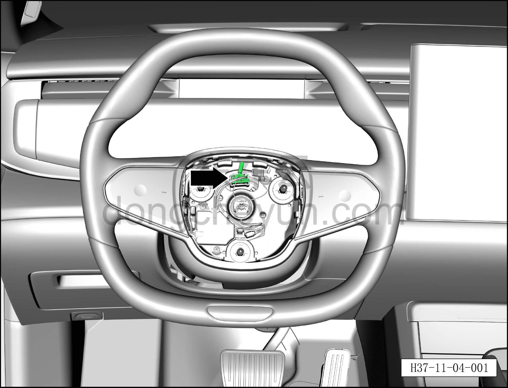
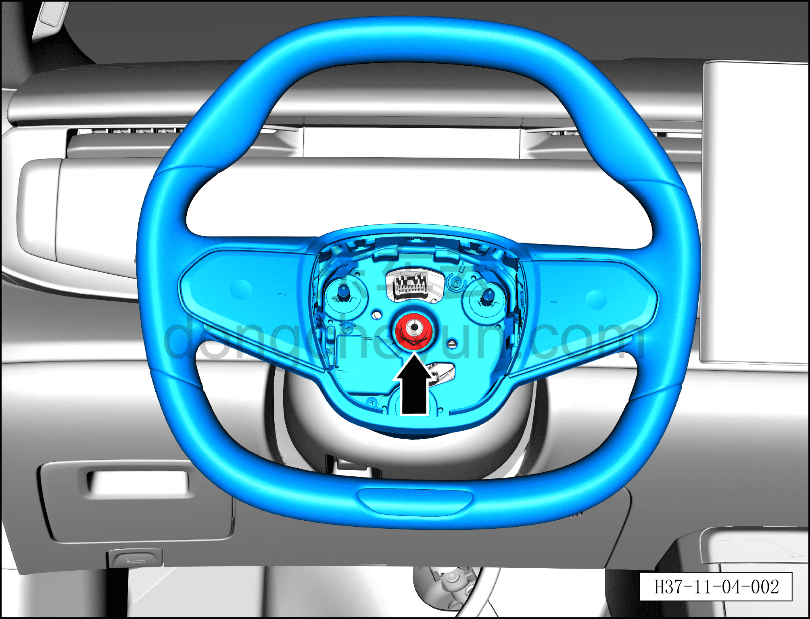
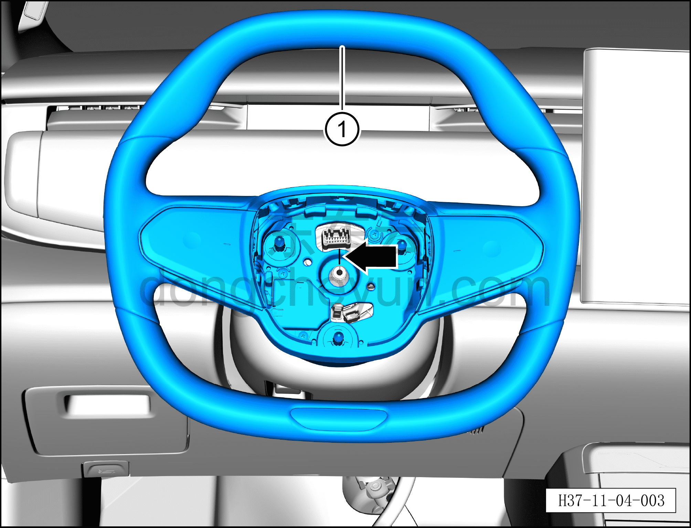

# Снятие и установка рулевого колеса

> Система безопасности › Система безопасности › Рулевое колесо  
> Оригинал: `拆卸与安装方向盘` · [dongcheyun 56746](https://dongcheyun.com/p/56746), страница `497f54cb071246f38f7692772a517ac7` · [оглавление](../README.md)

**Порядок снятия**

**Примечание:**

**– Перед обесточиванием автомобиля поверните рулевое колесо в среднее положение (колёса находятся в положении прямолинейного движения).**

**– Данный автомобиль оснащён подушкой безопасности водителя; при снятии рулевого колеса соблюдайте установленный порядок действий.**

1. Выключите все электроприборы, отключите питание.

2. Выполните операцию обесточивания автомобиля для ремонта. См. [3.1.4.1 Обесточивание автомобиля](../03-техническое-обслуживание/005-обесточивание-автомобиля.md)

3. Снимите подушку безопасности водителя. См. [11.1.5.1 Снятие и установка подушки безопасности водителя](008-снятие-и-установка-подушки-безопасности-водителя.md)

4. Снятие рулевого колеса.

a. Нажмите на фиксирующий зажим разъёма и отсоедините разъём, соединяющий кнопки быстрого доступа на рулевом колесе с переключателем рулевой колонки.

b. Торцевой головкой 18 мм отверните крепёжную гайку рулевого колеса. (Работа выполняется двумя людьми: один держит рулевое колесо, другой отворачивает крепёжную гайку.)

Момент затяжки гайки: 45±5 Н·м

c. Снимите рулевое колесо ①.

**Внимание:**

**– При снятии рулевого колеса обращайте внимание на метки на рулевой колонке и рулевом колесе.**

**– Если на рулевой колонке нет метки, перед снятием рулевого колеса нанесите метку на рулевую колонку маркером.**

**– При снятии вкрутите крепёжный болт рулевого колеса в рулевую колонку (достаточно 3~4 оборотов), потяните рулевое колесо вверх вдоль оси рулевой колонки, а после его снятия выверните болт.**

**– После снятия рулевого колеса не поворачивайте контактное кольцо, лучше зафиксировать его липкой лентой.**

**Порядок установки**

Установка выполняется в обратном порядке.

**Внимание:**

**– Перед установкой проверьте, что контактное кольцо находится в среднем положении.**

**– При установке рулевого колеса центральные метки совмещения на рулевом колесе и рулевой колонке должны совпадать.**

**–После завершения установки на месте проверьте, находится ли рулевое колесо в нейтральном положении; если нет — установите повторно. Проверьте в ходовых испытаниях: при прямолинейном движении автомобиля максимальный свободный ход рулевого колеса от среднего положения влево и вправо не должен превышать 5° в каждую сторону; если это не так, проверьте рулевое управление или повторите указанную выше операцию.**
