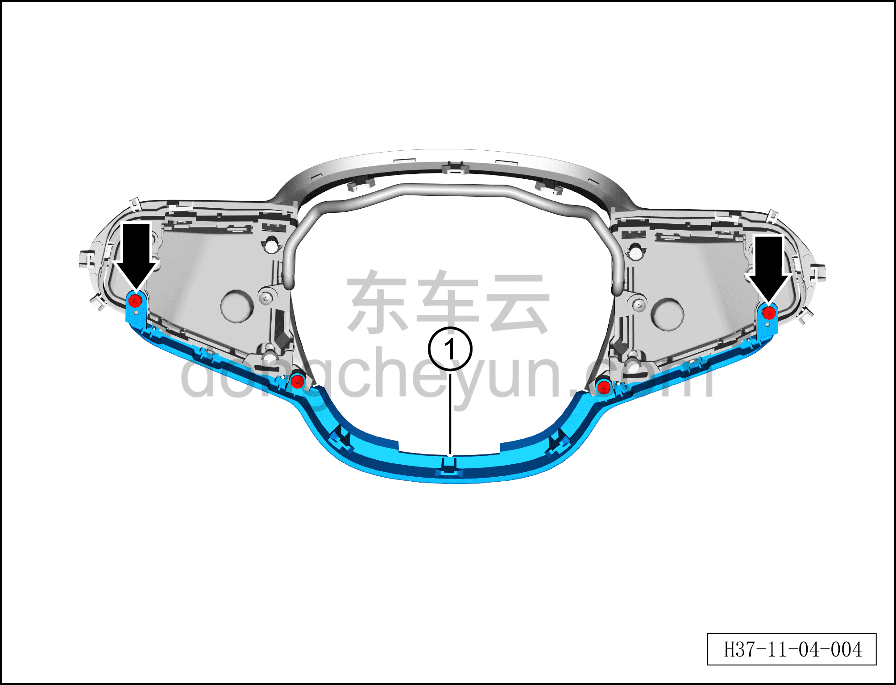
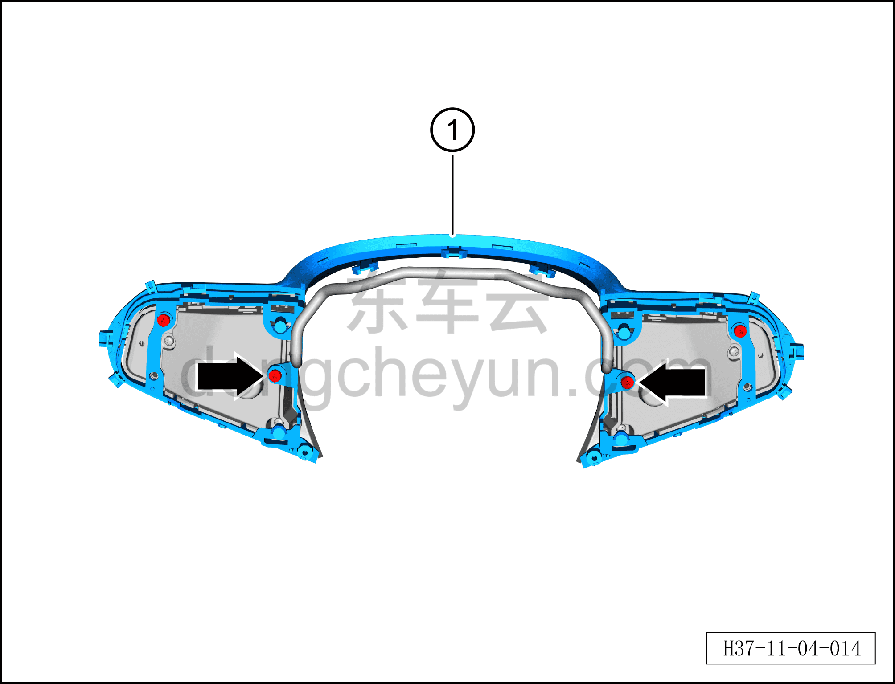

# Снятие и установка декоративной накладки рулевого колеса

> Система безопасности › Система безопасности › Рулевое колесо  
> Оригинал: `拆卸与安装方向盘装饰盖` · [dongcheyun 56746](https://dongcheyun.com/p/56746), страница `337f75ea32b1493988c173e9101d9b69` · [оглавление](../README.md)

**Порядок снятия**

**Примечание:**

**– Данный автомобиль оснащён подушкой безопасности водителя; при снятии рулевого колеса соблюдайте установленный порядок действий.**

**– Поверните рулевое колесо в среднее положение (колёса находятся в положении прямолинейного движения).**

1. Выключите все электроприборы, отключите питание.

2. Выполните операцию обесточивания автомобиля для ремонта. См. [3.1.4.1 Обесточивание автомобиля](../03-техническое-обслуживание/005-обесточивание-автомобиля.md)

3. Снимите подушку безопасности водителя. См. [11.1.5.1 Снятие и установка подушки безопасности водителя](008-снятие-и-установка-подушки-безопасности-водителя.md)

5. Снимите кнопки быстрого доступа на рулевом колесе вместе с декоративной накладкой рулевого колеса в сборе. См. [11.1.4.3 Снятие и установка кнопок быстрого доступа на рулевом колесе](006-снятие-и-установка-кнопок-быстрого-доступа-на-рулевом.md)

6. Снятие декоративной накладки рулевого колеса.

a. Крестовой отвёрткой выверните 4 крепёжных винта, соединяющих кнопки быстрого доступа на рулевом колесе с декоративной накладкой рулевого колеса в сборе.

Момент затяжки винта: 0,6±0,1 Н·м

b. Снимите декоративную накладку рулевого колеса (нижнюю часть) ①.

c. Крестовой отвёрткой выверните 4 крепёжных винта, соединяющих кнопки быстрого доступа на рулевом колесе с декоративной накладкой рулевого колеса в сборе.

Момент затяжки винта: 0,6±0,1 Н·м

d. Снимите декоративную накладку рулевого колеса (верхнюю часть) ①.

**Порядок установки**

Установка выполняется в обратном порядке.

**Внимание:**

**– После завершения установки проверьте и убедитесь в нормальной работе кнопок быстрого доступа на рулевом колесе, стеклоочистителя и переключения передач, затем подключите диагностический сканер и проверьте наличие кодов неисправностей; при их наличии найдите причину и очистите коды неисправностей.**
