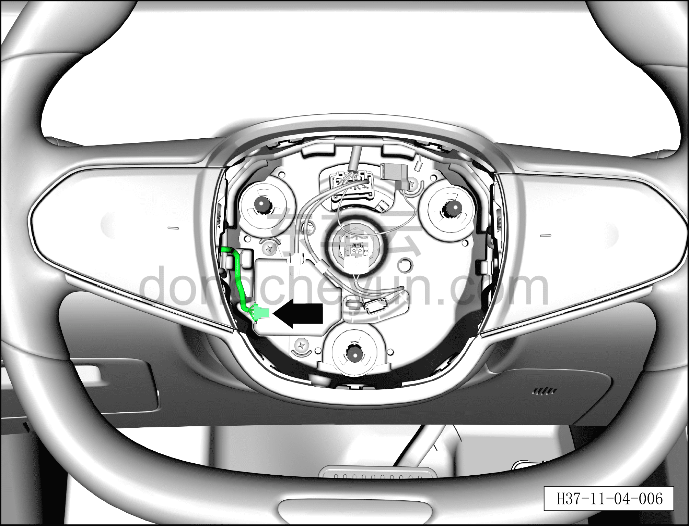
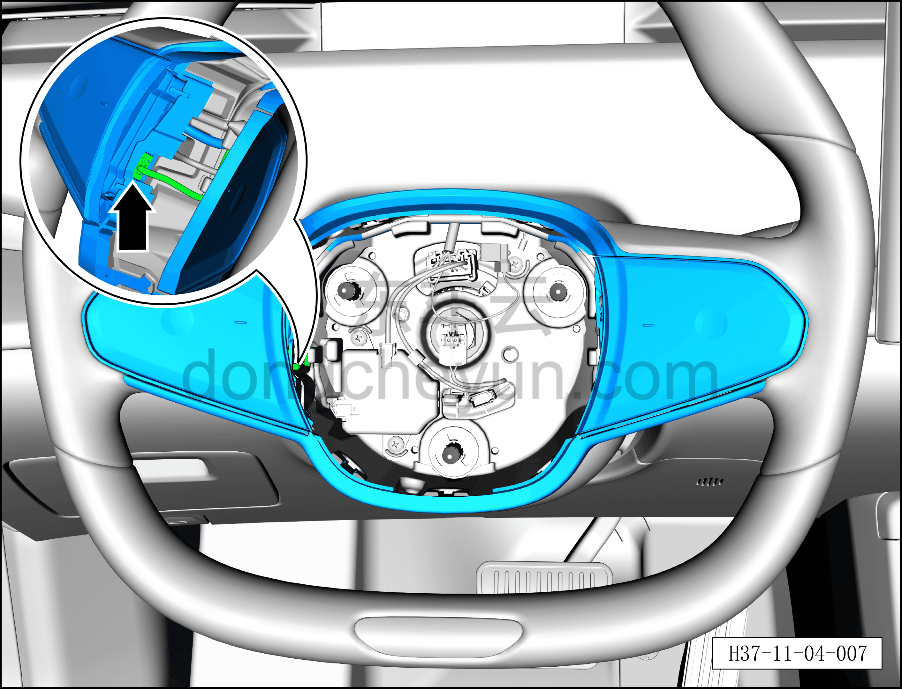
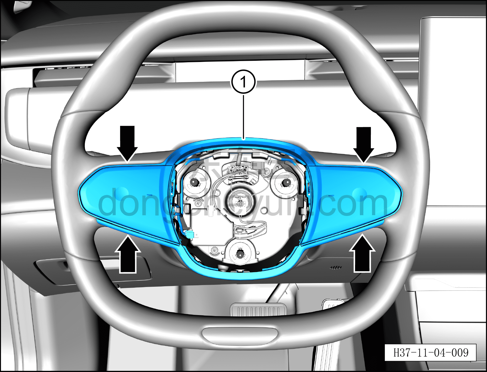
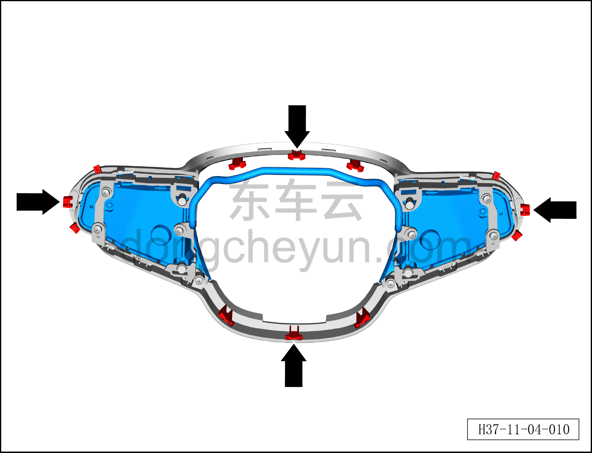
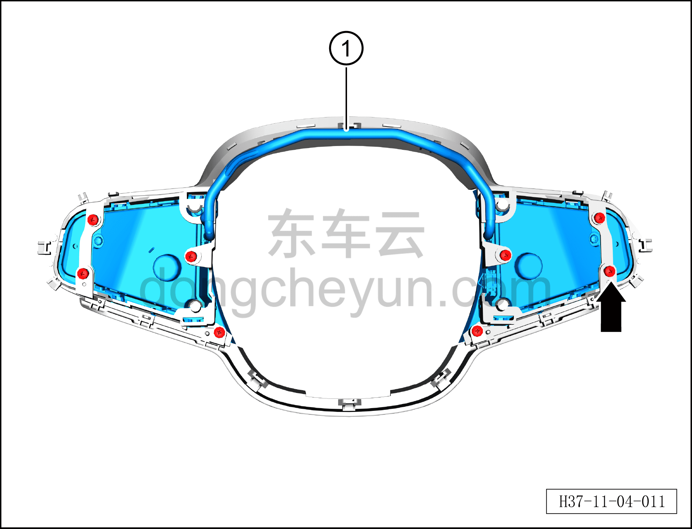

# Снятие и установка кнопок быстрого доступа на рулевом колесе

> Система безопасности › Система безопасности › Рулевое колесо  
> Оригинал: `拆卸与安装方向盘快拨键` · [dongcheyun 56746](https://dongcheyun.com/p/56746), страница `6050b4a667364083acd40ea7cc40a356` · [оглавление](../README.md)

**Порядок снятия**

**Примечание:**

**– Данный автомобиль оснащён подушкой безопасности водителя; при снятии кнопок быстрого доступа на рулевом колесе соблюдайте установленный порядок действий.**

**– Поверните рулевое колесо в среднее положение (колёса находятся в положении прямолинейного движения).**

**– При снятии кнопок быстрого доступа на рулевом колесе необходимо пробить закрытое сервисное отверстие на рулевом колесе.**

1. Выключите все электроприборы, отключите питание.

2. Выполните операцию обесточивания автомобиля для ремонта. См. [3.1.4.1 Обесточивание автомобиля](../03-техническое-обслуживание/005-обесточивание-автомобиля.md)

3. Снимите подушку безопасности водителя. См. [11.1.5.1 Снятие и установка подушки безопасности водителя](008-снятие-и-установка-подушки-безопасности-водителя.md)

4. Снятие кнопок быстрого доступа на рулевом колесе.

a. Небольшой плоской отвёрткой нажмите на фиксирующий зажим разъёма и отсоедините разъём, соединяющий кнопки быстрого доступа на рулевом колесе с контроллером рулевого колеса HOD.

b. Небольшой плоской отвёрткой нажмите на фиксирующий зажим разъёма и отсоедините разъём кнопок быстрого доступа на рулевом колесе.

**Примечание:**

**– Если разъём кнопок быстрого доступа на рулевом колесе трудно отсоединить, его можно отсоединить на последнем этапе.**

c. С помощью съёмника обивки с обоих концов снимите 12 фиксирующих защёлок и извлеките кнопки быстрого доступа на рулевом колесе вместе с декоративной накладкой рулевого колеса в сборе ①.

d. Крестовой отвёрткой выверните 8 крепёжных винтов, соединяющих кнопки быстрого доступа на рулевом колесе с декоративной накладкой рулевого колеса в сборе.

Момент затяжки винта: 0,6±0,1 Н·м

e. Снимите кнопки быстрого доступа на рулевом колесе ①.

**Порядок установки**

Установка выполняется в обратном порядке.

**Внимание:**

**– После завершения установки проверьте и убедитесь в нормальной работе кнопок быстрого доступа на рулевом колесе, стеклоочистителя и переключения передач, затем подключите диагностический сканер и проверьте наличие кодов неисправностей; при их наличии найдите причину и очистите коды неисправностей.**
